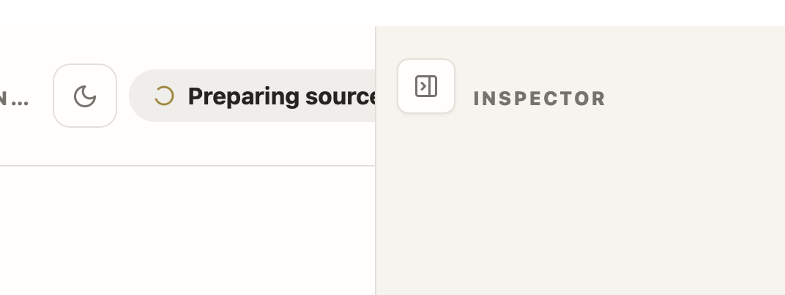
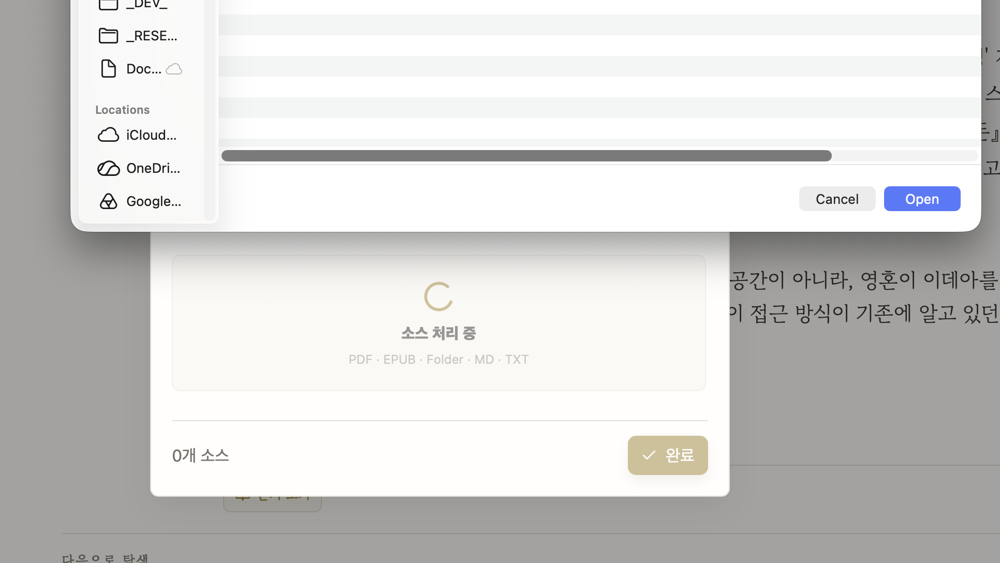

Import하는 pdf, epub filename에 ";"같은 특수문자가 들어가면 무시해버려

화면이 작게 뜨면 indicator가 잘리고 있어

중간에 interaction 없이 한번에 source의 모든 교육자료를 제작하는 버튼 만들어줘

chat 화면에서 selected text를 highlight하는 기능 만들어줘. 이는 MD_Reader project를 참고해서 해줘.

그림에 대해 설명을 구하는 경우, 다음에 learning material을 열면 이 설명이 없어져 있어. 설명도 user가 save할 수 있는 buttoN을 넣어서, annotation으로 저장할 수 있게 하고, 다음에 열었을 때 보여지게 해줘

새로운 project를 열고 소스 선택 버튼을 눌렀어, 그러면 file dialog가 뜨는데, 이때 벌써 소스 선택은 spinner가 돌고 있어 아직 선택도 안 했는데 말이야. spinner는 file 선택 후에 돌기 시작해야 해

책의 내용에 따라서, 어떤 책은 매우 학술적이고 전문적인 해설을 요구할 때가 있고, 어떤 책은 가벼운 교양서적이라 가볍게 읽을 책이 있어.  따라서 project를 새로 만들때  learning level을 setting 하면, 그에 맞는 prompt를 주입하는 것이 어떨까 싶어. 물론 user가 아무것도 넣지 않으면 default를 사용하고...

hard, medium, casual 로 하면 어떨까?

가능한 genre

History

Philosophy

Technical, Computer

Hard Science

Popular Science
