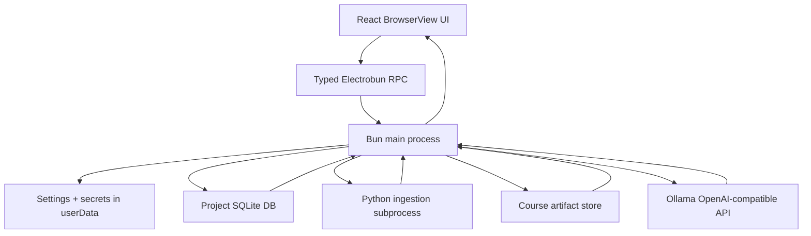

# Detailed Plan: Electrobun macOS Interactive Learning App

## 0. Product Direction

Build a macOS desktop app with Electrobun that manages learning projects. A project can contain many Markdown/PDF sources, generated intermediate materials, and multiple learning sessions.

The app is not a static course renderer and not a generic chatbot. It should behave like a prepared teacher:

- It prepares a rigorous lesson plan from the selected project material.
- It keeps a clear learning objective for each module.
- It reacts dynamically to the learner's actual answers.
- It redirects off-topic turns back to the source and current objective.
- It uses source-grounded explanations and visible source references.
- It can advance, remediate, summarize, and review based on learner state.

The current `test-learning-system/` prototype proves the desired runtime pattern:

- source/chunk/concept/course artifacts are separate from UI code
- actual tutor messages are generated dynamically
- course-manager logic prevents the tutor from drifting away from learning objectives
- model output is structured JSON with `message`, `diagram`, `choices`, `source_refs`, and `state_update`

Next implementation should preserve this architecture while replacing the temporary web server with an Electrobun Bun-main + BrowserView RPC app.

The product should be project-first, not one-file-at-a-time. A user learning one book may import many chapter Markdown files, generate materials once, close the app, and later continue from the saved project without rebuilding everything.

## 1. Target Stack

### Desktop Shell

- Electrobun
- macOS first
- TypeScript
- Bun main process in `src/bun/`
- Browser UI in `src/views/main/`
- Shared RPC and artifact types in `src/shared/`

### UI

- React + TypeScript inside the Electrobun view
- App-like interface, not a landing page
- Primary surfaces:
  - project switcher / project library
  - library/source list
  - upload/import flow
  - project material browser
  - course generation progress
  - course outline preview
  - adaptive tutor session
  - source/reference inspector
  - settings modal

### AI Provider

Use Ollama OpenAI-compatible API:

```text
https://ollama.com/v1
```

Required endpoints:

- `GET /models`
- `POST /chat/completions`

Provider details:

- Auth: `Authorization: Bearer <api key>`
- Model: user-selected in Settings
- API key: user-entered in Settings
- Base URL: default `https://ollama.com/v1`; make it advanced-configurable for future local/self-hosted OpenAI-compatible providers
- Structured JSON calls: `response_format: { "type": "json_object" }`

### Python Backend

Use a Python backend for document ingestion, especially PDF extraction.

Recommended structure:

```text
python/
  pyproject.toml
  uv.lock
  src/
    learning_backend/
      __init__.py
      cli.py
      ingest_markdown.py
      ingest_pdf.py
      normalize.py
      quality.py
      schemas.py
      tests/
```

Electrobun main owns orchestration. Python owns extraction/normalization only. Tutor planning and runtime model calls should stay in Bun/TypeScript unless a later reason appears.

## 2. Architecture



### Core Rule

Generated learning material is data, not generated frontend code.

The app should never generate arbitrary React/JSX per source. It should generate typed artifacts and render them through trusted UI components.

## 3. Proposed Repository Layout

```text
.
  electrobun.config.ts
  package.json
  tsconfig.json
  src/
    bun/
      index.ts
      app-window.ts
      rpc.ts
      paths.ts
      project-db.ts
      settings-service.ts
      ai-provider-settings.ts
      openai-compatible-client.ts
      project-service.ts
      source-service.ts
      material-service.ts
      course-artifact-service.ts
      course-generation-service.ts
      tutor-service.ts
      session-service.ts
      python-runner.ts
    shared/
      rpc-types.ts
      artifact-types.ts
      tutor-types.ts
      settings-types.ts
      result-types.ts
    views/
      main/
        index.html
        index.tsx
      App.tsx
      components/
        AppShell.tsx
        ProjectLibrary.tsx
        ProjectShell.tsx
        SourceImport.tsx
        SourceList.tsx
        MaterialBrowser.tsx
        GenerationProgress.tsx
        CourseOutline.tsx
          TutorSession.tsx
          SourceInspector.tsx
          VisualRenderer.tsx
          SettingsModal.tsx
        store/
          useAppStore.ts
          useSettingsStore.ts
          useTutorStore.ts
        styles/
          tokens.css
          app.css
  python/
    pyproject.toml
    uv.lock
    src/learning_backend/
      cli.py
      ingest_markdown.py
      ingest_pdf.py
      normalize.py
      quality.py
      schemas.py
```

## 4. Project Model, Runtime Paths, And Persistence

Use Electrobun `Utils.paths.userData` for runtime-writable data.

Do not write any of the following into bundled resources or `.app/Contents/Resources`:

- uploaded source copies
- generated artifacts
- session logs
- settings
- API keys
- extraction caches
- Python venvs
- generated exports

Suggested user data layout:

```text
~/Library/Application Support/interactive-learning/
  settings.json
  ai-provider-settings.json
  projects.sqlite
  projects/
    <project-id>/
      project.json
      sources/
        <source-id>/
          original.md | original.pdf
          source_manifest.json
          source_chunks.json
          extraction_quality.json
      materials/
        <material-id>/
          material_manifest.json
          concept_map.json
          course_plan.json
          visual_specs.json
          source_index.json
          generation_log.json
          sessions/
            <session-id>.json
  cache/
    python-venv/
    pdf-previews/
    tmp/
  logs/
    app.log
```

Add a `channel` subfolder later if canary/stable builds need isolation.

### Project-First Concepts

Use these terms consistently:

- Project: a user-owned learning workspace, for example one book, one course, or one research topic.
- Source: an imported Markdown/PDF file. A book chapter is usually one source.
- Material: generated learning material built from one or more sources. MVP can generate one material per source, but the schema should support multi-source materials.
- Session: one learning run over one material. A user can continue an existing session or start a fresh session over the same material.
- Artifact: generated structured JSON such as chunks, concept map, course plan, and visual specs.

### Storage Strategy

Use a hybrid storage model:

- SQLite stores queryable metadata, progress, relationships, sessions, messages, and learner signals.
- JSON files store larger generated artifacts that are easier to inspect, diff, regenerate, and pass to prompts.
- Original source files are copied into the project folder so projects remain stable even if the original path disappears.

This follows the useful MD_Reader pattern of SQLite-backed sessions, but expands the context hierarchy from document/chapter to project/source/material/session.

### Database Choice

Use SQLite in the Bun main process.

Implementation choice:

- Prefer Bun's SQLite support if it works cleanly in Electrobun.
- Otherwise test `better-sqlite3` in Electrobun/Bun before committing to it.
- Whichever driver is chosen, enable WAL and foreign keys, mirroring MD_Reader's durability pattern.

Keep database access in `src/bun/project-db.ts` and expose it only through typed services/RPC.

### Proposed SQLite Schema

```sql
CREATE TABLE projects (
  id TEXT PRIMARY KEY,
  title TEXT NOT NULL,
  description TEXT,
  created_at INTEGER NOT NULL,
  updated_at INTEGER NOT NULL,
  last_opened_at INTEGER,
  archived_at INTEGER
);

CREATE TABLE project_sources (
  id TEXT PRIMARY KEY,
  project_id TEXT NOT NULL REFERENCES projects(id) ON DELETE CASCADE,
  title TEXT NOT NULL,
  source_type TEXT NOT NULL CHECK (source_type IN ('markdown', 'pdf', 'text')),
  original_file_name TEXT NOT NULL,
  original_file_path TEXT,
  imported_file_path TEXT NOT NULL,
  content_hash TEXT NOT NULL,
  manifest_path TEXT,
  chunks_path TEXT,
  quality_status TEXT NOT NULL DEFAULT 'pending',
  created_at INTEGER NOT NULL,
  updated_at INTEGER NOT NULL
);

CREATE UNIQUE INDEX idx_project_sources_hash
  ON project_sources(project_id, content_hash);

CREATE TABLE learning_materials (
  id TEXT PRIMARY KEY,
  project_id TEXT NOT NULL REFERENCES projects(id) ON DELETE CASCADE,
  title TEXT NOT NULL,
  material_type TEXT NOT NULL DEFAULT 'source_course',
  status TEXT NOT NULL CHECK (status IN ('draft', 'generating', 'ready', 'failed')),
  manifest_path TEXT,
  concept_map_path TEXT,
  course_plan_path TEXT,
  visual_specs_path TEXT,
  source_index_path TEXT,
  generation_error TEXT,
  created_at INTEGER NOT NULL,
  updated_at INTEGER NOT NULL
);

CREATE TABLE material_sources (
  material_id TEXT NOT NULL REFERENCES learning_materials(id) ON DELETE CASCADE,
  source_id TEXT NOT NULL REFERENCES project_sources(id) ON DELETE CASCADE,
  ordinal INTEGER NOT NULL,
  PRIMARY KEY (material_id, source_id)
);

CREATE TABLE learning_sessions (
  id TEXT PRIMARY KEY,
  project_id TEXT NOT NULL REFERENCES projects(id) ON DELETE CASCADE,
  material_id TEXT NOT NULL REFERENCES learning_materials(id) ON DELETE CASCADE,
  title TEXT NOT NULL,
  status TEXT NOT NULL CHECK (status IN ('active', 'completed', 'archived')),
  current_module_id TEXT,
  completed_module_ids_json TEXT NOT NULL DEFAULT '[]',
  model TEXT,
  created_at INTEGER NOT NULL,
  updated_at INTEGER NOT NULL,
  archived_at INTEGER
);

CREATE INDEX idx_learning_sessions_material_updated
  ON learning_sessions(material_id, updated_at DESC);

CREATE TABLE learning_messages (
  id TEXT PRIMARY KEY,
  session_id TEXT NOT NULL REFERENCES learning_sessions(id) ON DELETE CASCADE,
  role TEXT NOT NULL CHECK (role IN ('user', 'assistant', 'system')),
  content TEXT NOT NULL,
  module_id TEXT,
  source_refs_json TEXT NOT NULL DEFAULT '[]',
  visual_id TEXT,
  state_update_json TEXT,
  created_at INTEGER NOT NULL,
  ordinal INTEGER NOT NULL
);

CREATE INDEX idx_learning_messages_session_ordinal
  ON learning_messages(session_id, ordinal ASC);

CREATE TABLE learner_signals (
  id TEXT PRIMARY KEY,
  session_id TEXT NOT NULL REFERENCES learning_sessions(id) ON DELETE CASCADE,
  material_id TEXT NOT NULL REFERENCES learning_materials(id) ON DELETE CASCADE,
  module_id TEXT,
  kind TEXT NOT NULL CHECK (kind IN ('misconception', 'strength', 'interest', 'remediation')),
  content TEXT NOT NULL,
  evidence_message_ids_json TEXT NOT NULL DEFAULT '[]',
  created_at INTEGER NOT NULL
);

CREATE TABLE module_progress (
  session_id TEXT NOT NULL REFERENCES learning_sessions(id) ON DELETE CASCADE,
  module_id TEXT NOT NULL,
  status TEXT NOT NULL CHECK (status IN ('not_started', 'in_progress', 'completed', 'needs_review')),
  mastery_score REAL,
  updated_at INTEGER NOT NULL,
  PRIMARY KEY (session_id, module_id)
);
```

### Session Modes

For an existing material, the UI should offer:

- Continue latest session
- Choose previous session
- Start new session

Starting a new session should reuse the generated material artifacts and source chunks. It should not regenerate the course unless the user explicitly asks.

## 5. Electrobun Main/View Boundary

Use typed RPC instead of ad hoc `postMessage`.

### RPC Request Groups

Browser view calls Bun main:

```ts
projects.create({ title, description })
projects.list()
projects.open(projectId)
projects.update(projectId, partial)
projects.archive(projectId)
projects.openFolder(projectId)

sources.openDialog(projectId)
sources.importPaths(projectId, paths)
sources.list(projectId)
sources.delete(sourceId)
sources.reingest(sourceId)

materials.generate(projectId, sourceIds)
materials.list(projectId)
materials.getArtifacts(materialId)
materials.regenerate(materialId)
materials.delete(materialId)

sessions.list(materialId)
sessions.start(materialId, { mode: 'new' | 'continue', sessionId?: string })
sessions.load(sessionId)
sessions.archive(sessionId)

tutor.startSession(materialId, sessionId?)
tutor.sendTurn(sessionId, userText)
tutor.advanceModule(sessionId)
tutor.resetSession(sessionId)
tutor.stop(sessionId)

settings.getPublic()
settings.updatePublic(partial)
aiProvider.status()
aiProvider.updateSettings(partial)
aiProvider.listModels()
aiProvider.testConnection()
```

Bun main sends messages to BrowserView:

```ts
sources.ingestionProgress({ projectId, sourceId, stage, message, progress })
materials.generationProgress({ projectId, materialId, stage, message, progress })
tutor.turnStarted({ sessionId })
tutor.turnCompleted({ sessionId, output })
tutor.turnError({ sessionId, error })
```

### Why This Boundary

- Browser never receives the API key.
- Browser never reads arbitrary local files directly.
- Python subprocess is owned by Bun main.
- Settings and artifact writes are centralized and testable.
- This maps cleanly onto Electrobun's `BrowserView.defineRPC` / `Electroview.defineRPC` pattern.

## 6. Settings And AI Provider Plan

Follow the MD_Reader pattern, adjusted for Electrobun.

### Settings Files

Use two services:

1. `settings-service.ts`
   - non-secret UI settings
   - selected model
   - base URL if considered non-secret
   - appearance preferences

2. `ai-provider-settings.ts`
   - API key and provider status
   - separate read path that does not leak the secret

### Public Settings Shape

```ts
interface AppSettings {
  theme: 'light' | 'dark' | 'system'
  selectedModel: string
  ollamaBaseUrl: string
  tutorLanguage: 'ko' | 'en'
  autoAdvanceOnMastery: boolean
  showSourceInspector: boolean
}
```

Default:

```ts
{
  theme: 'system',
  selectedModel: '',
  ollamaBaseUrl: 'https://ollama.com/v1',
  tutorLanguage: 'ko',
  autoAdvanceOnMastery: true,
  showSourceInspector: true
}
```

### Secret Settings Shape

```ts
interface AiProviderSecretSettings {
  ollamaApiKey?: string
}
```

### Provider Status Shape

```ts
interface AiProviderStatus {
  baseUrl: string
  hasApiKey: boolean
  apiKeySource: 'settings' | 'env' | null
  selectedModel: string
  reachable: boolean
  error?: string
}
```

### Settings UX

Settings modal should include:

- Base URL input, defaulting to `https://ollama.com/v1`
- API key password field
- "Leave blank to keep existing key" behavior
- explicit clear key button
- model dropdown populated from `/models`
- refresh models button
- test connection button
- saved-key status text, not the key value

Important behavior:

- Blank API-key field must not erase the saved key.
- Model selection persists immediately.
- On startup, list models and restore saved model only if it still exists.
- If saved model no longer exists, show "Model unavailable" and force user selection rather than silently choosing the first model.

## 7. OpenAI-Compatible Client

Create `src/bun/openai-compatible-client.ts`.

Responsibilities:

- construct endpoint from settings base URL
- add Bearer auth header
- list models
- create non-streaming JSON responses
- create streaming chat completions if needed later
- normalize provider errors
- parse SSE frames if streaming is used

Initial methods:

```ts
listModels(): Promise<Array<{ id: string; created?: number }>>

chatJson(params: {
  model: string
  messages: Array<{ role: 'system' | 'user' | 'assistant'; content: string }>
  temperature?: number
}): Promise<unknown>

chatText(params: {
  model: string
  messages: Array<{ role: 'system' | 'user' | 'assistant'; content: string }>
  temperature?: number
}): Promise<string>
```

Use `response_format: { type: 'json_object' }` for artifact generation and tutor turns.

## 8. Document Ingestion

### Supported Inputs

MVP:

- `.md`
- `.markdown`
- `.txt`
- `.pdf` with usable text layer

Later:

- scanned PDFs with OCR
- EPUB
- multi-document courses

### Markdown Ingestion

Can be done in TypeScript or Python. Prefer Python only if it reduces duplicated pipeline code.

Must preserve:

- headings
- paragraph order
- blockquotes
- lists
- footnotes when available
- image references
- table text
- source locators by heading path

### PDF Ingestion

Use Python backend.

MVP behavior:

1. Try text-layer extraction first.
2. Preserve page numbers.
3. Remove obvious repeated headers/footers.
4. Extract probable headings and captions when possible.
5. Compute extraction quality report.
6. Refuse or warn on likely scanned/noisy PDFs rather than silently producing a bad course.

Suggested Python libraries to evaluate:

- `pymupdf` for text blocks, pages, metadata, rendering previews
- `pypdf` as fallback text extraction
- optional later: OCR stack only after text-layer path is stable

### Python CLI Contract

Python should expose a CLI that prints JSON to stdout and writes larger artifacts to a requested output directory.

Example:

```bash
python -m learning_backend.cli ingest \
  --input /path/to/source.pdf \
  --output /userData/documents/<document-id>
```

Output:

```json
{
  "ok": true,
  "manifestPath": ".../source_manifest.json",
  "chunksPath": ".../source_chunks.json",
  "quality": {
    "status": "good",
    "warnings": []
  }
}
```

## 9. Python Backend Packaging Plan

Follow `electrobun-python-backend` constraints.

### Dev

Use explicit project root:

```json
{
  "scripts": {
    "dev": "INTERACTIVE_LEARNING_PROJECT_ROOT=$PWD electrobun dev",
    "start": "INTERACTIVE_LEARNING_PROJECT_ROOT=$PWD electrobun run"
  }
}
```

Python runner should resolve:

- `PROJECT_ROOT`
- `PYTHON_ROOT`
- `WORKSPACE_ROOT`

using sentinel checks:

- repo root contains `python/pyproject.toml` and `src/bun/index.ts`
- bundled root contains `python/pyproject.toml` and `python/src`

### Spawn Command

Prefer dev venv:

```ts
const venvPython = join(PYTHON_ROOT, '.venv', 'bin', 'python')
const cmd = existsSync(venvPython)
  ? [venvPython, '-m', 'learning_backend.cli', ...args]
  : ['uv', 'run', 'python', '-m', 'learning_backend.cli', ...args]
```

Always pass:

- `cwd: PYTHON_ROOT`
- `PYTHONUNBUFFERED=1`
- PATH including `/opt/homebrew/bin`, `/usr/local/bin`, `~/.cargo/bin`, `~/.local/bin`
- explicit output directory under user data

### Packaged App

Add Python source to `electrobun.config.ts` `build.copy`:

```ts
copy: {
  'src/views/main/index.html': 'views/main/index.html',
  'python/pyproject.toml': 'python/pyproject.toml',
  'python/uv.lock': 'python/uv.lock',
  'python/src': 'python/src'
}
```

Do not copy:

- `.venv`
- `__pycache__`
- `.pytest_cache`
- generated documents
- user artifacts

Decision needed during implementation:

- either bundle/install a known `uv` binary
- or create/manage a packaged Python environment under `Utils.paths.userData/cache/python-venv`
- or vendor a standalone Python runtime

For first MVP, dev-only PDF extraction is acceptable, but the plan must not assume shell PATH will exist in packaged macOS apps.

## 10. Source And Material Artifact Model

Persist source artifacts per source:

```text
source_manifest.json
source_chunks.json
extraction_quality.json
```

Persist learning artifacts per material:

```text
material_manifest.json
concept_map.json
course_plan.json
visual_specs.json
source_index.json
generation_log.json
```

### Source Manifest

```ts
interface SourceManifest {
  id: string
  projectId: string
  title: string
  sourceType: 'markdown' | 'pdf' | 'text'
  originalPath?: string
  importedAt: string
  extractionMethod: string
  language: string
  quality: {
    status: 'good' | 'warning' | 'poor'
    warnings: string[]
  }
}
```

### Material Manifest

```ts
interface MaterialManifest {
  id: string
  projectId: string
  title: string
  sourceIds: string[]
  sourceChunkIds: string[]
  generatedAt: string
  generatorModel: string
  status: 'draft' | 'ready' | 'failed'
}
```

### Source Chunk

```ts
interface SourceChunk {
  id: string
  headingPath: string[]
  pageRange?: [number, number]
  locator: string
  kind: 'body' | 'quote' | 'caption' | 'table' | 'note'
  text: string
  confidence: number
}
```

### Course Plan

Keep course plan as teacher preparation, not spoken script.

```ts
interface CourseModule {
  id: string
  title: string
  learningGoal: string
  conceptIds: string[]
  sourceChunkIds: string[]
  visualIds: string[]
  hookIntent: string
  checkpointRubric: string
  masterySignals: string[]
  misconceptionSignals: string[]
  remediationStrategy: string
}
```

No field should contain a fixed full tutor script.

## 11. Course Generation Pipeline

### Stage 0: Project Setup

Input:

- project title
- optional description

Output:

- `projects` row
- project folder under user data

### Stage 1: Import And Ingest Sources

Input:

- project id
- one or more file paths

Output:

- one `project_sources` row per file
- copied original file under the project folder
- source manifest per source
- normalized chunks per source
- extraction quality report per source

If an imported file has the same content hash as an existing project source, warn and offer:

- skip duplicate
- import as separate source anyway
- replace/reingest existing source

### Stage 2: Concept Map

LLM call with selected source chunks. MVP should support one source per material, but the prompt and schema should accept multiple sources.

Output:

- 8-20 concepts
- prerequisites
- why it matters
- misconceptions
- source refs
- visual candidates

Validation:

- every concept has source refs
- concept count within bounds
- no empty definitions

### Stage 3: Course Plan

LLM call with concept map + chunk summaries.

Output:

- 5-12 modules
- learning goals
- module order
- hook intent
- checkpoint rubric
- mastery/misconception signals
- source refs

Validation:

- every module cites chunks
- every module has at least one concept
- no fixed long tutor script
- module order has prerequisite coherence

### Stage 4: Visual Specs

LLM call or deterministic conversion from visual candidates.

Output:

- typed visual specs only
- no JSX
- no arbitrary HTML

### Stage 5: Course Preview

UI shows:

- title
- modules
- estimated time
- extraction warnings
- source coverage
- source list included in this material
- regenerate button
- start session button

### Regeneration Rules

- Reingesting a source should mark dependent materials as stale, not delete them.
- Regenerating a material should create a new material version or at least preserve previous sessions.
- Existing sessions should remain attached to the material version they used.

## 12. Adaptive Tutor Runtime

### Runtime Inputs Per Turn

Bun main builds the prompt from:

- project metadata
- material manifest
- current course plan
- current session state
- relevant source chunks
- recent conversation history
- learner's latest message
- course-manager hint

### Course Manager

The course manager is deterministic TypeScript logic. It should not write the tutor's words. It should decide:

- current module
- current phase
- whether the learner likely met the objective
- whether a misconception was detected
- whether to advance, remediate, or stay
- which chunks and visual specs are relevant

Use LLM for:

- natural teacher voice
- explanation wording
- dynamic question generation
- interpreting nuanced learner answers

Use deterministic logic for:

- artifact validity
- source-ref existence
- module boundaries
- saved progress
- "do not lose objective" constraints

### Tutor Output Schema

```ts
interface TutorTurnOutput {
  message: string
  diagram: string | null
  choices: string[]
  progress: number
  moduleId: string
  sourceRefs: string[]
  stateUpdate: {
    nextPhase: 'orient' | 'discuss' | 'explain' | 'check' | 'remediate' | 'complete'
    checkpointPassed: boolean
    advanceModule: boolean
    detectedMisconception: string | null
  }
}
```

Validation:

- `message` non-empty
- `sourceRefs` exist and belong to the current material's source set
- `diagram` exists or null
- `choices` max 3
- `moduleId` must match current module unless course manager explicitly advanced
- invalid output gets one repair call; if still invalid, show a controlled error

## 13. Session Persistence

Persist sessions in SQLite, with optional JSON snapshots under the material folder for debugging/export.

The key UX requirement is that the same material can have multiple sessions:

- continue the latest session
- resume a chosen historical session
- start over from the beginning without regenerating the material

Persist per session:

```ts
interface LearningSession {
  id: string
  projectId: string
  materialId: string
  createdAt: string
  updatedAt: string
  currentModuleId: string
  completedModuleIds: string[]
  messages: TutorMessage[]
  learnerSignals: {
    misconceptions: Array<{ moduleId: string; text: string; at: string }>
    strengths: Array<{ moduleId: string; text: string; at: string }>
    interests: Array<{ text: string; at: string }>
  }
}
```

This is required for:

- restart persistence
- recap
- review mode
- future memory/recommendation features

## 14. UI Plan

### App Shell

Three-pane desktop layout:

1. left sidebar
   - project library
   - project sources
   - generated materials
   - generation status

2. center
   - adaptive tutor chat
   - choice chips
   - free-form answer input
   - progress indicator

3. right inspector
   - current objective
   - source chunks
   - visual renderer
   - module outline

### Import Flow

States:

- no project: "Create or open a learning project"
- project opened
- one or more files selected
- extracting
- extraction warning
- sources added to project
- user selects source(s) for material generation
- generating material/course plan
- outline preview
- ready to learn

### Session Flow

When a user selects a ready material:

- if no sessions exist, show "Start learning"
- if sessions exist, show "Continue latest", "View previous sessions", and "Start over"
- continuing loads the latest active session
- starting over creates a new session tied to the same material

### Settings Modal

Sections:

- AI Provider
  - base URL
  - API key
  - model list
  - test connection

- Learning Behavior
  - tutor language
  - auto-advance on mastery
  - show/hide source inspector

- Storage
  - open data folder
  - open current project folder
  - clear generated artifacts for selected material
  - archive project

## 15. Build And Config

Initial `package.json` scripts:

```json
{
  "scripts": {
    "dev": "INTERACTIVE_LEARNING_PROJECT_ROOT=$PWD electrobun dev",
    "dev:watch": "INTERACTIVE_LEARNING_PROJECT_ROOT=$PWD electrobun dev --watch",
    "start": "INTERACTIVE_LEARNING_PROJECT_ROOT=$PWD electrobun run",
    "build:dev": "bun install && electrobun build",
    "build:stable": "electrobun build --env=stable",
    "typecheck": "tsc --noEmit",
    "test:python": "cd python && uv run pytest",
    "smoke:python": "env PATH=/usr/bin:/bin INTERACTIVE_LEARNING_PROJECT_ROOT=$PWD bun run scripts/smoke-python.ts"
  }
}
```

Initial `electrobun.config.ts` must include:

- app name and identifier
- Bun entrypoint
- main view entrypoint
- HTML copy
- Python source copy
- macOS app metadata

Before implementation, verify exact Electrobun config shape with current CLI/docs.

## 16. Implementation Todos

### Milestone 1: Scaffold Electrobun App

- [ ] Run `bunx electrobun init` or create equivalent structure.
- [ ] Add React view.
- [ ] Add typed shared RPC schema.
- [ ] Create main BrowserWindow/BrowserView.
- [ ] Add settings service using `Utils.paths.userData`.
- [ ] Add `project-db.ts` with SQLite init, WAL, foreign keys, and schema migrations.
- [ ] Add project create/list/open/archive RPC.
- [ ] Add Settings modal shell.
- [ ] Verify app launches with `bun run dev`.

Done when:

- app opens on macOS
- renderer can call a typed Bun RPC request
- settings persist across restart
- projects persist across restart

### Milestone 2: Ollama Provider Settings

- [ ] Add `ai-provider-settings.ts` for secret handling.
- [ ] Add `openai-compatible-client.ts`.
- [ ] Implement `/models` equivalent through RPC.
- [ ] Implement test connection.
- [ ] Add settings UI for base URL, API key, model.
- [ ] Blank key field preserves existing key.
- [ ] Saved model restores only if it exists.

Done when:

- model list loads from `https://ollama.com/v1`
- selected model persists across restart
- no API key is returned to renderer

### Milestone 3: Python Ingestion Backend

- [ ] Create `python/pyproject.toml`.
- [ ] Add `learning_backend.cli`.
- [ ] Implement Markdown ingestion.
- [ ] Implement PDF text-layer ingestion.
- [ ] Emit `source_manifest.json` and `source_chunks.json`.
- [ ] Add extraction quality warnings.
- [ ] Add Bun `python-runner.ts`.
- [ ] Add `source-service.ts` to copy originals into the project folder.
- [ ] Insert/update `project_sources` rows with content hashes and artifact paths.
- [ ] Add restricted-PATH smoke test.

Done when:

- creating a project and importing `example/017-section.md` produces a source row and chunks
- importing a text-layer PDF into a project produces chunks with page locators
- duplicate source detection works within a project
- bad/scanned PDF shows warning instead of silent bad course

### Milestone 4: Course Generation

- [ ] Define artifact JSON schemas/types.
- [ ] Generate concept map via Ollama JSON call.
- [ ] Validate concept map.
- [ ] Generate course plan via Ollama JSON call.
- [ ] Validate course plan.
- [ ] Generate typed visual specs.
- [ ] Persist artifacts under project `materials/<material-id>/`.
- [ ] Insert/update `learning_materials` and `material_sources`.
- [ ] Add generation progress UI.

Done when:

- arbitrary Markdown source in a project can produce a 5-12 module material
- every concept/module has source refs
- outline preview can be shown before learning starts
- closing/reopening the app shows the ready material without regeneration

### Milestone 5: Adaptive Tutor Runtime

- [ ] Port `test-learning-system/server.mjs` prompt strategy into `tutor-service.ts`.
- [ ] Add deterministic course-manager logic.
- [ ] Add tutor turn JSON validation and repair.
- [ ] Add source inspector.
- [ ] Add visual renderer.
- [ ] Add SQLite-backed session/message/progress persistence.
- [ ] Add continue latest / choose previous / start over flow.
- [ ] Add stop/cancel for long model calls.

Done when:

- tutor opens with natural AI-generated first turn
- learner answers change the next tutor response
- good answers advance modules
- misconception answers trigger remediation
- latest session restores after restart
- same material can start a separate fresh session without regenerating artifacts

### Milestone 6: QA And Packaging

- [ ] TypeScript `tsc --noEmit`.
- [ ] Python tests.
- [ ] Python subprocess smoke test with restricted PATH.
- [ ] Manual import test with `example/017-section.md`.
- [ ] Manual import test with at least one real text-layer PDF.
- [ ] Verify settings/model restore after restart.
- [ ] Verify API key is not exposed to renderer.
- [ ] Verify build copies Python source but not mutable state.
- [ ] Run Electrobun build.

Done when:

- dev app works end to end
- packaged app either works end to end or has a documented blocker specifically around Python environment/bootstrap

## 17. First Implementation Slice For Next Session

Start here:

1. Stop the temporary `test-learning-system/server.mjs` server if still running.
2. Scaffold the Electrobun app.
3. Add `src/shared/rpc-types.ts`.
4. Add `src/bun/project-db.ts` with the `projects`, `project_sources`, `learning_materials`, `learning_sessions`, and `learning_messages` schema.
5. Add `src/bun/project-service.ts` and project create/list/open/archive RPC.
6. Add a minimal project library UI.
7. Add `src/bun/settings-service.ts`.
8. Add `src/bun/ai-provider-settings.ts`.
9. Add `src/bun/openai-compatible-client.ts`.
10. Add `src/views/main/components/SettingsModal.tsx`.
11. Verify:
   - app launches
   - project create/list persists after restart
   - settings save
   - API key blank save preserves existing secret
   - model list loads from Ollama
   - selected model persists after restart

Do not start with PDF extraction. Project/database and provider/settings correctness are the foundation because every source import, generation, and tutor turn depends on them.

## 18. Important Design Decisions

- App is project-first, not single-file-first.
- Generated materials should be reusable across sessions and app restarts.
- Same material can have many sessions: continue old learning or start fresh.
- SQLite stores relationships/progress/messages; JSON files store large generated artifacts.
- Keep lesson scripts out of artifacts. Store objectives and rubrics, not fixed tutor speeches.
- Use AI for natural teaching turns, not for app control.
- Use deterministic course manager logic for progress and objective control.
- Keep source references mandatory.
- Keep provider secret in Bun main only.
- Use Python for extraction, not for tutor runtime.
- Treat dev and packaged runtime paths as different from day one.
- Use user data for all mutable runtime files.

## 19. Open Questions For Implementation

These should be answered by quick implementation probes, not long debate:

- Does current Electrobun scaffold work cleanly with React + Vite-like view structure, or should the view use Electrobun's default bundling directly?
- Should project DB use Bun SQLite directly, or does `better-sqlite3` work reliably in the Electrobun/Bun packaged runtime?
- Which Python PDF library gives the best text-layer extraction on our sample PDFs: `pymupdf` or `pypdf`?
- Should packaged MVP bootstrap a Python venv under user data, or should packaged PDF support wait until the app shell/tutor flow is stable?
- Does Ollama's OpenAI-compatible endpoint reliably support `response_format: { type: "json_object" }` for the selected models, or do we need JSON repair fallback for all structured calls?
