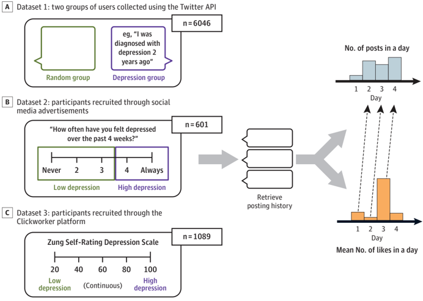
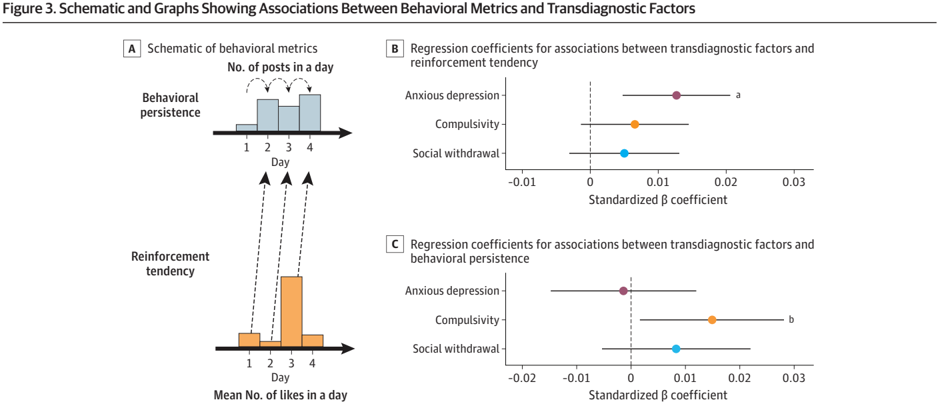

# 2026 - Mirea et al. - The Reinforcement Effect of Social Media Likes in Depression

## JAMAPsychiatry Original Investigation

Dan-Mircea Mirea, PhD; Stephenie Chen, BSE; Jialing Ding, MSc; Kepler Palacio-Soto, BS; Judith N. Mildner, PhD; Sean W. Kelley, PhD; Claire M. Gillan, PhD; Erik C. Nook, PhD; Yael Niv, PhD

Editorial

Multimedia

Supplemental content

Author Affiliations: Department of Psychology, Princeton University, Princeton, New Jersey (Mirea, Nook, Niv); Department of Computer Science, Princeton University (Chen); Princeton Neuroscience Institute, Princeton, New Jersey (Ding, Palacio-Soto, Niv); Department of Psychology, Trinity College Dublin, Dublin, Ireland (Mildner, Kelley, Gillan).

Corresponding Author: Dan-Mircea Mirea, PhD, Department of Psychology, Princeton University, 40Woodlands Way, Princeton, NJ 08540(dmirea@princeton.edu).

(Reprinted)

IMPORTANCE There is growing concern about the impact of social media on mental health. Understanding the psychological processes underlying social media use could lead to greater insight.

OBJECTIVE To investigate individual differences in the effect of social media likes on posting behavior and their association with and specificity to depressive psychopathology.

DESIGN, SETTING, AND PARTICIPANTS This cross-sectional study used longitudinal Twitter behavior to test the association between depressive and other forms of psychopathology and the tendency to be reinforced by likes. The study involved passively scraped Twitter data (dataset 1) or participants recruited online through Twitter ads (dataset 2) and a recruitment platform (dataset 3). In total, the 3 datasets contained over 17 million posts from 7736 Twitter users. These data were analyzed from March 2023 through January 2026.

MAINOUTCOMESANDMEASURES Reinforcement tendency was estimated as the association between previous-day likes and current-day posting. The depression measure varied between datasets: self-disclosure in dataset 1, past 4-week depression severity in dataset 2, and a validated questionnaire in dataset 3. Dataset 3 also included other psychiatric measures used to estimate scores on transdiagnostic symptom scores.

RESULTS Dataset 1 comprised 1045 users who reported a depression diagnosis on Twitter, and 5001 randomly sampled users. Dataset 2 comprised 601 users (mean [range] age, 45.2 years [18-78]; 251 [41.7%] women, 333 [55.5%] men, and 17 [2.8%] individuals with other gender identities). Dataset 3 comprised 1089 users (mean [range] age, 30.8 years [18-68]; 703 [64.6%] women, 358 [32.8%] men, and 28 [2.6%] individuals with other gender identities). Individuals with a depression diagnosis or higher symptoms of depression tended more to be reinforced by likes in all datasets (dataset 1: β = .013; P = .002; dataset 2: β = .026; P = .03; dataset 3 [preregistered]: β = .008, P = .02), despite substantial differences between datasets in depression measurement and composition. In dataset 3, greater reinforcement tendency was specifically associated with a transdiagnostic anxious-depression factor, whereas behavioral persistence was linked to a compulsivity and intrusive thought factor.

CONCLUSIONS AND RELEVANCE In this study, depressive psychopathology was associated with a greater tendency to be reinforced by a type of social reward on Twitter, in contrast to typical laboratory-based findings of blunted reinforcement learning in depression. These findings suggest potential mechanisms linking social media use to worse mental health or vice versa, and emphasize the importance of studying real-world behavior.

JAMAPsychiatry . doi:10.1001/jamapsychiatry.2026.1430 Published online July 8, 2026.

S ocial media plays an increasingly large role in our lives, withover5billionusersgloballyasofJanuary2024. 1 The rapid spread of social media has raised concerns about its impact on mental health. Despite an explosion of research on this topic, findings remain inconclusive. 2 While some reviews and meta-analyses have reported associations betweenfrequentsocialmediauseandpoormentalhealth, 3-5 others have highlighted positive effects, such as increased social support, or a mix of the two. 6-9 Notably, many of these effects have been deemed too small to justify widespread societal concerns. 6,10

Theheterogeneityinthisliteraturelikelyreflectsthecomplexity, variability, and bidirectionality of the findings, 11-13 as well as methodological limitations in prior research. 14 First, most studies have relied on self-reported social media use, 15 whichonlymoderatelycorrelateswithactualuse. 16 Additionally, social media use is often treated as a monolith, with few distinctions past active use (posting) vs passive use (consuming content). To advance the field, researchers have called for morenuancedstudies 17 thatincorporatebehavioraldata 14 and focus on psychological mechanisms that might explain how the design features of social media interact with mental health. 18 Here, we leverage behavioral Twitter data to uncover one promising mechanism-social media reinforcement learning-that we show is robustly associated with depressive psychopathology.

The social rewards that people receive from other users whentheypost-likes, views, shares, or comments-are a central feature of social media, thought to contribute to its addictive nature. 19 Reinforcement learning, a framework for understanding how behavior is shaped by rewards, 20,21 predicts that social rewards should reinforce posting. 22 A higher rate of rewards (eg, more likes per post, on average) should make posting more valuable (ie, more worth the effort and the opportunitycostofgivingupotherrewards),leadinguserstopostmore frequently in the near future. 23 This prediction has been supported in several social media datasets, 24,25 including through computational modeling. 26-28 Moreover, recent evidence suggests that users tend to replicate posts that were rewarded in the past. 25,29

However, little attention has been paid to individual differences in the reinforcing effect of likes, which might be particularly relevant to mental health. For example, more habitual social media users have been shown to be less sensitive to likes, in line with theories of habit formation, 24 and adolescents have been shown to learn faster from likes. 28 However, no study that we are aware of has investigated how social media reinforcement learning is modulated by depression or other psychiatric symptoms, despite extensive research in computational psychiatry linking depression to atypical reward processing. 30-32 Compared with controls, individuals with depression learn more from negative outcomes 31,33 and are more sensitive to effort. 34 Notably, depression has been meta-analytically linked to reduced reward sensitivity, 35 though some studies challenge this link. 36 Ahandful of studies have examined the social domain, finding reduced social learning 37,38 in depression and a link between reduced sensitivity to social rewards and poorer mental health. 39 However,

JAMAPsychiatry Published online July 8, 2026

(Reprinted)

## KeyPoints

Question Is depressive psychopathology linked to differential reinforcement by a type of social reward, namely likes on social media?

Findings In this cross-sectional study using Twitter data, depression was significantly associated with an increased tendency for likes to reinforce posting frequency. This association replicated across 3 datasets with differing sample compositions and depression measures, and was robust to a range of controls.

Meaning In this study, depressive psychopathology was associated with a greater tendency to be reinforced by rewards on social media, a behavioral pattern that might link poor mental health to social media use.

it remains unclear to what extent these findings generalize to rich, real-world social contexts (though see 40,41 who examined how neuroticism and depression modulate reinforcementlearningfromexaminationgrades).Therefore,thestudy of reward processing on social media could both uncover psychological mechanisms linking social media use to mental health, and test the generalizability of laboratory-identified links between mental health and reward processing in realworld settings. 42

Tothis end, we tested whether depression modulates the tendency to be reinforced by social media likes using behavioral data from Twitter. Building on ideas from reinforcementlearning theory, 23 though not directly applying computational models, we quantified reinforcement tendency as the influence of the mean rate of likes in a day on users' next-day posting behavior, and tested its moderation by depression. To ensure the robustness of our findings, we analyzed 3 datasets withdifferentdata-collectionapproachesanddepressionmeasures ( Figure 1 ), including a preregistered replication. 45 In the absenceofclinicianassessment,weusedepressionbroadlyto denote depressive psychopathology, self-reported as a clinicaldiagnosis(dataset1),recentlevelsoffeelingdepressed(dataset 2), or recent depression symptom severity (dataset 3).

## Methods

## Datasets

Weused3datasetswithdifferentdata-collectionstrategiesand measuresofdepression.Dataset1(N = 6046afterfiltering)consisted of a group of Twitter users (n = 1045) who self-disclosed adepression diagnosis via tweets and a group of random users (n = 5001). Note that we labeled this group random rather than control or nondepressed, as the users' depression status is unknown. This dataset was collected entirely by scraping existing data using the Twitter API (ie, without participant recruitment),allowingustoreachamuchlargersamplesizethanwould be feasible otherwise. The procedure and sample size were basedonpreviousrecommendations. 46,47 Dataset2(N = 601after filtering) was an existing dataset 48 comprising Twitter users recruited through Twitter ads, who reported their level of depression in the past 4 weeks on a 5-point Likert scale.

jamapsychiatry.com Weanalyzed 3 Twitter datasets. Dataset 1 (N = 6046) was a fully scraped dataset containing 2 groups of Twitter users: a depression group of users (n = 1045) who disclosed a diagnosis of depression in a tweet and a random group of users (n = 5001). Dataset 2 (N = 601) consisted of participants, recruited through Twitter ads, who self-reported their level of depression in the past 4 weeks on a 5-point Likert scale. Lastly, dataset 3 (N = 1089) consisted of participants recruited mostly through the Clickworker platform, whoself-reported their level of depression using a validated and widely used scale (Zung Self-Rating Depression Scale 43 ). For each user in each dataset, Dataset 3 (N = 1089 after filtering) was an existing dataset 49,50 comprisingusersrecruitedviacrowdsourcing,whocompleted theZungSelf-RatingDepressionScale 43 (avalidateddepression questionnairewithalonghistoryofuse)aspartofalargerquestionnairebatterythathasbeenusedinpreviousstudies. 51 Across datasets, each user's 3200 most recent tweets were retrieved using the Twitter API. Suspected bots, duplicates, infrequent posters, users whohadreceivednolikesandusersindatasets2 and3withoutmentalhealthordemographicinformationwere filtered out, resulting in our final samples (dataset 1: 14 791 435 posts; dataset 2: 1 278 311 posts; dataset 3: 1 341 608 posts). Although the Twitter data are longitudinal in nature, this is a correlational study. Dataset 1 was deemed not human participants research by the Princeton Institutional Review Board (IRB). Datasets 2 and 3 were shared by the teams who collected them according to their institutional guidelines (New York University IRB protocol IRB-FY2022-5783; Trinity College Dublin Department of Psychology Research Ethics Committee, approval ID: SPREC112018-32). All participants in Datasets 2 and 3 provided informed written consent. For more details, see the eMethods and eTable 1 in Supplement 1.

Figure 1. Schematic Showing Data Collection and Processing Pipeline

## Data Preprocessing

Toaccountfordifferences in time zones or circadian rhythms between different users, we defined each user's day empiri-

jamapsychiatry.com weretrieved their history of posts, including retweets, replies, and quote tweets. We binned the posts into days and built models in which the number of posts on a given day was regressed against the mean number of likes per post on the previous day. Note that we do not have the precise timing of likes and therefore consider the likes for each post as received on the day of the post. This is in line with empirical data that suggest that the median half-life of engagement with a tweet (including likes) is approximately 80 minutes. 44 See Methods for further details.

cally by identifying their least active hour and binning posts into daily (24-hour) intervals. For each day, we calculated the total number of posts, the mean likes per post, and the like countofthemostlikedpost,applyingalog(x + 1)transformation to normalize distributions (eMethods in Supplement 1).

## Depression Measures

Depression was measured in different ways across datasets: self-disclosure on Twitter in dataset 1, past 4-week selfreported severity in dataset 2, or the validated Zung SelfRating Depression Scale in dataset 3, which measures current depression symptom severity.

## Factor Analysis

Dataset 3 also included other psychiatric symptom measures (eMethods in Supplement 1), allowing us to test whether our findings generalize beyond depressive symptoms. Following prior methodology, 51 we performed factor analysis with promax rotation using the factanal function in R version 4.1.3 (R Project) and specifying a 3-factor solution, in line with previous factor solutions of this questionnaire battery. 51,52 We verified that factor loadings were similar to previous studies (eFigure 1 in Supplement 1) and subsequently used the same labels: anxious-depression(highestloadings:depressivesymptoms,traitanxiety,apathy),compulsivityandintrusivethought

(Reprinted)

JAMAPsychiatry Published online July 8, 2026

(highest loadings: obsessive-compulsive, alcohol addiction, eating disorder symptoms), and social withdrawal (highest loading: social anxiety). Factor scores were computed using the regression method.

## Statistical Analyses

Linear mixed-effects regression models used the previousday number of likes per post as an independent variable and the current-day number of posts as the dependent variable. The models included per-user random intercepts and slopes for likes, with the random slopes representing individual reinforcement tendency. Depression was included as an interaction term. In within-participant models, all variables that varied within-participant were mean-centered to isolate within-participant relations. Only random slopes were fit in these models, as centering rendered all intercepts close to 0. Whenever specified, we also controlled for previous-day posts (by adding this variable as a regressor) to account for autocorrelation in posting. In transdiagnostic analyses, the coefficient of the autocorrelation term, which quantifies consistency in posting frequency, was used as a measure of behavioral persistence. All models are listed in the eMethods in Supplement 1.

Weuse b for unstandardized and β for standardized coefficients. Standardization was performed by z scoring the independent and dependent variables. 95% CIs were computed using the Wald method. In dataset 3, mean-centered analyses and transdiagnostic analyses were exploratory. We report 2-tailed P values for all preregistered analyses in dataset 3 as we found an opposite main effect than expected.

## Code Availability

Analysis code in R is available in our OSF repository. 45

## Results

## Participant Characteristics

Dataset 1 (N = 6046) comprised 1045 users who reported a depression diagnosis on Twitter, and 5001 randomly sampled users. In dataset 2 (N = 601), 251 (41.7%) were women, 333 (55.4%) were men, 17 (2.8%) were individuals with other genderidentities, and the mean (range) age was 45.2 (18-78) years. In dataset 3 (N = 1089), 703 (64.6%) were women, 358 (32.9%) men, 28 (2.6%) were individuals with other gender identities, and the mean (range) age was 30.8 (18-68) years.

## Social Media Likes Reinforce Posting Behavior MoreStrongly in People With Depression

In dataset 1, an association between likes per post on the previous day and posts on the current day was found ( b = 0.098; 95%CI, 0.091-0.105; P < 2 × 10 -16 ) (eTable 2 in Supplement 1 for model fits). Importantly, this association was higher in the depression group than in the random group ( Figure 2 A) (likes × group interaction: b = 0.035; 95% CI, 0.019-0.052; P = 1.73 × 10 -5 ) (see the eResults in Supplement 1 for associations between depression and posting frequency or mean number of likes). This group difference was robust to mean-

- E4 JAMAPsychiatry Published online July 8, 2026

(Reprinted)

centering (to isolate within-participant variance) and controlling for previous-day posts (Figure 2B) (main effect: β = 0.030; 95%CI,0.026-0.033;likes × groupinteraction:β = 0.013;95% CI, 0.005-0.022; P = .002), and to using only each day's mostliked post in the model (eTable 3 in Supplement 1). Thus, depression was associated with a greater tendency to be reinforced by a type of social media reward. Additionally, in both groups, a subset of users showed a negative association between previous-day likes and current-day posts (Figure 2C).

## Heightened Reinforcement Tendency in Depression Replicates Across Datasets

Dataset 1 suffered from common method bias (as the dependent and independent variables stem from the same behavioral data), selection bias (as users in the depression group chose to disclose their diagnosis on social media), 46 and the lack of a true control group (as the random group likely contained users with depression). Therefore, the study team sought to replicate the findings in 2 additional datasets. In dataset 2, Twitter users recruited through ads reported their recent depression level.

As in dataset 1, more previous-day likes were associated with more current-day posts ( b = 0.042; 95% CI, 0.0290.056; P = 2.22 × 10 -9 ), with a higher reinforcement tendencyinparticipantswithhighlevelsofdepression(Figure2D) (likes × depression level interaction: b = 0.051; 95%CI, 0.0140.089; P = .008). The depression moderation also held whenmean-centering and controlling for previous-day posts (Figure 2E) (β = 0.026; 95% CI, 0.002-0.050; P = .03), though themainassociationwithlikeswasnotsignificant(β = 0.006; 95% CI, -0.002 to 0.015; P = .14). Once again, individual differences were observed, with some participants showing a negative effect of likes (Figure 2F). Parallel results emerged when considering only the most-liked previous-day post (eTable 3 in Supplement 1). Other mental health constructs (overall mental health and loneliness) did not moderate reinforcement tendency, showing its specificity to depression (eFigure 2 in Supplement 1). However, when treating depression as a continuous variable, the likes × depression interaction was not significant (mean-centered and autocorrelationcontrolled analysis: β = 0.004; 95% CI, -0.004 to 0.012; P = .30), possibly due to the item being ordinal, high measurement error when using a single item to assess depression, or insufficient power. To address these concerns, a preregistered replication 45 was conducted using a validated depression measure in dataset 3.

In dataset 3, participants recruited through crowdsourcingcompletedtheZungSelf-ReportedDepressionScale. 43 The association between depression and reinforcement tendency was replicated (Figure 2G) ( b = 0.0018; 95% CI, 0.00040.0032; P = .01). Notably, however, the association between previous-day mean likes and current-day number of posts was negative (β = -0.101; 95% CI, 0.168 to -0.033; P = .003). Theresultsheldwhenmean-centeringandcontrollingforprevious-day posts (Figure 2H) (main effect of likes: β = -0.017; 95% CI, -0.024 to -0.010; P = 1.57 × 10 -6 ; likes × depression interaction:β = 0.008;95%CI,0.001-0.015; P = .02),andwhen only the most-liked post was considered (eTable 3 in Supple-

jamapsychiatry.com jamapsychiatry.com

ment1).Again,therewassubstantialheterogeneity(Figure2I). Participantsinthisdatasetalsoreportedwhethertheyhadbeen diagnosedwithdepressionbyaphysician.Moderationbythis diagnostic measure was directionally consistent but not significant (eTable 4 in Supplement 1), suggesting continuous measuresofsymptomseveritymaybemoresensitive.Insum, depression was associated with a greater tendency to be rein-

A, D, and G, Visualization of associations between the mean number of likes per post obtained on the previous day and the number of posts made on the current day for datasets 1 to 3 (without mean-centering or controlling for previous-day posts to increase interpretability). Thin lines represent individual fits; thick lines represent group-level effects. In D, high depression level represents a response of often or always on a question about the past 4-week level of depression, whereas low is a response of never, rarely, or sometimes. In G, high depression level is 1 SD or more above the mean, low is 1 SD or more below the mean, and medium is within 1 SD above or below the mean. B, E, H, Regression coefficients for within-participant models in all 3 datasets, in which current-day posts are regressed against previous-day likes, moderated by depression. These regression models controlled for the number of posts on the previous day, and all social media variables were mean-centered within participant. In H, depression was z scored and thus the main effect of likes represents the mean effect. C, F, and I, Histograms of the random (individual participant) slopes for the effect of likes (the reinforcement tendency) in each of the models in B, E, and H, respectively. a P < .001. b P < .01. c P < .05.

forced by likes across 3 datasets with substantial differences in data collection and depression measurement methods.

In all 3 datasets, the association between depression and reinforcement tendency was robust to controlling for age and gender, and the data also revealed an association between heightened reinforcement tendency and age. Moreover, mean likes per post positively moderated reinforce-

(Reprinted)

JAMAPsychiatry Published online July 8, 2026

A, Schematic of the 2 behavioral metrics: reinforcement tendency (ie, the (ie, the autocorrelation between current-day and next-day posts).

correlation of current-day likes and next-day posts) and behavioral persistence B, Standardized regression coefficients for the moderation of 3 transdiagnostic factors on reinforcement tendency. The coefficients were not significantly different from 0 for compulsivity and intrusive thought (β = 0.010; 95% CI, -0.003 to 0.022; P = .14) and social withdrawal (β = 0.010; 95% CI, -0.003 to 0.023; P = .14). C, Standardized regression coefficients for the moderation of

menttendency,potentiallyexplainingthemeannegativeeffect of likes in dataset 3 (eResults in Supplement 1). Interestingly, depression was not robustly associated to the tendency to be reinforced by another type of social media reward-retweetswith a significant association observed only in dataset 3 (eResults in Supplement 1).

## Reinforcement Tendency and Behavioral Persistence Map onto Different Transdiagnostic Factors

Psychiatric research has been moving toward multidimensional measures that cross diagnostic boundaries. 53,54 To establish the specificity of these results along such transdiagnosticdimensions,inlinewithpriorwork, 51,52 3transdiagnostic factors (anxious-depression, compulsivity and intrusive thought, and social withdrawal) were derived from the battery of mental health symptom questions in dataset 3. Reinforcementtendencywasspecificallyassociatedwithanxiousdepression(likes × anxious-depression interaction: β = 0.013 95% CI, 0.005-0.021; P = .002) ( Figure 3 B) and not with the other 2 factors, including when mean-centering and controlling for demographics and other moderators (eFigure 3A in Supplement 1). The anxious-depression factor was associated with 3 scales: depression, apathy, and trait anxiety. Similar to the depression scale, apathy and trait anxiety were significantly associated with reinforcement tendency (apathy: β = 0.012; 95% CI, 0.004-0.017; P = .002; trait anxiety: β = 0.008; 95% CI, 0.001-0.014; P = .03). By contrast, behavioral persistence (the autocorrelation betweencurrent-dayand next-dayposting)(Figure 3A) was associated with compulsivity and intrusive thought(Figure3C)(β = 0.015;95%CI,0.0020.028; P = .03) and not with the other 2 factors (although this

JAMAPsychiatry Published online July 8, 2026

(Reprinted)

3 transdiagnostic factors on behavioral persistence. The coefficients were not significantly different from 0 for anxious depression (β = -0.002; 95% CI, -0.015 to 0.012; P = .78) and social withdrawal (β = 0.008; 95% CI, -0.006 to 0.022; P = .24).

a P < .01.

b P < .05.

association did not survive mean-centering and additional controls) (eFigure 3B in Supplement 1).

## Discussion

We investigated whether people with depression are differentially reinforced by a type of social media reward. Across 3 datasets, we found that depression was associated with a greater tendency to be reinforced by likes. This association wasstrikingly consistent in all datasets despite differences in samplecompositionanddepressionmeasures,andwaslargely robust to demographic controls and other moderators, persisting eventhoughlikestendednottoreinforcepostinginparticipants who received fewer likes in general (see eDiscussion in Supplement 1). We also showed heightened reinforcement tendency was specific to an anxious-depression factor. Another compulsivity and intrusive thoughts factor was specifically associated with heightened behavioral persistence, although this association was not robust to further controls.

Our findings add nuance to the existing literature, which generally links depression to blunted reinforcement learning. 35,39 However, previous studies mostly relied on laboratory-based cognitive tasks, where small monetary rewards might not have been motivating enough for participants. Our study examined reward-driven behavior in a realworld environment, where users behave out of their own volition. Thus, our results might be more characteristic of general processing of real-world rewards. Similarly, in the field of emotional reactivity, early laboratory-based work supported a link between depression and reduced emotional reactivity

jamapsychiatry.com to valenced stimuli, 55 but subsequent experience-sampling studies showed heightened emotional reactivity to daily events, life stressors, and peer rejection in depression. 56-58 Thus, our results add to an emerging body of evidence suggesting depression may be associated with heightened, rather than blunted, responses to rewards in the real world. Future studies should integrate both in-laboratory and real-world assessments of reinforcement learning in the same subjects to more directly measure their convergent validity (or divergence) and relationship with depression. 42

Our findings also identify a behavioral trait that links a feature of social media platforms-quantitative social rewards-to depression. While heightened reinforcement by real-world rewards in depression might be domain-general, its effects could be particularly pronounced on social media due to the social nature of these rewards. For example, depression has been associated with increased sensitivity to social exclusion, 59 which might explain reduced posting in response to fewer likes. In line with interpersonal theories of depression that posit increased feedback-seeking, 60 depression has been linked in self-report studies to higher seeking and monitoring of social feedback on social media. 61-63 These links could also be explained through the social compensation hypothesis, 64,65 which suggests that people receiving fewer offline social rewards, including people with depression, 66 use social media as a compensatory source of accessible reward. Thus, our findings may reflect increased subjective value of social media rewards, driven by feedbackseeking motivations or social compensation needs in people with depression.

Given the correlational nature of our study, we cannot infer causal relations. Rather than depression increasing reinforcementtendency,increasedsocialmediareinforcementtendency could worsen depressive symptoms. Indeed, in one study, adolescents reporting using social media for feedbackseekingdevelopedworsesymptomsofdepressionayearlater, 61 potentiallyduetohighrewardsensitivityintensifyingthenegative impacts of social media rewards on mental health. Moreover, studies using self-report, 67 simulated social media environments, 68 andFacebookdata 69,70 suggestthatsocialmedia rewards can signal social support, increase happiness, and reduce loneliness. Conversely, paucity of social reward triggers negative emotions and reduces self-esteem and feelings of belongingness. 68,71,72 This could lead to heightened symptoms of depression in social media users that are strongly reinforced by such rewards.

Lastly, dataset 3 revealed that greater reinforcement tendencygeneralizes across a broader anxious-depression internalizing dimension (and is specific to this dimension), potentially highlighting a shared mechanism of depression and anxietythatisinlinewiththeirhighcomorbidity.Wealsofound a specific association between a compulsivity and intrusive thought dimension and behavioral persistence in posting, a putative indicator of real-world habit tendencies. This finding extends laboratory-based work linking increased habitual behavior to compulsivity, 51,73 and suggests compulsive individuals might be more prone to forming social media habits.

jamapsychiatry.com That said, the reported effects are small-unsurprisingly given noisy real-world digital behavioral data. 42 Such effects can however still be meaningful and are considered key to a replicable and cumulative science. 42,74 Notably, our key finding replicated across 3 heterogenous datasets, suggesting it is robust and generalizable. Over 60% of humans use social media and approximately 4% of people experience depression, 75 henceevenweakassociationsbetweensocialmediareinforcement tendency and mental health may have significant public health consequences.

## Limitations

Our study has several limitations. First and foremost, our results apply only to people with depressive psychopathology who choose to post on social media. This population may not be representative of people with clinical depression. Second, despite the longitudinal nature of our data and withinparticipant behavioral effects, our mental health data were cross-sectional, and we do not know when symptoms began. Assuch,wecannotresolvethecausalrelationshipbetweenbehavior and symptoms, a topic for future research using repeated symptom measures. Third, our findings from Twitter may not generalize to other platforms, such as Instagram or TikTok, which differ in features and usage patterns, including the use of likes, though studies have found similar reinforcement-learning mechanisms on other platforms. 26,28 Fourth, we did not consistently replicate the likes results with retweets, which may reflect a true difference between types of social rewards (likes more directly signaling validation or praise) or statistical limitations (eg, lower variance in retweet effects on posting). Fifth, although our samples were geographically diverse, they consisted mainly of English speakers, and cross-cultural replication is needed. Sixth, all depressionmeasureswereself-reported;clinicianassessmentswould providestrongervalidationofourfindings.Notably,ourstudy cannot distinguish between clinically significant depressive symptoms and constructs such as neuroticism, nor determinewhethergreaterreinforcementtendencyreflectsastable trait or a transient state. Moreover, analyses using binary vs continuousmeasuressometimesyieldeddifferentresults,suggesting that more work is needed to understand the shape of the relationship between depressive psychopathology and reinforcementtendency.Lastly, our regression models do not fully capture the dynamics of reinforcement learning. For example, people learn from prediction errors (the difference between outcomes and expectations) and may vary in their sensitivity to positive vs negative errors. Fitting reinforcementlearning models to social media data could uncover finer associations between psychopathology and computational parameters, 22 for instance by operationalizing reinforcement tendency as a reward sensitivity parameter scaling the magnitude of reward, or as a learning rate parameter, similarly to previous studies. 28,35,36 However, this approach is challenging due to the noisy nature of posting data. 42 Ultimately, the different operationalizations lead to similar behavioral hypotheses: reward increases will be associated with greater behavioralreinforcementinindividualswithgreaterreinforcement tendency.

(Reprinted)

JAMAPsychiatry Published online July 8, 2026

E8

## Conclusions

In this cross-sectional study, we found that individuals with depressive psychopathology showed a greater ten-

## ARTICLE INFORMATION

Accepted for Publication: April 9, 2026. Published Online: July 8, 2026. doi:10.1001/jamapsychiatry.2026.1430

Author Contributions: Dr Mirea had full access to all of the data in the study and takes responsibility for the integrity of the data and the accuracy of the data analysis. Drs Nook and Niv contributed equally. Concept and design: Mirea, Nook, Niv.

Acquisition, analysis, or interpretation of data:

Mirea, Chen, Palacio-Soto, Ding, Mildner, Kelley,

Gillan, Niv, Nook. Drafting of the manuscript: Mirea. Critical review of the manuscript for important intellectual content: Mirea, Chen, Ding, Mildner, Kelley, Gillan, Nook, Niv. Statistical analysis: Mirea. Obtained funding: Mirea, Gillan, Niv. Administrative, technical, or material support:

Palacio Soto, Kelley.

Supervision: Nook, Niv.

Conflict of Interest Disclosures: Dr Gillan reported grants from Research Ireland during the conduct of the study and grants from European Research Council and grants from Health Research Board outside the submitted work. No other disclosures were reported.

Funding/Support: Dr Mirea was supported by a Princeton Precision Health grant. Dr Nook is supported by a NARSAD Young Investigator Grant from the Brain and Behavior Research Foundation and a Princeton Precision Health grant. Dr Niv is supported by the National Institute of Mental Health (R01MH119511).

Role of the Funder/Sponsor: The funders had no role in the design and conduct of the study; collection, management, analysis, and interpretation of the data; preparation, review, or approval of the manuscript; and decision to submit the manuscript for publication.

Data Sharing Statement: See Supplement 2.

Additional Contributions: Wewouldlike to thank Steve Rathje, PhD, and Jay Van Bavel, PhD, NewYork University, for their generous donation of dataset 2.

## REFERENCES

- 1 . DataReportal. Digital 2024: global overview report. Accessed June 2, 2026. https:// datareportal.com/reports/digital-2024-globaloverview-report

- 2 . Valkenburg PM. Social media use and well-being: what we know and what we need to know. Curr Opin Psychol . 2022;45:101294. doi:10.1016/j. copsyc.2021.12.006

- 3 . Cunningham S, Hudson CC, Harkness K. Social media and depression symptoms: a meta-analysis. Res Child Adolesc Psychopathol . 2021;49(2):241-253. doi:10.1007/s10802-020-00715-7

- 4 . Huang C. A meta-analysis of the problematic social media use and mental health. Int J Soc

JAMAPsychiatry Published online July 8, 2026

dency to be reinforced by likes on Twitter. Our results underscore the importance of studying real-world behavior in computational psychiatry and highlights a putative psychological mechanism linking social media use to mental health.

Psychiatry . 2022;68(1):12-33. doi:10.1177/ 0020764020978434

pitfalls, progress, and next steps. Trends Cogn Sci . 2021;25(1):55-66. doi:10.1016/j.tics.2020.10.005

5 . Vahedi Z, Zannella L. The association between self-reported depressive symptoms and the use of social networking sites (SNS): a meta-analysis. Curr Psychol . 2021;40(5):2174-2189. doi:10.1007/ s12144-019-0150-6

- 6 . Godard R, Holtzman S. Are active and passive social media use related to mental health, wellbeing, and social support outcomes? Ameta-analysis of 141 studies. J Comput Mediat Commun . 2024;29(1):zmad055. doi:10.1093/ jcmc/zmad055

- 7 . Hancock J, Liu SX, Luo M, Mieczkowski H. Psychological well-being and social media use: a meta-analysis of associations between social media use and depression, anxiety, loneliness, eudaimonic, hedonic and social well-being. SSRN . Published online April 15, 2022. doi:10.2139/ssrn. 4053961

- 8 . Meier A, Reinecke L. Computer-mediated communication, social media, and mental health: a conceptual and empirical meta-review. Communic Res . 2021;48(8):1182-1209. doi:10.1177/

0093650220958224

- 9 . Yin XQ, de Vries DA, Gentile DA, Wang JL. Cultural background and measurement of usage moderate the association between social networking sites (SNSs) usage and mental health: a meta-analysis. Soc Sci Comput Rev . 2019;37(5): 631-648. doi:10.1177/0894439318784908

- 10 . Orben A, Przybylski AK. The association between adolescent well-being and digital technology use. Nat Hum Behav . 2019;3(2):173-182. doi:10.1038/s41562-018-0506-1

- 11 . Orben A, Dienlin T, Przybylski AK. Social media's enduring effect on adolescent life satisfaction. Proc Natl Acad Sci U S A . 2019;116(21):10226-10228. doi:10.1073/pnas.1902058116

- 12 . Vaid SS, Kroencke L, Roshanaei M, et al. Variation in social media sensitivity across people and contexts. Sci Rep . 2024;14(1):6571. doi:10.1038/ s41598-024-55064-y

- 13 . Valkenburg PM, Meier A, Beyens I. Social media use and its impact on adolescent mental health: an umbrella review of the evidence. Curr Opin Psychol . 2022;44:58-68. doi:10.1016/j.copsyc.2021.08.017

- 14 . Parry DA, Fisher JT, Mieczkowski H, Sewall CJR, Davidson BI. Social media and well-being: a methodological perspective. Curr Opin Psychol . 2022;45:101285. doi:10.1016/j.copsyc.2021.11.005

- 15 . Orben A. Teenagers, screens and social media: a narrative review of reviews and key studies. Soc Psychiatry Psychiatr Epidemiol . 2020;55(4):407-414. doi:10.1007/s00127-019-01825-4

- 16 . Parry DA, Davidson BI, Sewall CJR, Fisher JT, Mieczkowski H, Quintana DS. A systematic review and meta-analysis of discrepancies between logged and self-reported digital media use. Nat Hum Behav . 2021;5(11):1535-1547. doi:10.1038/s41562-02101117-5

- 17 . Kross E, Verduyn P, Sheppes G, Costello CK, Jonides J, Ybarra O. Social media and well-being:

(Reprinted)

- 18 . Orben A, Meier A, Dalgleish T, Blakemore SJ. Mechanisms linking social media use to adolescent mental health vulnerability. Nat Rev Psychol . Published online May 7, 2024. doi:10.1038/s44159024-00307-y

- 19 . Flayelle M, Brevers D, King DL, Maurage P, Perales JC, Billieux J. A taxonomy of technology design features that promote potentially addictive online behaviours. Nat Rev Psychol . 2023;2(3): 136-150. doi:10.1038/s44159-023-00153-4

- 20 . Niv Y. Reinforcement learning in the brain. J Math Psychol . 2009;53(3):139-154. doi:10.1016/ j.jmp.2008.12.005

- 21 . Sutton RS, Barto AG. Reinforcement Learning, Second Edition: An Introduction . MIT Press; 2018.

- 22 . Turner G, Ferguson A, Katiyar T, Palminteri S, Orben A. Old strategies, new environments: reinforcement Learning on social media. Biol Psychiatry . 2025:97(10):989-1001. doi:10.1016/ j.biopsych.2024.12.012

- 23 . Niv Y, Daw ND, Joel D, Dayan P. Tonic dopamine: opportunity costs and the control of response vigor. Psychopharmacology (Berl) . 2007; 191(3):507-520. doi:10.1007/s00213-006-0502-4

- 24 . Anderson IA, Wood W. Social motivations' limited influence on habitual behavior: tests from social media engagement. Motiv Sci . 2023;9(2):107. doi:10.1037/mot0000292

- 25 . Gurjar O, Bansal T, Jangra H, Lamba H, Kumaraguru P. Effect of Popularity Shocks on User Behaviour. Proceedings of the International AAAI Conference on Web and Social Media. 2022;16:253-263. doi:10.1609/icwsm.v16i1.19289

- 26 . Lindström B, Bellander M, Schultner DT, Chang A, Tobler PN, Amodio DM. A computational reward learning account of social media engagement. Nat Commun . 2021;12(1):1311. doi:10.1038/s41467-020-19607-x

- 27 . Turner G, Gunschera LJ, Subrahmanya S, et al. Acomputational model of reward learning and habits on social media. Accessed June 2, 2026. https://osf.io/xe25k

- 28 . da Silva Pinho A, Céspedes Izquierdo V, Lindström B, van den Bos W. Youths' sensitivity to social media feedback: a computational account. Sci Adv . 2024;10(43):eadp8775. doi:10.1126/sciadv. adp8775

- 29 . Brady WJ, McLoughlin K, Doan TN, Crockett MJ. How social learning amplifies moral outrage expression in online social networks. Sci Adv . 2021;7 (33):eabe5641. doi:10.1126/sciadv.abe5641

- 30 . Chen C, Takahashi T, Nakagawa S, Inoue T, Kusumi I. Reinforcement learning in depression: a review of computational research. Neurosci Biobehav Rev . 2015;55:247-267. doi:10.1016/ j.neubiorev.2015.05.005

- 31 . Eshel N, Roiser JP. Reward and punishment processing in depression. Biol Psychiatry . 2010;68 (2):118-124. doi:10.1016/j.biopsych.2010.01.027

32 . Halahakoon DC, Kieslich K, O'Driscoll C, Nair A, Lewis G, Roiser JP. Reward-processing behavior in depressed participants relative to healthy

jamapsychiatry.com volunteers: a systematic review and meta-analysis. JAMAPsychiatry . 2020;77(12):1286-1295.

doi:10.1001/jamapsychiatry.2020.2139

- 33 . Pike AC, Robinson OJ. Reinforcement learning in patients with mood and anxiety disorders vs control individuals: a systematic review and meta-analysis. JAMAPsychiatry . 2022;79(4):313-322. doi:10.1001/jamapsychiatry.2022.0051

- 34 . Berwian IM, Wenzel JG, Collins AGE, et al. Computational mechanisms of effort and reward decisions in patients with depression and their association with relapse after antidepressant discontinuation. JAMAPsychiatry . 2020;77(5): 513-522. doi:10.1001/jamapsychiatry.2019.4971

- 35 . Huys QJ, Pizzagalli DA, Bogdan R, Dayan P. Mapping anhedonia onto reinforcement learning: a behavioural meta-analysis. Biol Mood Anxiety Disord . 2013;3(1):12. doi:10.1186/2045-5380-3-12

- 36 . Brown VM, Zhu L, Solway A, et al. Reinforcement learning disruptions in individuals with depression and sensitivity to symptom change following cognitive behavioral therapy. JAMA Psychiatry . 2021;78(10):1113-1122. doi:10.1001/ jamapsychiatry.2021.1844

- 37 . Frey AL, Frank MJ, McCabe C. Social reinforcement learning as a predictor of real-life experiences in individuals with high and low depressive symptomatology. Psychol Med . 2021;51 (3):408-415. doi:10.1017/S0033291719003222

- 38 . Safra L, Chevallier C, Palminteri S. Depressive symptoms are associated with blunted reward learning in social contexts. PLoS Comput Biol . 2019; 15(7):e1007224. doi:10.1371/journal.pcbi.1007224

- 39 . Blain B, Pinhorn I, Sharot T. Sensitivity to intrinsic rewards is domain general and related to mental health. Nat Ment Health . 2023;1(9):679691. doi:10.1038/s44220-023-00116-x

- 40 . Villano WJ, Kraus NI, Reneau TR, Jaso BA, Otto AR, Heller AS. Individual differences in naturalistic learning link negative emotionality to the development of anxiety. Sci Adv . 2023;9(1): eadd2976. doi:10.1126/sciadv.add2976

- 41 . Villano WJ, Heller AS. Depression is associated with blunted affective responses to naturalistic reward prediction errors. Psychol Med . Published online February 2, 2024:1-9. doi:10.1017/ S0033291724000047

- 42 . Mirea DM, Nook E, Niv Y. Cognitive modeling of real-world behavior for understanding mental health. Trends in Cognitive Sciences . 2026;30(4): 350-363. doi:10.1016/j.tics.2025.07.009

- 43 . Zung WW. A self-rating depression scale. Arch Gen Psychiatry . 1965;12:63-70. doi:10.1001/ archpsyc.1965.01720310065008

- 44 . Pfeffer J, Matter D, Sargsyan A. The Half-Life of a Tweet. Proceedings of the International AAAI Conference on Web and Social Media. 2023;17:1163-1167. doi:10.1609/icwsm.v17i1. 22228

- 45 . OSF. Depression is associated with higher sensitivity to social media rewards. Accessed June 2, 2026. https://osf.io/u8trw/overview

- 46 . Ernala SK, Birnbaum ML, Candan KA, et al. Methodological gaps in predicting mental health states from social media: triangulating diagnostic signals. in: proceedings of the 2019 CHI Conference on Human Factors in Computing Systems. Accessed June 2, 2026. https://dl.acm.org/doi/epdf/10.1145/ 3290605.3300364

jamapsychiatry.com

- 47 . Bathina KC, Ten Thij M, Lorenzo-Luaces L, Rutter LA, Bollen J. Individuals with depression express more distorted thinking on social media. Nat Hum Behav . 2021;5(4):458-466. doi:10.1038/ s41562-021-01050-7

- 48 . Rathje S, Pretus C, He JK, et al. Unfollowing hyperpartisan social media influencers durably reduces out-party animosity. Accessed June 2, 2026. https://osf.io/preprints/psyarxiv/acbwg_v2

- 49 . Kelley SW, Mhaonaigh CN, Burke L, Whelan R, Gillan CM. Machine learning of language use on Twitter reveals weak and non-specific predictions. Digit Med . 2022;5(1):1-13. doi:10.1038/s41746-02200576-y

- 50 . Kelley SW, Gillan CM. Using language in social media posts to study the network dynamics of depression longitudinally. Nat Commun . 2022;13(1): 870. doi:10.1038/s41467-022-28513-3

- 51 . Gillan CM, Kosinski M, Whelan R, Phelps EA, DawND.Characterizing a psychiatric symptom dimension related to deficits in goal-directed control. eLife . 2016;5:e11305. doi:10.7554/eLife. 11305

- 52 . Rouault M, Seow T, Gillan CM, Fleming SM. Psychiatric symptom dimensions are associated with dissociable shifts in metacognition but not task performance. Biol Psychiatry . 2018;84(6): 443-451. doi:10.1016/j.biopsych.2017.12.017

- 53 . Kotov R, Krueger RF, Watson D, et al. The Hierarchical Taxonomy of Psychopathology (HiTOP): a dimensional alternative to traditional nosologies. J Abnorm Psychol . 2017;126(4): 454-477. doi:10.1037/abn0000258

- 54 . Insel T, Cuthbert B, Garvey M, et al. Research domain criteria (RDoC): toward a new classification framework for research on mental disorders. AmJ Psychiatry . 2010;167(7):748-751. doi:10.1176/ appi.ajp.2010.09091379

- 55 . Bylsma LM, Morris BH, Rottenberg J. Ameta-analysis of emotional reactivity in major depressive disorder. Clin Psychol Rev . 2008;28(4): 676-691. doi:10.1016/j.cpr.2007.10.001

- 56 . Bylsma LM, Taylor-Clift A, Rottenberg J. Emotional reactivity to daily events in major and minor depression. J Abnorm Psychol . 2011;120(1): 155-167. doi:10.1037/a0021662

- 57 . Ha T, van Roekel E, Iida M, Kornienko O, Engels RCME, Kuntsche E. Depressive symptoms amplify emotional reactivity to daily perceptions of peer rejection in adolescence. J Youth Adolesc . 2019;48(11):2152-2164. doi:10.1007/s10964-01901146-4

- 58 . Myin-Germeys I, Peeters F, Havermans R, et al. Emotional reactivity to daily life stress in psychosis and affective disorder: an experience sampling study. Acta Psychiatr Scand . 2003;107(2):124-131. doi:10.1034/j.1600-0447.2003.02025.x

- 59 . Niu GF, Shi XH, Yao LS, et al. Social exclusion and depression among undergraduate students: the mediating roles of rejection sensitivity and social self-efficacy. Curr Psychol . Published online August 3, 2022. doi:10.1007/s12144-022-03318-1

- 60 . Hames JL, Hagan CR, Joiner TE. Interpersonal processes in depression. Annu Rev Clin Psychol . 2013;9:355-377. doi:10.1146/annurev-clinpsy-050212185553

- 61 . Nesi J, Prinstein MJ. Using social media for social comparison and feedback-seeking: gender and popularity moderate associations with

(Reprinted)

depressive symptoms. J Abnorm Child Psychol . 2015;43(8):1427-1438. doi:10.1007/s10802-0150020-0

- 62 . Janssen LHC, Valkenburg PM, Keijsers L, Beyens I. A harsher reality for adolescents with depression on social media. Sci Rep . 2025;15(1): 10947. doi:10.1038/s41598-025-89762-y

- 63 . Fassi L, Ferguson AM, Przybylski AK, Ford TJ, Orben A. Social media use in adolescents with and without mental health conditions. Nat Hum Behav . 2025;9(6):1283-1299. doi:10.1038/s41562-02502134-4

- 64 . Kardefelt-Winther D. A conceptual and methodological critique of internet addiction research: towards a model of compensatory internet use. ComputHumanBehav . 2014;31:351-354. doi:10.1016/j.chb.2013.10.059

- 65 . WegmannE, Brand M. A narrative overview about psychosocial characteristics as risk factors of a problematic social networks use. Curr Addict Rep . 2019;6(4):402-409. doi:10.1007/s40429-01900286-8

- 66 . Carvalho JP, Hopko DR. Behavioral theory of depression: reinforcement as a mediating variable between avoidance and depression. J Behav Ther Exp Psychiatry . 2011;42(2):154-162. doi:10.1016/j. jbtep.2010.10.001

- 67 . Carr CT, Wohn DY, Hayes RA. as social support: Relational closeness, automaticity, and interpreting social support from paralinguistic digital affordances in social media. Comput Human Behav . 2016;62:385-393. doi:10.1016/j.chb.2016.03.087

- 68 . Voggenreiter A, Brandt S, Putterer F, Frings A, Pfeffer J. The role of likes: how online feedback impacts users' mental health. Accessed June 2, 2026. doi:10.1145/3614419.3643995

- 69 . Marengo D, Montag C, Sindermann C, Elhai JD, Settanni M. Examining the links between active Facebook use, received likes, self-esteem and happiness: a study using objective social media data. Telemat Inform . 2021;58:101523. doi:10.1016/j. tele.2020.101523

- 70 . Seo M, Kim J, Yang H. Frequent interaction and fast feedback predict perceived social support: using crawled and self-reported data of Facebook users. J Comput Mediat Commun . 2016;21(4):282297. doi:10.1111/jcc4.12160

- 71 . Lee HY, Jamieson JP, Reis HT, et al. Getting fewer 'likes' than others on social media elicits emotional distress among victimized adolescents. Child Dev . 2020;91(6):2141-2159. doi:10.1111/cdev. 13422

- 72 . Reich S, Schneider FM, Heling L. Zero likes-symbolic interactions and need satisfaction online. Comput Human Behav . 2018;80:97-102. doi:10.1016/j.chb.2017.10.043

- 73 . Gillan CM, Robbins TW, Sahakian BJ, van den Heuvel OA, van Wingen G. The role of habit in compulsivity. Eur Neuropsychopharmacol . 2016; 26(5):828-840. doi:10.1016/j.euroneuro.2015.12.033

- 74 . Götz FM, Gosling SD, Rentfrow PJ. Small effects: the indispensable foundation for a cumulative psychological science. Perspect Psychol Sci . 2022;17(1):205-215. doi:10.1177/ 1745691620984483

- 75 . World Health Organization. Depressive disorder (depression). Accessed June 2, 2026. https://www.who.int/news-room/fact-sheets/ detail/depression
