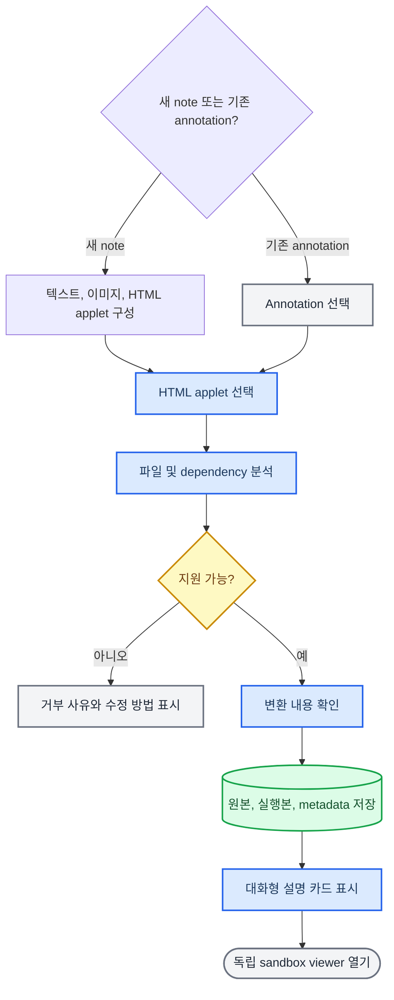

# 외부 Single-file HTML Annotation Sandbox Viewer 구현 계획

_Claude 등에서 export한 대화형 HTML을 annotation에 첨부하고, 사용자가 명시적으로 선택했을 때만 독립된 sandbox viewer에서 실행하기 위한 구현 계약 — 2026-08-15_

| 항목 | 결정 |
| --- | --- |
| 상태 | Implemented, draft-note composition follow-up added 2026-08-15 |
| 대상 앱 | Learnie / Electrobun `1.18.1` |
| 1차 입력 형식 | UTF-8 `.html` 또는 `.htm` 단일 파일 |
| 실행 위치 | RPC와 preload가 없는 별도 sandbox `BrowserWindow` |
| 네트워크 정책 | 실행 중 완전 차단 |
| 저장 정책 | DB에는 metadata만, 원본과 실행본은 project의 annotation asset으로 저장 |
| 기존 Visual IR | 유지. 외부 HTML과 병합하거나 대체하지 않음 |

---

## 📌 결론과 핵심 결정

이 기능은 기술적으로 구현 가능하다. 다만 HTML을 현재 React DOM에 삽입하거나 메인 window의 iframe에서 바로 실행하는 방식은 채택하지 않는다. import한 파일은 신뢰할 수 없는 실행 코드로 취급하고, annotation에는 코드 자체가 아닌 첨부 metadata만 연결한다. 실제 실행은 사용자가 `대화형 설명 열기`를 누른 뒤 RPC와 preload가 없는 별도 sandbox `BrowserWindow`에서만 허용한다.

1차 버전의 핵심 결정은 다음과 같다.

- 새 annotation kind를 만들지 않고 기존 note, question, highlight 등 어느 annotation에도 붙을 수 있는 범용 `attachments` 구조를 추가한다.
- 새 note를 만들 때는 annotation을 먼저 저장하도록 강제하지 않는다. 작성 화면에서 텍스트, 붙여넣은 이미지, HTML applet을 동등한 입력으로 조합하고 셋 중 하나 이상이면 저장할 수 있다.
- `material_annotations`에는 `attachments_json` column을 추가한다. 기존 kind `CHECK` 제약은 변경하지 않는다.
- 원본 HTML은 보존하고, 검증과 dependency localization을 거친 별도의 `runnable.html`만 실행한다.
- 실행용 window에는 RPC와 preload를 제공하지 않고 `sandbox`, CSP의 opaque origin, 전면 navigation 차단을 적용한다. Electrobun의 sandbox mode에서는 RPC가 비활성화된다.[^1]
- HTML은 자동 실행하지 않는다. annotation card에서 사용자가 명시적으로 열 때만 renderer process와 window를 생성한다.
- arbitrary CDN을 허용하지 않는다. 완전 자급형 HTML 또는 앱이 정확한 버전과 hash를 알고 있는 dependency만 import 단계에서 localize한다.
- applet은 학습 진도, mastery, tutor context에 영향을 주지 않는다. 1차 버전에서는 applet과 host app 간 메시지 통신도 제공하지 않는다.

이 구조는 현재의 안전한 `SideChatVisualSpec`과 역할이 다르다. Visual IR은 모델 출력으로부터 자동 생성해 메인 UI에서 안전하게 렌더링할 수 있는 bounded data이고, 외부 HTML attachment는 사용자가 직접 가져온 임의 코드다. 두 경로의 신뢰 수준을 섞지 않는 것이 가장 중요한 설계 원칙이다.

## 🔎 실제 샘플과 현재 구조 분석

### Claude export 샘플

검토 대상은 `/Users/anselm/Downloads/hh-gating-na-vs-k.html`이다.

| 검사 항목 | 결과 | 설계상 의미 |
| --- | --- | --- |
| 파일 크기 | 10,557 bytes, 208 lines | 기본 import 제한보다 훨씬 작음 |
| SHA-256 | `1e224e19b6693cdeb6edea25a9d4ce2a9015565e66ce4d9a8ffb40a33aa51779` | 회귀 fixture와 변조 검증 기준으로 사용 가능 |
| HTML 구조 | inline CSS, canvas, slider, inline JavaScript | sandbox에서 동작 가능한 전형적인 applet |
| 외부 dependency | `Chart.js@4.4.1` UMD를 jsDelivr에서 로드 | 현재 상태로는 엄밀한 offline single-file이 아님 |
| 네트워크 API | `fetch`, XHR, WebSocket 사용 없음 | Chart.js만 localize하면 offline 실행 가능 |
| host 접근 표현 | `parent`, `top`, `opener`, `postMessage` 사용 없음 | 샘플은 단순하지만 신뢰 근거로 삼지는 않음 |
| 고위험 embed | iframe, object, embed, form 없음 | 1차 compatibility policy를 통과할 수 있음 |

이 샘플은 지원 가능한 첫 사례다. importer가 정확히 `https://cdn.jsdelivr.net/npm/chart.js@4.4.1/dist/chart.umd.min.js`를 인식하고 검증된 로컬 Chart.js 코드로 대체하면 네트워크 없이 실행할 수 있다. 샘플 내부의 주석도 offline 사용 시 Chart.js를 내려받아야 한다고 명시한다.

### 현재 Learnie 구조

| 현재 구성 | 확인된 동작 | 변경 방향 |
| --- | --- | --- |
| `src/shared/side-chat-visual.ts` | JSON expression tree만 허용 | 그대로 유지 |
| `src/bun/annotation-service.ts` | 모델에게 HTML, SVG, CSS, JavaScript를 반환하지 말라고 명시 | 그대로 유지 |
| `material_annotations.kind` | SQLite `CHECK`로 6개 kind 제한 | kind를 늘리지 않음 |
| `result_json` | note/question 결과를 저장 | 실행 attachment와 분리 |
| note image asset | annotation별 project 폴더에 바이너리 저장 | 경로 규칙과 transaction pattern 재사용 |
| `annotations.json` | material annotation snapshot | attachment metadata만 포함 |
| document/project transfer | material directory를 재귀 복사 | applet asset도 자연스럽게 포함 |
| readable annotation export | note image만 asset으로 복사 | external HTML export 추가 필요 |
| 메인 `BrowserWindow` | RPC가 연결된 신뢰된 app view | 외부 HTML을 절대 여기서 실행하지 않음 |

## 🎯 목표와 비목표

### 목표

- 사용자가 note 작성 중이거나 저장된 annotation을 관리할 때 Claude/GPT 등에서 export한 HTML 파일을 첨부할 수 있게 한다.
- import 전에 compatibility와 dependency를 분석해 실행 가능 여부를 설명한다.
- 원본 파일을 손실 없이 보존하고 실행용 snapshot은 별도로 만든다.
- 사용자가 annotation에서 applet을 선택했을 때 독립된 window로 연다.
- applet 코드가 메인 renderer RPC, filesystem, project DB, provider key에 접근하지 못하게 한다.
- 실행 중 외부 네트워크 요청, navigation, popup, download, nested frame을 차단한다.
- 앱 재시작, project bundle 복구, document/project transfer 후에도 attachment를 복원한다.
- 삭제, 교체, export를 원자적이고 예측 가능하게 처리한다.
- macOS와 Windows의 native renderer에서 동일한 보안 조건을 자동·수동 검증한다.

### 비목표

- Learnie가 모든 학습 material의 applet을 AI로 자동 생성하는 기능
- HTML, CSS, JavaScript 편집기나 개발자 콘솔 제공
- React/TSX/JSX, npm install, build step, dev server 지원
- 여러 파일 또는 ZIP web app, ES module graph, WebAssembly, Web Worker 지원
- 임의 CDN, remote image, API, analytics, font 요청 허용
- applet이 host에 점수, 진도, mastery, 정답 여부를 전달하는 protocol
- tutor가 applet 내부 상태를 읽거나 applet을 자동 조작하는 기능
- transcript 또는 source 본문에 applet을 inline으로 실행하는 기능
- import한 코드를 안전한 코드로 “sanitize했다”고 보장하는 기능

## 🧭 사용자 흐름



### Import 진입점

- 저장된 annotation card의 overflow menu와 annotation 상세 화면에 `HTML applet 가져오기`를 추가한다.
- draft side-chat에는 직접 첨부하지 않는다. 먼저 annotation으로 저장한 뒤 import하도록 한다.
- 처음에는 annotation당 external HTML 1개만 허용한다. 데이터 모델은 배열을 사용해 다중 attachment 확장이 가능하게 한다.
- Bun process가 file picker를 열고 `.html,.htm`만 선택하도록 한다. renderer가 임의의 local path를 RPC parameter로 전달하지 않는다.

### Compatibility 확인 화면

사용자가 파일을 선택하면 즉시 저장하지 않고 다음 정보를 보여준다.

| 표시 항목 | 예시 |
| --- | --- |
| 제목 | `Na와 K 채널 게이트 동역학` |
| 원본 파일 | `hh-gating-na-vs-k.html` |
| 크기 | `10.3 KB` |
| 실행 판정 | `변환 후 실행 가능` |
| dependency 처리 | `Chart.js 4.4.1을 검증된 로컬 사본으로 포함` |
| 차단되는 기능 | `네트워크, 새 창, 다운로드, host 통신` |
| provenance | `외부 HTML · 사용자가 직접 가져옴` |

판정은 `ready`, `ready_after_localization`, `rejected` 세 가지로 제한한다. 경고만 표시하고 위험 기능을 그대로 실행하는 중간 상태는 두지 않는다.

### Annotation 표시

저장 후 annotation에 작은 `대화형 설명` attachment card를 붙인다.

- 제목, 원본 파일명, import 시각, offline 여부를 표시한다.
- 주 동작은 `열기`, 보조 동작은 `원본 내보내기`, `교체`, `삭제`로 구성한다.
- 코드를 preview하거나 자동으로 실행하지 않는다.
- applet이 누락되거나 hash가 맞지 않으면 `파일이 손상되었거나 이동 중 누락됨` 상태를 표시하고 실행을 차단한다.
- keyboard focus, screen reader label, loading state, window open failure를 포함한다.

### Viewer 동작

- 별도 native window를 열고 OS title bar에 applet 제목을 표시한다.
- 기본 크기는 `min(1180px, 화면 폭 - 96px)` × `min(820px, 화면 높이 - 96px)`로 하되 최소 `720 × 520`을 보장한다.
- viewer는 자체 scroll을 사용하며 applet document의 전체 폭과 높이를 보존한다.
- native overlay는 viewer viewport 전체만 담당하므로 source/chat의 scroll, collapse, clipping과 좌표를 동기화하지 않는다.
- 동시에 하나의 external HTML viewer만 유지한다. 다른 applet을 열면 기존 viewer를 닫고 새 viewer를 연다.
- window를 닫으면 ephemeral partition과 runtime token을 폐기한다.
- applet 내부의 `window.close()` 동작에 의존하지 않는다. 항상 별도 viewer의 OS close control로 종료할 수 있어야 한다.

## 🏗 신뢰 경계와 실행 아키텍처

### Process 경계

| 구성요소 | 신뢰 수준 | 책임 | 금지 사항 |
| --- | --- | --- | --- |
| Main React view | 신뢰됨 | attachment metadata 표시, 사용자 동작 요청 | raw HTML 수신·삽입·실행 금지 |
| Bun import service | 신뢰됨 | file picker, 검증, 변환, hash, 저장 | renderer가 준 path 신뢰 금지 |
| Project asset store | 데이터 | original/runnable/manifest 보관 | executable path를 DB에 저장 금지 |
| Runtime server | 신뢰됨 | 짧은 수명의 token URL과 보안 header 제공 | 범용 file server로 사용 금지 |
| Sandbox viewer window | 신뢰되지 않음 | applet 실행과 native window chrome | RPC, preload, same-origin 권한, navigation 금지 |

### 권장 실행 순서

1. renderer가 `annotationId`와 `attachmentId`만 RPC로 보낸다.
2. Bun service가 DB에서 annotation 소유 관계와 project/material을 다시 확인한다.
3. `manifest.json`, DB metadata, `runnable.html`의 hash를 모두 대조한다.
4. runtime server가 cryptographically random한 일회성 token을 발급한다.
5. exact runtime URL만 허용하는 navigation rule과 `sandbox: true`를 함께 지정해 별도 `BrowserWindow`를 생성한다.
6. 생성 직후 public `setNavigationRules` API로 같은 allowlist를 다시 적용해 이후 navigation도 차단한다.
7. sandbox window가 token URL을 직접 load한다.
9. runtime server는 CSP와 보안 header를 붙여 `runnable.html`을 응답하고 token을 해당 viewer에 묶는다.
10. viewer 종료 시 window, token, in-memory bytes, event listener를 제거한다.

현재 Electrobun `1.18.1`의 `BrowserWindow` option에는 `partition`이 없다. 대신 응답 CSP의 `sandbox allow-scripts`에서 `allow-same-origin`을 제외해 applet을 opaque origin으로 실행하고 persistent storage 접근을 막는다. 별도 bundled shell은 native renderer에서 빈 document로 열리는 실제 실패가 확인되어 제거했다.

### Runtime response header

실행 문서는 loopback server에서 다음과 유사한 header로 제공한다. 최종 directive 지원 여부는 Phase 0 spike에서 macOS native renderer와 Windows renderer 양쪽에서 확인한다.

```http
Content-Type: text/html; charset=utf-8
X-Content-Type-Options: nosniff
Cache-Control: no-store
Referrer-Policy: no-referrer
Content-Security-Policy: default-src 'none'; script-src 'unsafe-inline'; style-src 'unsafe-inline'; img-src data: blob:; font-src data:; connect-src 'none'; media-src data: blob:; frame-src 'none'; object-src 'none'; worker-src 'none'; manifest-src 'none'; base-uri 'none'; form-action 'none'; sandbox allow-scripts
```

`script-src 'unsafe-inline'`은 applet 자체의 JavaScript를 실행하기 위해 필요하다. 이것이 안전하다는 의미는 아니며, 안전 경계는 별도 sandbox window, RPC 부재, opaque origin을 만드는 CSP sandbox, network 차단, navigation 차단의 조합이다.

### Runtime server 규칙

- `127.0.0.1`에만 bind한다.
- route는 `/external-html/<128-bit-random-token>`처럼 추측이 어려운 값을 사용한다.
- `GET`과 `HEAD`만 허용한다.
- token은 한 viewer에만 귀속하고 짧은 TTL을 둔다.
- directory listing, query 기반 path, range를 제공하지 않는다.
- response body는 검증이 끝난 `runnable.html` 하나뿐이다.
- Origin, Referer, Host가 기대와 다르면 거부한다. 단, native renderer의 실제 header 동작은 spike에서 기록한다.
- 메인 app의 image/figure asset server와 route나 token namespace를 공유하지 않는다.

### Electrobun 보안 조건

현재 설치 버전은 `1.18.1`이다. 문서상 sandbox mode는 RPC를 끄지만 event emission은 유지한다.[^1] 따라서 다음을 추가 조건으로 둔다.

- viewer window에 메인 app RPC schema나 preload를 전달하지 않는다.
- applet document에서 발생한 message나 custom event를 Bun command로 변환하지 않는다.
- lifecycle에 필요한 native window close/crash event만 수신한다.
- nested webview를 만들 수 있다고 가정하지 않는다. sandbox mode에서는 nested webview가 지원되지 않는다.[^1]
- window 생성 시 exact token URL navigation rule을 함께 전달하고, 생성 직후 public `setNavigationRules` API로 같은 규칙을 재적용한다.
- applet이 `window.opener` 또는 host RPC에 접근할 수 없는지 반드시 공격 fixture로 확인한다.

## 💾 데이터 모델과 저장 형식

### 범용 attachment model

새 kind 대신 `MaterialAnnotation`에 범용 attachment metadata를 추가한다.

```ts
export type AnnotationAttachment = ExternalHtmlAttachment;

export type ExternalHtmlAttachment = {
  kind: "external_html";
  schemaVersion: 1;
  id: string;
  title: string;
  originalFileName: string;
  originalByteSize: number;
  runnableByteSize: number;
  originalSha256: string;
  runnableSha256: string;
  compatibility: "self_contained" | "localized";
  importerVersion: 1;
  dependencies: ExternalHtmlDependency[];
  importedAt: number;
};

export type ExternalHtmlDependency = {
  name: string;
  version: string;
  originalUrl: string;
  bundledAssetId: string;
  sha256: string;
  license: string;
};

export type MaterialAnnotation = {
  // existing fields
  attachments?: AnnotationAttachment[];
};
```

중요한 제약은 다음과 같다.

- absolute path, runtime token, local URL, raw HTML은 metadata에 저장하지 않는다.
- `originalFileName`은 표시용일 뿐 path 계산에 사용하지 않는다.
- attachment ID는 Bun process가 생성한다.
- `schemaVersion`과 `importerVersion`으로 이후 변환 규칙 변경을 추적한다.
- DB row와 manifest의 metadata가 다르면 실행하지 않고 repair 대상으로 표시한다.

### DB migration

`material_annotations`에 다음 column을 추가한다.

```sql
ALTER TABLE material_annotations
ADD COLUMN attachments_json TEXT NOT NULL DEFAULT '[]';
```

이 migration은 기존 kind `CHECK` table을 재작성하지 않아도 된다. 변경 범위는 다음과 같다.

- `MaterialAnnotationRow`에 `attachments_json` 추가
- `rowToAnnotation`, insert, replace, update query에서 attachments 직렬화
- 기존 row는 `[]`로 읽기
- 잘못된 JSON은 빈 배열로 fallback하되 sync warning을 남기기
- `annotations.json` snapshot에는 portable metadata만 기록

### Project asset layout

```text
<project-root>/<project-id>/materials/<material-id>/annotation-assets/<annotation-id>/
├── <existing-note-image-id>.png
└── external-html/
    └── <attachment-id>/
        ├── original.html
        ├── runnable.html
        ├── manifest.json
        └── licenses/
            └── chart.js.txt
```

`manifest.json`에는 DB metadata의 복사본, import policy version, transform 목록, 각 파일 hash를 기록한다. `runnable.html`은 실행 snapshot이고 `original.html`은 사용자가 가져온 원본이다. 앱 upgrade 때 실행본을 몰래 다시 생성하지 않는다. 재변환은 사용자의 명시적 `호환성 업데이트` 동작으로만 수행한다.

### 원자적 저장

1. project asset directory 내부에 sibling temporary directory를 만든다.
2. `original.html`, `runnable.html`, license, manifest를 `wx`로 기록한다.
3. 기록한 파일을 다시 읽어 hash를 확인한다.
4. directory rename으로 attachment directory를 확정한다.
5. DB transaction으로 `attachments_json`을 갱신한다.
6. `writeMaterialAnnotationsSnapshot`을 실행한다.
7. DB 또는 snapshot 실패 시 새 attachment를 rollback한다.

filesystem과 SQLite를 하나의 진짜 transaction으로 묶을 수 없으므로 단계별 compensating action을 구현한다. startup 또는 project scan에서 DB에는 없고 filesystem에만 남은 temporary/orphan directory를 정리할 수 있어야 한다.

### 교체와 삭제

- 교체는 기존 파일을 overwrite하지 않는다. 새 attachment ID로 import를 완료한 뒤 metadata reference를 교체하고 마지막에 이전 directory를 삭제한다.
- attachment 삭제는 metadata에서 제거한 뒤 snapshot을 쓰고 directory를 삭제한다. 파일 삭제 실패는 sync warning과 cleanup queue로 남긴다.
- annotation 전체 삭제는 기존 `removeAllNoteImageFiles`를 일반화한 `removeAllAnnotationAssets`를 호출한다.
- 열린 viewer의 attachment를 삭제할 때는 먼저 viewer를 닫고 token을 폐기한다.

## 🧪 Import policy와 dependency localization

### 파일 제한

1차 버전의 기본 제한값은 다음과 같다.

| 제한 | 값 | 이유 |
| --- | ---: | --- |
| 원본 HTML | 2 MiB | 비정상 입력과 UI stall 방지 |
| 변환 실행본 | 5 MiB | dependency inline 후 크기 제한 |
| annotation당 applet | 1개 | UX와 lifecycle 단순화 |
| encoding | strict UTF-8 | 플랫폼별 decoding 차이 제거 |
| document | HTML 1개 | multi-file path graph 차단 |
| viewer 동시 실행 | 1개 | CPU·메모리 DoS 제한 |

file extension만 믿지 않고 regular file 여부, byte length, NUL byte, strict UTF-8 decode, HTML root를 확인한다. parser는 `parse5`를 직접 dependency로 선언해 사용하고, transitive dependency에 우연히 의존하지 않는다.

### 즉시 거부할 구성

- `<iframe>`, `<frame>`, `<object>`, `<embed>`, `<portal>`
- `<base>`, meta refresh, form submission
- service worker, Web Worker, SharedWorker, importScripts
- dynamic `import()`, external ES module graph, import map
- WebAssembly와 executable binary/data URL
- popup, download attribute, file input, clipboard, geolocation, media capture
- `http:`, `https:`, `file:`, `ftp:`, custom scheme resource 중 allowlist localization 대상이 아닌 것
- inline event나 일반 inline script 자체는 거부하지 않는다. 그것이 applet의 본체이기 때문이다.

정적 검사는 보안 sandbox를 대체하지 않는다. JavaScript를 regex로 “안전하게 정화”하는 것은 불가능하므로, parser 검사는 compatibility와 defense-in-depth 용도로만 사용한다.

### Dependency registry

외부 dependency는 exact allowlist registry로 관리한다.

```ts
type ExternalHtmlDependencyPolicy = {
  sourceUrl: string;
  name: string;
  version: string;
  bundledAssetPath: string;
  sha256: string;
  licenseAssetPath: string;
  transform: "inline_script" | "inline_style";
};
```

첫 registry entry는 샘플에 필요한 Chart.js로 제한한다.

| 항목 | 값 |
| --- | --- |
| URL | `https://cdn.jsdelivr.net/npm/chart.js@4.4.1/dist/chart.umd.min.js` |
| package | `chart.js` |
| version | `4.4.1` |
| transform | 해당 `<script src>`를 검증된 UMD inline script로 교체 |
| runtime network | 없음 |
| license | bundled license를 attachment export에 포함 |

dependency bytes는 import 시 CDN에서 다운로드하지 않는다. 앱 package에 version과 hash가 고정된 사본을 포함하고, import service가 package asset의 hash까지 확인한 뒤 inline한다. 이렇게 해야 사용자의 import 결과가 네트워크 상태나 CDN의 미래 변경에 좌우되지 않는다.

### Deterministic transform

- 원본은 byte-for-byte 보존한다.
- parser로 DOM tree를 만들고 doctype, head, body를 정규화한다.
- allowlisted external script/style만 고정 bytes로 대체한다.
- remote URL이 하나라도 남으면 실패한다.
- CSP는 runtime response header가 책임지고, 실행본에는 import provenance comment와 원본 hash만 삽입한다.
- 같은 원본, dependency registry, importerVersion이면 같은 `runnableSha256`이 나와야 한다.
- title은 `<title>`에서 가져오되 길이와 control character를 정규화하고 없으면 파일 stem을 사용한다.

## 🔌 RPC와 service API

### Two-phase import

renderer가 local path나 HTML bytes를 다루지 않도록 import를 준비와 확정으로 나눈다.

```ts
export type ExternalHtmlImportPreview = {
  previewId: string;
  annotationId: string;
  title: string;
  originalFileName: string;
  originalByteSize: number;
  status: "ready" | "ready_after_localization" | "rejected";
  dependencies: ExternalHtmlDependency[];
  blockedCapabilities: string[];
  rejectionReasons: Array<{ code: string; message: string }>;
  expiresAt: number;
};
```

```ts
"annotations.prepareExternalHtmlImport": {
  params: { annotationId: string };
  response: ExternalHtmlImportPreview | null;
};

"annotations.commitExternalHtmlImport": {
  params: {
    annotationId: string;
    previewId: string;
    expectedAnnotationUpdatedAt: number;
  };
  response: MaterialAnnotation;
};

"annotations.cancelExternalHtmlImport": {
  params: { previewId: string };
  response: { cancelled: boolean };
};
```

`prepare`는 Bun file picker를 열고 temp area에서 검증한 뒤, 10분 이내의 opaque `previewId`와 metadata만 renderer에 반환한다. `commit`은 preview가 같은 annotation과 현재 app process에 속하는지 확인한다. `expectedAnnotationUpdatedAt`으로 사용자가 preview를 보는 동안 annotation이 바뀐 경우 stale write를 막는다.

### Viewer와 관리 RPC

```ts
"annotations.openExternalHtml": {
  params: { annotationId: string; attachmentId: string };
  response: { opened: true };
};

"annotations.removeExternalHtml": {
  params: {
    annotationId: string;
    attachmentId: string;
    expectedAnnotationUpdatedAt: number;
  };
  response: MaterialAnnotation;
};

"annotations.exportExternalHtmlOriginal": {
  params: { annotationId: string; attachmentId: string };
  response: { exported: boolean; fileName?: string };
};
```

모든 command는 다음을 server-side에서 재검증한다.

- annotation 존재 여부와 attachment membership
- current project/material ownership
- attachment kind와 schemaVersion
- metadata/manifest/file hash 일치
- canonical path가 해당 annotation asset root 아래인지
- symlink가 아니고 regular file인지
- viewer open 전에 executable size가 정책 범위인지

## 🧱 구현 모듈과 변경 지점

| 파일 또는 새 모듈 | 변경 책임 |
| --- | --- |
| `src/shared/artifact-types.ts` | attachment types와 `MaterialAnnotation.attachments` |
| `src/shared/rpc-types.ts` | prepare, commit, open, remove, export RPC |
| `src/bun/project-db.ts` | `attachments_json` migration과 schema |
| `src/bun/annotation-store.ts` | attachment serialization과 optimistic update |
| `src/bun/annotation-assets.ts` | annotation asset root와 공통 삭제/resolve helper |
| `src/bun/external-html-policy.ts` | size, parser, URL, forbidden capability 검사 |
| `src/bun/external-html-dependencies.ts` | exact dependency registry와 hash 검증 |
| `src/bun/external-html-import-service.ts` | picker, preview lifecycle, transform, atomic commit |
| `src/bun/external-html-runtime-server.ts` | tokenized loopback route와 CSP header |
| `src/bun/external-html-viewer.ts` | sandbox window, runtime token, 단일 viewer lifecycle |
| `src/bun/annotation-service.ts` | attachment orchestration, snapshot sync, cleanup warning |
| `src/bun/index.ts` | RPC wiring과 app shutdown cleanup |
| `src/bun/annotation-export-service.ts` | readable export에 original, manifest, license 포함 |
| `electrobun.config.ts` | 검증된 dependency/license asset copy |
| `src/views/main/components/AnnotationExternalHtmlAttachment.tsx` | 공통 attachment card와 import confirmation UI |
| `src/views/main/components/QuestionThreadAnnotationCard.tsx` | question annotation attachment slot |
| `src/views/main/App.tsx` | chat/source annotation action wiring |
| `src/views/main/components/ImmersiveSourceView.tsx` | immersive annotation action wiring |
| `src/views/main/components/WorkspacePages.tsx` | annotation library 상세/관리 action |

note image 전용 `annotation-image-assets.ts`의 path 계산과 annotation 전체 삭제 로직은 공통 `annotation-assets.ts`로 이동한다. 기존 image URL server는 image 표시만 계속 담당하고, executable HTML을 제공하는 runtime server와 합치지 않는다.

## 📦 Snapshot, transfer, export

### Project snapshot과 복구

- `annotations.json`에는 attachment metadata가 포함되지만 raw HTML은 포함되지 않는다.
- project scan에서 snapshot을 DB로 복원할 때 attachment metadata schema를 검증한다.
- asset directory가 없거나 hash가 다르면 annotation 자체를 버리지 않고 attachment에 `syncWarning`을 붙인다.
- filesystem에만 있는 orphan attachment를 자동으로 annotation에 연결하지 않는다.

### Document와 project transfer

현재 transfer가 material directory를 재귀 복사하므로 새 asset directory도 payload에 들어간다. 다만 다음 validation을 추가해야 한다.

- archive extraction 단계에서 path traversal과 symlink를 거부한다.
- transfer manifest/count에 external HTML attachment 수와 bytes를 추가한다.
- import 후 DB metadata, manifest, original, runnable hash를 다시 검증한다.
- tamper된 attachment만 quarantine하고 나머지 project/document import는 계속할 수 있게 한다.
- importerVersion이 현재 앱보다 새로우면 실행하지 않고 upgrade 안내를 표시한다.

### Readable annotation export

annotation readable export ZIP은 applet마다 다음을 포함한다.

```text
assets/<annotation-id>/<attachment-id>/
├── original.html
├── manifest.json
├── README.txt
└── licenses/
    └── chart.js.txt
```

기본 readable export에는 `runnable.html`을 넣지 않는다. 실행본은 Learnie sandbox 정책에 맞춘 내부 snapshot이며, 외부에서 일반 browser로 열 경우 동일한 안전 경계가 없다. 사용자가 명시적으로 `실행본 내보내기`를 요청하는 별도 기능은 후속 범위로 둔다.

## 🛡 Threat model과 방어책

| 위협 | 공격 예 | 주 방어 | 검증 |
| --- | --- | --- | --- |
| Main RPC 탈취 | applet에서 project 삭제 command 호출 | sandbox window, RPC 미주입 | main/scoped RPC 호출 불가 integration test |
| Network exfiltration | `fetch`로 자료 전송 | CSP `connect-src 'none'`, remote URL 제거 | local test server request 0건 |
| Remote script 공급망 | CDN script 변조 | import 시 download 금지, bundled hash allowlist | dependency hash failure test |
| Filesystem 접근 | `file://` read 또는 navigation | URL policy, CSP, navigation block | fixture로 read 실패 확인 |
| Top navigation | main app 또는 external site로 이동 | 독립 window, CSP sandbox, navigation rules | location/meta refresh test |
| Popup/download | 새 창, 자동 파일 저장 | CSP sandbox, rules, forbidden capability policy | popup/download fixture |
| Persistent tracking | cookie/localStorage로 다음 실행 추적 | CSP sandbox opaque origin | reopen 후 storage 비어 있음 |
| CPU/memory DoS | infinite loop, 거대한 canvas | 명시적 실행, 단일 viewer, 크기 제한, 강제 close 가능 | stress fixture와 main UI responsiveness |
| Asset tamper | transfer 후 runnable 교체 | original/runnable/manifest/DB hash 대조 | 1 byte 수정 시 open 거부 |
| Path traversal | 조작된 filename/manifest | ID 기반 canonical path, filename 비신뢰 | `../`, symlink test |
| Stale update | import 중 annotation 변경 | `expectedAnnotationUpdatedAt` 비교 | concurrent update test |
| Orphan leakage | DB 실패 후 파일 잔존 | temp rename, compensating cleanup, startup scan | injected failure test |

무한 loop를 JavaScript 수준에서 완벽히 예방할 수는 없다. 따라서 viewer window는 메인 window와 분리하고 사용자가 OS close control로 강제 종료할 수 있어야 한다. viewer의 hang이 app process 전체로 전파되는지 Phase 0에서 반드시 확인한다. native renderer가 격리를 보장하지 못하면 CEF viewer 사용 또는 해당 platform 기능 비활성화를 release gate로 둔다.

## ✅ 검증 전략

### Unit tests

- strict UTF-8, NUL, extension, regular file, size limit
- title 추출과 filename 정규화
- forbidden element와 protocol 탐지
- exact Chart.js URL/version matching
- allowlisted script의 deterministic inline transform
- 변환 후 remote URL 잔존 검사
- original/runnable/manifest SHA-256 계산
- attachment JSON validation과 unknown schema handling
- canonical path와 symlink/path traversal 차단
- stale `updatedAt` rejection

### Service integration tests

- prepare → commit 성공
- preview expiry/cancel/app restart 후 commit 거부
- file write, DB update, snapshot 단계별 failure rollback
- replace 성공 전 기존 attachment 유지
- delete와 annotation 전체 삭제 시 asset cleanup
- annotations snapshot round trip
- document/project transfer round trip
- readable export에 original, manifest, README, license 포함
- manifest 또는 runnable 1 byte 변조 시 viewer open 거부

### Sandbox integration tests

다음 공격 fixture를 실제 viewer에서 실행한다.

- `fetch`, image beacon, WebSocket, EventSource
- external script/style/font/image
- `window.open`, anchor navigation, meta refresh, form submit
- `file://`, `views://`, app custom scheme 접근
- `localStorage`, cookie, IndexedDB를 저장한 뒤 reopen
- `parent`, `opener`, RPC global, preload global 탐색
- iframe/object/embed/worker/service worker 생성
- infinite timer, busy loop, 대형 canvas

성공 조건은 기능이 단순히 “에러가 남”이 아니라 다음처럼 관측 가능해야 한다.

- test server request count가 0
- main window URL과 DOM이 변하지 않음
- RPC handler invocation count가 0
- 새 native window가 생기지 않음
- reopen한 partition에 storage가 남지 않음
- viewer 종료 후 token URL이 `404` 또는 `410`
- main window가 계속 입력과 scroll에 반응함

### Product QA

- 실제 `hh-gating-na-vs-k.html`을 import해 세 slider와 세 chart가 offline에서 갱신됨
- 원본 파일을 이동하거나 삭제해도 저장된 applet이 실행됨
- 앱 재시작 후 동일 annotation에서 열림
- project/document transfer 후 동일하게 열림
- annotation export에서 original HTML을 복원할 수 있음
- light/dark mode와 관계없이 applet의 자체 style을 그대로 유지함
- 작은 화면에서 viewer가 화면 밖으로 나가지 않고 내부 scroll이 동작함
- keyboard만으로 import, confirm, open, close, remove가 가능함
- screen reader가 attachment 상태와 실패 원인을 읽을 수 있음

### 성능 기준

| 항목 | 목표 |
| --- | ---: |
| 100 KiB self-contained HTML 분석 | 300 ms 이하 |
| Chart.js localization 포함 import 준비 | 700 ms 이하 |
| viewer open to first content | 1.2 s 이하 |
| viewer가 닫힌 상태의 main UI 추가 메모리 | metadata 수준 |
| close 후 viewer process/resource 회수 | 3 s 이내 |

수치는 release gate라기보다 초기 회귀 기준이다. CI machine과 실제 packaged app에서 baseline을 기록한 뒤 조정한다.

## 🚧 단계별 구현 계획

### Phase 0 — Security spike

목표는 저장 UI를 만들기 전에 Electrobun runtime의 실제 격리 성질을 확인하는 것이다.

1. synthetic malicious HTML fixture를 만든다.
2. `sandbox`, no RPC, no preload, opaque origin인 별도 BrowserWindow를 생성한다.
3. initial navigation rule과 생성 직후 재적용되는 rule을 확인한다.
4. applet에서 opener와 host RPC에 접근할 수 없는지 확인한다.
5. tokenized loopback response와 CSP sandbox가 macOS native renderer에서 동작하는지 확인한다.
6. Windows packaged build에서도 같은 검사를 반복한다.
7. busy loop가 main window responsiveness에 미치는 영향을 측정한다.

완료 조건:

- RPC, navigation, network, popup, persistent storage test가 모두 차단된다.
- main view와 viewer의 process/resource 격리가 수용 가능하다.
- 실패 시 CEF viewer 또는 platform gate 중 하나를 결정하고 문서에 기록한다.

### Phase 1 — Data와 import core

1. shared attachment types와 runtime validator 추가
2. `attachments_json` migration과 annotation store round trip
3. 공통 annotation asset path helper 분리
4. HTML parser/policy와 deterministic transform 구현
5. Chart.js 4.4.1 bundled dependency, hash, license 추가
6. prepare/commit/cancel preview lifecycle 구현
7. filesystem/DB/snapshot compensating transaction 구현

완료 조건:

- UI 없이 service test로 실제 샘플을 import할 수 있다.
- DB와 snapshot에 raw HTML이나 absolute path가 들어가지 않는다.
- import 실패가 partial asset이나 broken annotation을 남기지 않는다.

### Phase 2 — Sandbox viewer

1. tokenized runtime server 구현
2. token URL을 직접 여는 별도 sandbox BrowserWindow manager 구현
3. shell 전용 최소 RPC, exact navigation rules, ephemeral partition 적용
4. single viewer lifecycle과 app shutdown cleanup
5. manifest/hash validation 후에만 token 발급
6. malicious fixture integration suite 구성

완료 조건:

- 실제 샘플의 interactivity가 offline에서 정상 동작한다.
- threat model의 sandbox integration test를 통과한다.
- close 후 runtime token과 viewer resource가 회수된다.

### Phase 3 — Annotation UX

1. 기존 annotation card 공통 attachment slot 추가
2. import picker와 compatibility confirmation modal 구현
3. ready, localized, rejected, missing, tampered 상태 UI 구현
4. open, replace, export original, remove action 연결
5. chat, immersive source, annotation library 세 surface에 동일 컴포넌트 적용
6. accessibility와 keyboard flow 검증

완료 조건:

- 사용자가 어느 surface에서든 같은 annotation attachment를 보고 관리한다.
- 파일 선택만으로 실행되지 않고 confirm과 open이 분리된다.
- 실패 원인이 기술 용어 없이도 해결 가능하게 표시된다.

### Phase 4 — Portability와 export

1. project scan/snapshot validation 확장
2. document/project transfer count와 post-import hash verification 추가
3. readable annotation export asset/README/license 추가
4. orphan cleanup과 repair status 구현
5. 구버전 앱에서 unknown attachment가 annotation 전체를 깨뜨리지 않는지 확인

완료 조건:

- transfer/export round trip에서 원본과 hash가 유지된다.
- attachment 손상은 해당 attachment만 격리하고 다른 annotation은 보존한다.

### Phase 5 — Hardening과 rollout

1. packaged macOS와 Windows 수동 QA
2. feature flag `externalHtmlAnnotations` 뒤에서 내부 사용
3. crash, open failure, import rejection 로그를 code 내용 없이 수집
4. sample applet과 malicious corpus로 regression 실행
5. 문서, 사용자 경고, third-party license 최종 검토

완료 조건:

- security checklist와 QA matrix가 release artifact에 첨부된다.
- code, HTML contents, selected text는 telemetry에 기록되지 않는다.
- flag를 끄면 기존 annotation과 Visual IR 기능이 동일하게 동작한다.

## 🗂 작업 순서와 예상 변경 단위

구현 commit은 다음처럼 분리한다.

1. `types(db): add portable annotation attachments`
2. `feat(import): validate and stage external html applets`
3. `feat(viewer): run applets in isolated electrobun sandbox`
4. `feat(ui): manage external html attachments on annotations`
5. `feat(export): transfer and export applet assets`
6. `test(security): add malicious html sandbox coverage`

각 commit은 해당 unit/integration test를 함께 포함한다. Phase 0 spike에서 보안 조건이 성립하지 않으면 Phase 1 이후를 시작하지 않는다.

## ⚖️ 주요 선택지와 기각 사유

| 선택지 | 판단 | 이유 |
| --- | --- | --- |
| React `dangerouslySetInnerHTML` | 기각 | applet script와 main app이 같은 trust boundary에 놓임 |
| main view의 일반 iframe/srcdoc | 기각 | Electrobun RPC와 main document 주변 경계가 불명확하고 inline layout 문제도 큼 |
| source/chat 안의 inline webview | 보류 | native overlay의 scroll, clipping, collapse, focus 동기화 복잡도가 큼 |
| 별도 trusted shell + full-window sandbox webview | 기각 | macOS native renderer에서 bundled shell이 빈 document로 열리는 실제 실패가 확인됨 |
| token URL을 직접 여는 sandbox BrowserWindow | 채택 | RPC 없이 exact navigation allowlist와 CSP opaque origin을 적용할 수 있음 |
| HTML을 `result_json`에 base64 저장 | 기각 | DB/snapshot 팽창, diff/transfer 부담, executable data 혼합 |
| 새 annotation kind `applet` | 1차 기각 | 기존 kind CHECK migration과 모든 filter/UI 경로 변경이 불필요함 |
| annotation 범용 attachment column | 채택 | note/question 등 기존 의미를 유지하고 향후 다른 attachment로 확장 가능 |
| import 시 CDN 다운로드 | 기각 | 재현성과 공급망 안전성이 없음 |
| exact dependency registry | 채택 | 지원 범위와 hash/license를 명시할 수 있음 |

## 🚦 Release gate와 후속 확장

### Release gate

다음 중 하나라도 충족하지 못하면 기능을 기본 활성화하지 않는다.

- packaged macOS와 Windows에서 RPC 접근이 불가능함을 입증
- 모든 network/navigation test가 차단됨을 입증
- busy-loop viewer를 사용자가 닫을 수 있고 main UI가 복구됨을 입증
- transfer 후 hash 검증과 tamper 차단
- Chart.js bundled asset의 version, hash, license 확정
- raw HTML이 log, DB, annotations.json, React state에 들어가지 않음

### 후속 확장 후보

1차 버전이 안정된 뒤에만 다음을 검토한다.

- annotation당 여러 applet
- vetted dependency registry 확대
- ZIP 기반 multi-file package와 manifest standard
- applet screenshot/thumbnail의 별도 sandbox 생성
- 제한된 host bridge를 통한 `reset`, `theme`, `resize` 메시지
- authoring tool이 직접 export할 수 있는 Learnie Applet Package 포맷

host bridge가 필요해지면 임의 `postMessage`를 전달하지 않고 versioned schema, direction별 allowlist, payload size limit, no command execution 원칙으로 별도 threat model을 작성해야 한다. 학습 진도 연동은 그 이후에도 독립된 product decision으로 남긴다.

## 🏁 완료 정의

기능은 다음 조건을 모두 만족할 때 완료로 본다.

- 실제 Claude export 샘플을 annotation에 import할 수 있다.
- Chart.js dependency가 network 없이 localize되고 slider/chart가 정상 작동한다.
- import 분석 이후에도 사용자의 명시적 `열기` 전에는 sandbox window를 만들거나 applet을 실행하지 않는다.
- 실행은 별도 sandbox viewer window에서만 일어나며 main RPC, preload, network, navigation, popup, persistent storage가 없다.
- annotation 삭제·교체·snapshot·project/document transfer·readable export가 일관된다.
- 손상 또는 최신 버전 incompatibility가 annotation 전체 손실로 이어지지 않는다.
- 기존 `SideChatVisualSpec`, note image, question thread, annotation export regression이 없다.
- security integration suite와 packaged app QA 결과가 기록되어 있다.

[^1]: [Electrobun BrowserView documentation](https://github.com/blackboardsh/electrobun/blob/main/docs/src/content/docs/electrobun/apis/browser-view.mdx) — sandbox mode, HTML loading, partition, RPC limitation.
[^2]: [Electrobun webview tag documentation](https://github.com/blackboardsh/electrobun/blob/main/docs/src/content/docs/electrobun/apis/browser/electrobun-webview-tag.mdx) — sandboxed webview navigation rules and isolation options.
