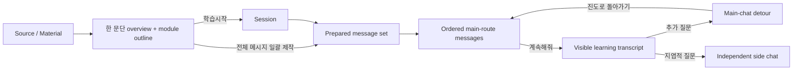
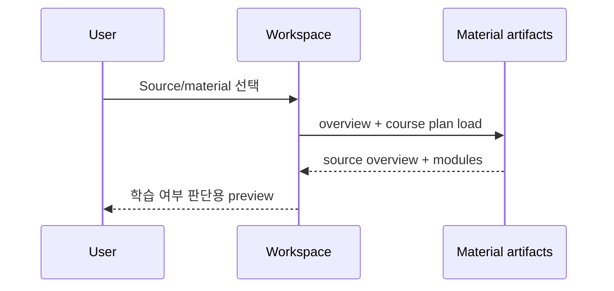
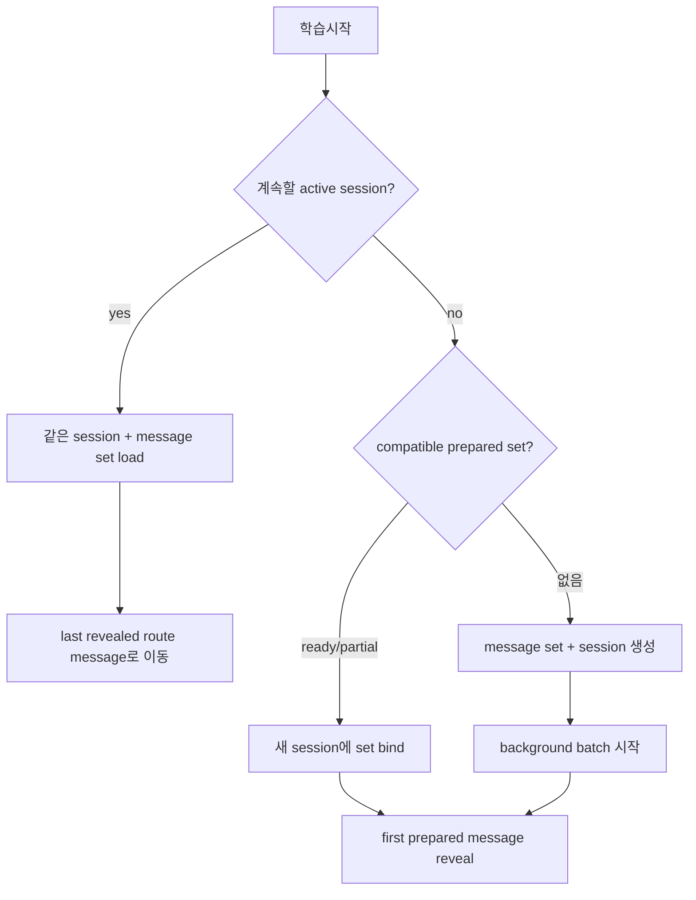

# Learning Flow Modification Plan

## 0. 문서 목적과 결정 상태

이 문서는 Learnie의 학습 흐름을 `chunk 중심의 즉석 진행`에서 `미리 제작된 message route 중심의 interactive learning`으로 전환하기 위한 구현 계약이다.

이번 변경의 핵심은 단순히 버튼 하나를 없애는 것이 아니다.

- source를 선택한 뒤 학습 여부를 판단하는 preview 단계가 먼저 온다.
- 학습의 본진은 순서가 정해진 prepared learning messages다.
- session은 prepared message set을 소비하면서, 실제로 본 메시지와 detour를 기록한다.
- module과 chunk는 content organization과 source grounding을 위한 구조로 남지만, learner가 직접 조작하는 최소 navigation 단위는 message가 된다.
- detour, side chat, module 이동은 prepared route를 삭제하거나 무효화하지 않는다.

이 문서는 계획만 다룬다. 구현은 포함하지 않는다.

## 1. 확정된 제품 결정

### 1.1 Navigation

- `다음 대목으로` 버튼을 제거한다.
- 기본 전진은 `계속해줘` 한 가지로 통합한다.
- `계속해줘`는 현재 source chunk를 직접 조작하지 않고, 현재 session에 연결된 prepared message set에서 다음 unread message를 reveal한다.
- 다음 prepared message가 다음 chunk 또는 다음 module에 속하면 그 경계는 backend가 자연스럽게 넘는다.
- detour 상태에서는 `진도로 돌아가기`가 다음 prepared message를 reveal하면서 본진 route로 복귀한다.
- module 목록과 `다음 모듈로` 동작은 명시적인 module jump/resume 용도로 남길 수 있다. 단, module 이동은 어느 prepared message도 삭제하지 않는다.

### 1.2 Prepared messages

- 일괄 제작된 메시지는 임시 cache가 아니라 `prepared learning material`이다.
- model, prompt policy, learning level, source/material, generation 당시 annotation context가 같다면 재사용한다.
- detour 질문, side chat, session load, module 이동은 prepared message set의 유효성을 깨지 않는다.
- context가 달라져 새 prepared material이 필요하면 기존 것을 삭제하지 않고 새 version을 만든다.
- 이미 시작한 session은 자신이 시작할 때 연결된 prepared message set에 고정된다.

### 1.3 Session

- session은 계속 필요하다.
- session은 다음을 소유한다.
  - 어느 prepared message set을 학습 중인지
  - 어느 prepared message까지 실제로 reveal했는지
  - module별 마지막 학습 위치
  - main transcript의 user 질문과 detour tutor 응답
  - session에 귀속되는 annotation과 interaction history
  - completion/archive 상태
- 같은 source라도 model 또는 generation context가 다르면 다른 prepared message set과 다른 session을 가질 수 있다.

### 1.4 수동 `전체 메시지 일괄 제작`

- 이 버튼은 “지금 학습 시작” 버튼이 아니다.
- source/material을 미리 준비해 두기 위한 background action이다.
- 버튼을 눌러도 learning workspace에 tutor message를 표시하지 않는다.
- 현재 보고 있거나 학습 중인 다른 source/session을 교체하지 않는다.
- 생성은 background에서 계속되고, user는 다른 source를 읽거나 다른 session을 학습할 수 있다.

## 2. 현재 구조와 목표 구조의 차이

### 현재 구조

- material을 선택하면 `coursePlan.subtitle`와 module grid만 표시한다.
- `학습시작`은 session을 만들고 첫 tutor turn을 즉석 생성한다.
- `전체 메시지 일괄 제작`도 session이 없으면 session을 만들고 첫 message를 visible로 표시한다.
- prepared와 visible message가 모두 `learning_messages`에 들어가고 같은 `ordinal` 공간을 공유한다.
- explicit chunk/module progression은 `discardPreparedFuture()`를 호출한다.
- `다음 대목으로`, `다음 모듈로`, `계속해줘`가 동시에 있어 진행 의미가 중복된다.
- one-step prefetch와 full batch가 서로 다른 next-message 후보를 만들 수 있다.

### 목표 구조



중요한 ownership은 다음과 같다.

| 대상 | 소유 범위 | 변경/삭제 규칙 |
|---|---|---|
| Source overview | material artifact | material이 재생성될 때 version 갱신 |
| Prepared message set | material + generation context | immutable version, 자동 삭제 금지 |
| Prepared message | prepared message set | route position 고정 |
| Session progress | session | reveal할 때만 전진 |
| Main transcript | session | 실제로 보인 route message와 detour만 기록 |
| Side chat | side-chat thread | main route와 cursor에 영향 없음 |
| Annotation | material 또는 session scope | scope에 따라 공유/격리 |

## 3. UX Design Brief

### 3.1 Feature summary

Learnie는 긴 source를 학습하려는 자기주도 학습자에게, 먼저 source의 전체 윤곽을 보여주고 학습 여부를 결정하게 한다. 학습을 시작하면 미리 만들어지는 안정적인 main route를 message 단위로 따라가되, 사용자는 언제든 detour 또는 side chat으로 세부 내용을 탐색하고 원래 흐름으로 즉시 돌아올 수 있다.

### 3.2 Primary user action

source preview를 읽고 `학습시작`을 선택한 뒤, `계속해줘`로 prepared route를 한 message씩 소비하는 것이 primary action이다.

### 3.3 Design direction

- 현재 screenshot의 차분한 editorial 학습 화면을 유지한다.
- source title, one-paragraph overview, module outline 순으로 읽히는 문서형 hierarchy를 사용한다.
- 학습 전 preview와 학습 중 transcript를 시각적으로 명확히 구분한다.
- background generation은 존재감을 과장하지 않고, 학습을 막지 않는 상태 정보로만 보인다.
- 모든 버튼을 같은 강도로 만들지 않는다. preview의 primary action은 `학습시작`, secondary action은 `전체 메시지 일괄 제작`이다.

### 3.4 Layout strategy

source/material 선택 직후 workspace의 reading order는 다음과 같다.

1. source title
2. 예상 학습 시간과 source 범위 같은 짧은 metadata
3. source 전체를 설명하는 한 문단 overview
4. module outline
5. `학습시작` primary action

`전체 메시지 일괄 제작`은 source preview의 secondary action 또는 source/material row의 quick action으로 제공한다. 다른 source를 학습하는 동안 다음 source를 준비할 수 있어야 하므로 topbar의 현재 workspace state에만 종속시키지 않는다.

### 3.5 Key states

| 상태 | workspace에 보여줄 것 | 허용 action |
|---|---|---|
| material 없음 | source 선택 안내 | source 선택/import |
| preview 준비됨 | overview + modules | 학습시작, 미리 제작 |
| prepare-only 생성 중 | preview 유지, 작은 progress/status | 다른 source/session 이동, 중지 |
| 앱 재시작 후 복구 중 | 저장된 완료 수와 `이어서 준비 중` 상태 | 평소처럼 다른 source/session 사용 |
| prepare-only 일부 완료 | preview 유지, 준비된 message 수 | 학습시작, 생성 재개 |
| prepared set 완료 | preview 유지, 준비 완료 표시 | 학습시작 |
| 새 학습 시작 중 | first message skeleton/status | workspace 이탈 가능 |
| active session | last revealed message 중심 transcript | 계속해줘, 질문, module 이동 |
| detour | detour transcript + 복귀 action | 추가 질문, 진도로 돌아가기 |
| side chat | 별도 thread/panel | main route에 영향 없이 질문 |
| generation 실패 | 실패 단계와 재개 가능 여부 | 재시도, partial 사용 |
| incompatible version 존재 | 기존 session/version 보존 | compatible set 사용 또는 새 session 시작 |

### 3.6 Interaction model

- preview scroll과 module scan만으로 학습 전 판단이 가능해야 한다.
- `학습시작`을 누르면 compatible prepared set을 재사용하거나 새 set 생성을 시작한다.
- 첫 route message가 준비되는 즉시 그 message만 reveal하고, 나머지 생성은 background로 계속한다.
- `계속해줘`는 next prepared message가 있으면 즉시 reveal한다.
- 다음 message가 아직 생성 중이면 해당 한 건을 기다리되, 다른 UI 사용은 막지 않는다.
- main composer 질문은 detour로 기록하고 route pointer를 움직이지 않는다.
- `진도로 돌아가기`는 새로운 main-route 답변을 LLM에 다시 묻지 않고 prepared next message를 reveal한다.
- module jump는 target module의 session별 next unread message로 이동한다.
- 이전 module로 돌아오면 그 module에서 마지막으로 reveal한 다음 message부터 재개한다.

### 3.7 Content requirements

- overview: 한 문단, 권장 3~6문장, source의 주제·핵심 긴장·범위·학습 가치 포함.
- overview는 generic subtitle인 `Source-grounded adaptive learning material`을 대체하는 실제 source 설명이어야 한다.
- generation status는 `준비 중 12/48`, `48개 메시지 준비됨`, `18개 준비됨 · 이어서 만들 수 있음`처럼 구체적으로 표시한다.
- 오류는 무엇이 실패했고 partial prepared material을 사용할 수 있는지를 함께 알려준다.
- `discard`, `stale`, `fingerprint` 같은 내부 용어는 learner-facing copy에 노출하지 않는다.

### 3.8 Implementation references

- interaction state와 focus: `impeccable/reference/interaction-design.md`
- preview hierarchy와 module layout: `impeccable/reference/spatial-design.md`
- generation/error microcopy: `impeccable/reference/ux-writing.md`

### 3.9 Open questions with recommended defaults

구현을 멈출 정도의 미결 사항은 없다. 다음 default로 진행한다.

- multi-source material overview는 선택된 sources 전체의 공통 범위와 차이를 한 문단으로 요약한다.
- compatible prepared set이 여러 개면 가장 최근에 완성된 것을 `학습시작`의 default로 사용한다.
- active session이 있으면 새 session을 암묵적으로 만들지 않고 해당 session을 계속한다. 별도 `새로 시작` action에서만 새 session을 만든다.
- source/module annotation은 material scope, generated message annotation은 session scope를 기본으로 한다.

## 4. Source preview 개편

### 4.1 Overview artifact 추가

현재 `CoursePlan`에는 title, generic subtitle, audience, estimated time, modules만 있다. 여기에 source-specific overview를 artifact로 추가한다.

권장 type:

```ts
type MaterialOverview = {
  paragraph: string;
  sourceChunkIds: string[];
  generatedAt: string;
  generatorVersion: string;
};
```

저장 방식은 다음 둘 중 하나로 구현할 수 있으나, ownership은 material artifact여야 한다.

- `course_plan.json`의 `overview` field
- 별도 `material_overview.json`

권장은 별도 `material_overview.json`이다. module plan 재구성과 overview 재생성을 독립시킬 수 있고, 기존 course plan schema의 책임이 불필요하게 커지지 않는다.

### 4.2 Overview generation policy

- source 전체 chunk를 근거로 생성한다.
- 단순 첫 문단 복사나 module title 나열로 대체하지 않는다.
- source에 없는 평가나 과장된 학습 효용을 만들지 않는다.
- overview에 사용한 대표 chunk id를 저장해 source grounding을 검사할 수 있게 한다.
- 기존 material에는 lazy backfill을 허용하되, preview를 열 때 UI를 오래 막지 않는다.
- backfill 중에는 module outline을 먼저 표시하고 overview 자리에 paragraph skeleton을 사용한다.

### 4.3 Preview UI

현재 `App.tsx`의 `session ? ... : artifacts ? empty-state` branch를 source preview component로 분리한다.

권장 component:

```text
SourceLearningPreview
  SourceHeader
  MaterialOverview
  ModuleOutline
  PreviewActions
  PreparationStatus
```

module 목록은 지금처럼 한눈에 훑을 수 있게 유지하되, overview가 module grid보다 먼저 읽혀야 한다.

## 5. Prepared material과 session의 분리

### 5.1 핵심 변경

prepared message를 더 이상 `learning_messages`에 저장하지 않는다.

현재처럼 prepared와 visible transcript가 같은 table/ordinal을 공유하면 다음 문제가 반복된다.

- detour insert를 위해 미래 ordinal을 계속 이동해야 한다.
- discarded row가 visible ordinal을 가로막는다.
- module 이동이 transcript mutation으로 변질된다.
- prepare-only가 session을 강제로 만들고 workspace를 바꾼다.
- 하나의 prepared route를 session lifecycle과 독립적으로 관리하기 어렵다.

목표 구조에서는 immutable prepared message set과 mutable session transcript를 분리한다.

### 5.2 새 table: `learning_message_sets`

```sql
CREATE TABLE learning_message_sets (
  id TEXT PRIMARY KEY,
  material_id TEXT NOT NULL REFERENCES learning_materials(id) ON DELETE CASCADE,
  status TEXT NOT NULL CHECK (status IN
    ('queued', 'generating', 'interrupted', 'waiting_for_provider',
     'paused', 'partial', 'ready', 'failed', 'cancelled', 'superseded')),
  provider TEXT NOT NULL,
  model TEXT NOT NULL,
  tutor_language TEXT NOT NULL,
  learning_level TEXT NOT NULL,
  material_fingerprint TEXT NOT NULL,
  annotation_snapshot_hash TEXT NOT NULL,
  prompt_version TEXT NOT NULL,
  generation_context_hash TEXT NOT NULL,
  total_messages INTEGER NOT NULL DEFAULT 0,
  completed_messages INTEGER NOT NULL DEFAULT 0,
  next_route_index INTEGER NOT NULL DEFAULT 0,
  generation_owner_id TEXT,
  lease_expires_at INTEGER,
  last_checkpoint_at INTEGER,
  resume_count INTEGER NOT NULL DEFAULT 0,
  error TEXT,
  created_at INTEGER NOT NULL,
  updated_at INTEGER NOT NULL
);

CREATE INDEX idx_learning_message_sets_material_context
  ON learning_message_sets(material_id, generation_context_hash, updated_at DESC);
```

`generation_context_hash`는 다음을 포함한다.

- material/source fingerprint
- provider/model
- tutor language
- learning level
- prompt version
- generation에 반영되는 annotation snapshot hash

API key 존재 여부, 현재 selected module, detour transcript는 prepared content identity에 포함하지 않는다.

`generation_owner_id`와 lease field는 앱 process가 종료된 뒤 남은 `generating` row를 안전하게 회수하기 위한 runtime ownership이다. prepared content identity에는 포함하지 않는다.

### 5.3 새 table: `prepared_learning_messages`

```sql
CREATE TABLE prepared_learning_messages (
  id TEXT PRIMARY KEY,
  message_set_id TEXT NOT NULL REFERENCES learning_message_sets(id) ON DELETE CASCADE,
  route_index INTEGER NOT NULL,
  module_id TEXT NOT NULL,
  module_index INTEGER NOT NULL,
  source_chunk_id TEXT,
  target_event TEXT NOT NULL,
  content TEXT NOT NULL,
  blocks_json TEXT NOT NULL DEFAULT '[]',
  source_refs_json TEXT NOT NULL DEFAULT '[]',
  choices_json TEXT NOT NULL DEFAULT '[]',
  visual_id TEXT,
  state_update_json TEXT,
  route_before_json TEXT NOT NULL,
  route_after_json TEXT NOT NULL,
  created_at INTEGER NOT NULL,
  UNIQUE(message_set_id, route_index),
  UNIQUE(message_set_id, module_id, module_index)
);
```

prepared row는 delivery state를 바꾸지 않는다. session이 소비했는지는 session progress가 소유한다.

### 5.4 `learning_sessions` 변경

```sql
ALTER TABLE learning_sessions ADD COLUMN message_set_id TEXT;
ALTER TABLE learning_sessions ADD COLUMN last_revealed_route_index INTEGER NOT NULL DEFAULT -1;
ALTER TABLE learning_sessions ADD COLUMN last_revealed_message_id TEXT;
ALTER TABLE learning_sessions ADD COLUMN started_at INTEGER;
```

새 session은 특정 `message_set_id`에 pin된다. message set이 나중에 superseded되어도 기존 session은 계속 읽을 수 있다.

### 5.5 module별 progress

module jump와 복귀를 안전하게 지원하기 위해 session별 module pointer를 둔다.

```sql
CREATE TABLE session_module_progress (
  session_id TEXT NOT NULL REFERENCES learning_sessions(id) ON DELETE CASCADE,
  module_id TEXT NOT NULL,
  last_revealed_module_index INTEGER NOT NULL DEFAULT -1,
  last_revealed_message_id TEXT,
  updated_at INTEGER NOT NULL,
  PRIMARY KEY (session_id, module_id)
);
```

global route progress와 module progress를 함께 두는 이유:

- 일반적인 `계속해줘`는 global route 순서를 따른다.
- explicit module jump는 target module의 next unread message를 찾는다.
- 원래 module로 돌아오면 그 module pointer 다음부터 재개한다.
- module jump가 다른 module의 pointer를 수정하지 않는다.

### 5.6 visible transcript 정리

`learning_messages`는 실제로 user가 본 내용만 저장한다.

추가 field 후보:

```sql
ALTER TABLE learning_messages ADD COLUMN origin_prepared_message_id TEXT;
ALTER TABLE learning_messages ADD COLUMN conversation_kind TEXT NOT NULL DEFAULT 'main'
  CHECK (conversation_kind IN ('main', 'detour'));
```

prepared reveal transaction:

1. session과 message set binding을 확인한다.
2. session/module pointer에 맞는 prepared message를 읽는다.
3. prepared content를 새 visible `learning_messages` row로 복사한다.
4. `origin_prepared_message_id`를 기록한다.
5. global/module pointer를 갱신한다.
6. session snapshot을 갱신한다.

visible ordinal은 visible transcript 안에서만 `MAX(ordinal) + 1`을 사용한다. 미래 메시지와 ordinal을 공유하지 않으므로 detour 시 shift가 필요 없다.

## 6. 새 user flow

### 6.1 Source 선택



- session을 자동 load하거나 만들지 않는다.
- preview는 transcript가 아니다.
- existing sessions와 prepared sets 상태는 Inspector에서 별도로 보여준다.

### 6.2 `학습시작`



동작 규칙:

- `학습시작`은 full batch를 자동 시작한다.
- prepare-only로 이미 만들어 둔 compatible set이 있으면 재생성하지 않는다.
- first message가 아직 없으면 그 message 준비 상태만 foreground에 보여주고 나머지 앱은 막지 않는다.
- first message가 준비되면 reveal하고 session을 active learning workspace에 연결한다.
- batch는 source 끝까지 background에서 계속된다.

### 6.3 이전 session 계속하기

- session이 pin한 exact message set을 load한다.
- 새 model이 현재 선택되어 있어도 기존 session의 message set을 자동 교체하지 않는다.
- 마지막 visible transcript를 모두 복원하되, viewport는 `last_revealed_message_id`에 맞춘다.
- selected module도 마지막 main-route message의 module로 복원한다.
- prepared set의 아직 읽지 않은 메시지는 그대로 남아 있어야 한다.
- partial set이었다면 background generation을 이어서 재개할 수 있다.

### 6.4 `계속해줘`

우선순위:

1. current session/message set의 next prepared message가 있으면 즉시 reveal.
2. batch가 그 message를 생성 중이면 그 한 건의 completion을 기다림.
3. batch가 `partial`, `interrupted`, `waiting_for_provider`이면 same message set에서 generation을 재개.
4. provider failure이면 현재 transcript와 prepared prefix를 보존하고 구체적인 recovery action 표시.

`paused` 또는 user가 명시적으로 `cancelled`한 set은 앱이 임의로 자동 재개하지 않는다. user가 `이어서 만들기`를 선택할 때만 재개한다.

`계속해줘`는 더 이상 `paragraph/chunk/module` mode를 받지 않는다. backend route position이 content boundary를 소유한다.

### 6.5 Detour와 복귀

- main composer의 질문은 `conversation_kind = 'detour'`로 visible transcript에 추가한다.
- detour tutor output도 같은 kind로 기록한다.
- session route pointer는 움직이지 않는다.
- detour를 여러 차례 이어도 prepared set은 변하지 않는다.
- `진도로 돌아가기`는 deterministic bridge를 추가한 뒤 next prepared route message를 reveal한다.
- detour 때문에 prepared message를 재생성하지 않는다.

### 6.6 Side chat

- 아주 지엽적인 질문은 main transcript가 아니라 side-chat thread에 저장한다.
- side chat은 session/message set id를 context anchor로 쓸 수 있지만 route pointer를 읽거나 쓰지 않는다.
- side chat 메시지는 `learning_messages.ordinal`에 들어가지 않는다.
- side chat을 닫거나 다시 열어도 main workspace의 last revealed message 위치를 유지한다.

### 6.7 Module 이동

- module 목록 선택과 `다음 모듈로`는 content filter가 아니라 module resume action이다.
- target module에서 이미 읽은 메시지가 있으면 마지막 read position 다음을 준비한다.
- 아직 읽지 않은 module이면 module_index 0부터 시작한다.
- target module을 보고 있는 동안 원래 module의 progress row는 변경하지 않는다.
- 원래 module을 다시 선택하면 그 module의 next unread message부터 계속한다.
- module jump가 global completion을 조작하거나 message set을 supersede하지 않는다.

## 7. `전체 메시지 일괄 제작`의 새 역할

### 7.1 Prepare-only contract

수동 버튼은 다음 contract를 가진다.

```ts
type PrepareMessageSetInput = {
  materialId: string;
  forceNewVersion?: boolean;
};
```

반환값에는 session이 없어야 한다.

```ts
type PrepareMessageSetResult = {
  messageSet: LearningMessageSetSummary;
};
```

- session row를 만들지 않는다.
- workspace `session/context/messages` state를 변경하지 않는다.
- first message를 visible로 만들지 않는다.
- source/material 선택을 바꾸지 않는다.
- 동일 context의 ready/generating set이 있으면 중복 job을 만들지 않는다.

### 7.2 Background job ownership

현재 batch ownership은 `sessionId` 중심이다. 이를 `messageSetId`와 `materialId` 중심으로 바꾼다.

- app-level background job manager가 여러 material의 상태를 관리한다.
- UI push event는 `materialId`, `messageSetId`, progress를 포함한다.
- active workspace가 다른 material이어도 generation이 지속된다.
- source/material list에 준비 상태를 표시해 다음 source가 준비됐는지 확인할 수 있게 한다.
- generation progress는 각 prepared message commit과 같은 transaction에서 checkpoint한다.
- 앱 재시작 시 UI에서 해당 material을 열지 않아도 interrupted job을 찾아 자동 재개한다.

### 7.3 앱 종료와 자동 재개

핵심 원칙은 `앱 종료는 generation cancel이 아니다`이다.

앱이 꺼져 있는 동안 provider 호출을 계속할 수는 없지만, 다음 실행에서는 마지막으로 성공한 prepared message 바로 다음부터 자동으로 일괄 제작을 이어간다. user가 source를 다시 선택하거나 `전체 메시지 일괄 제작`을 다시 누를 필요가 없어야 한다.

#### Message 단위 durable checkpoint

각 route message 생성은 다음 순서로 처리한다.

1. `next_route_index`와 직전 row의 `route_after_json`을 읽는다.
2. 해당 route message 하나를 provider에 요청한다.
3. 하나의 DB transaction 안에서:
   - `prepared_learning_messages(message_set_id, route_index)`를 insert한다.
   - `completed_messages`를 갱신한다.
   - `next_route_index`를 다음 값으로 갱신한다.
   - `last_checkpoint_at`과 lease heartbeat를 갱신한다.
4. transaction commit 이후 다음 message로 넘어간다.

`UNIQUE(message_set_id, route_index)`를 idempotency key로 사용한다.

- provider 응답 전에 앱이 종료되면 같은 route index를 다시 요청한다.
- provider 응답 후 DB commit 전에 종료되면 같은 route index를 다시 요청할 수 있으나 duplicate row는 생기지 않는다.
- prepared row insert와 counter update 사이에 종료되어 progress가 어긋나는 상태를 만들지 않는다.
- resume 시 visible session snapshot으로 route를 다시 추측하지 않고, 마지막 committed prepared row의 `route_after_json`에서 virtual route state를 복원한다.

#### Process lease와 startup recovery

- 앱 시작마다 고유한 `generation_owner_id`를 만든다.
- generating job은 짧은 `lease_expires_at`과 heartbeat를 가진다.
- 정상 종료에서는 best-effort로 자신의 generating jobs를 `interrupted`로 mark한다.
- 강제 종료, crash, 전원 종료처럼 shutdown hook이 실행되지 않아도 다음 앱 instance가 expired lease를 감지한다.
- startup recovery coordinator는 DB/service 초기화 직후 다음을 수행한다.
  1. 현재 instance가 소유하지 않은 expired `generating` set을 `interrupted`로 전환.
  2. `interrupted` set의 material/context가 여전히 읽을 수 있는지 검사.
  3. generation lease를 새 instance로 획득.
  4. `next_route_index`부터 background generation을 자동 재개.
  5. 완료하면 `ready`, 일부만 가능하면 정확한 원인 상태로 전환.
- recovery는 workspace UI mount나 active material 선택에 의존하지 않는다.

#### 재개 우선순위와 동시성

- active session이 곧 소비할 next message가 없는 set을 최우선으로 재개한다.
- 그 다음은 user가 `학습시작`한 set, 마지막은 prepare-only set 순서다.
- provider별 concurrency limit를 지켜 여러 interrupted set이 동시에 폭주하지 않게 한다.
- auto-resume job은 app 전체 `busy`나 tutor composer disabled 상태를 만들지 않는다.

#### Cancel과 interruption 구분

- app 종료/crash: `interrupted`이며 다음 실행에서 자동 재개.
- 일시적 network/provider 문제: retry/backoff 후 `waiting_for_provider`; 조건이 회복되면 자동 재개.
- API key 또는 model 없음: `waiting_for_provider`; 설정 완료 후 자동 재개.
- user가 `중지`를 선택: `paused`; 다음 실행에서도 자동 재개하지 않음.
- user가 명시적으로 version 폐기를 선택: `cancelled` 또는 `superseded`; 자동 재개하지 않음.

#### UI 상태

- startup에서 자동 재개되면 `이어서 준비 중 · 18/65`처럼 마지막 checkpoint를 포함해 표시한다.
- `처음부터 다시 생성`처럼 오해할 표현을 쓰지 않는다.
- 현재 학습 중인 source가 아니면 source/material list의 작은 상태로만 표시한다.
- 정상적으로 재개된 background job 때문에 modal이나 blocking toast를 띄우지 않는다.
- 재개 불가능하면 `18개까지 준비됨 · 모델을 선택하면 이어서 만듭니다`처럼 원인과 recovery action을 함께 보여준다.

### 7.4 중복/새 version 정책

- 같은 `generation_context_hash`의 ready set: 그대로 재사용.
- 같은 hash의 partial/interrupted/waiting set: 마지막 checkpoint부터 이어서 생성.
- 같은 hash의 generating set: 기존 job 상태 표시.
- 다른 hash의 set: 기존 set 보존, 새 version 생성.
- `다시 만들기`는 destructive overwrite가 아니라 새 version 생성이다.

## 8. One-step prefetch 정리

full batch가 primary route generator가 되면 현재 `tutor_prefetches`와 prepared batch가 next-message ownership을 경쟁하게 해서는 안 된다.

권장안:

- active session의 primary next-message source는 오직 bound message set이다.
- one-step prefetch는 migration 기간에만 fallback으로 유지한다.
- message set generation이 active/ready이면 one-step prefetch를 만들지 않는다.
- full batch가 안정화된 뒤 `tutor_prefetches`, `prefetchStatus`, 관련 settings를 제거하거나 side feature로 축소한다.
- `계속해줘`가 어느 candidate를 선택했는지 한 경로로 결정되어야 한다.

## 9. Annotation과 version semantics

현재 annotation은 material 중심이고 일부 chat anchor가 message id를 참조한다. 새 흐름에서는 scope를 명시한다.

### Material annotation

- source view의 highlight, note, lookup
- 같은 material을 사용하는 session 사이에서 공유 가능
- prepared set generation에 반영한다면 annotation snapshot hash에 포함

### Session annotation

- generated learning message 또는 session transcript에 붙인 annotation
- `session_id`와 `anchor_message_id`를 가진다.
- 다른 session에 자동 공유하지 않는다.

### Generation 이후 annotation 변경

- 현재 session의 prepared set을 자동 폐기하지 않는다.
- user가 새 annotation을 반영한 route를 원할 때 `새 prepared version 만들기`를 제공한다.
- 기존 session은 기존 set으로 계속할 수 있다.

## 10. RPC와 shared type 개편

### 제거/축소

```ts
// 제거 대상
"sessions.advance": { mode: "chunk" | "paragraph" | "module" }
```

### 신규/변경 API

```ts
"materials.prepareMessages": {
  params: { materialId: string; forceNewVersion?: boolean };
  response: LearningMessageSetSummary;
};

"materials.messageSetStatus": {
  params: { materialId: string };
  response: LearningMessageSetSummary[];
};

"materials.resumeMessageSetGeneration": {
  params: { messageSetId: string };
  response: LearningMessageSetSummary;
};

"sessions.start": {
  params: { materialId: string; mode: "new" | "continue"; sessionId?: string };
  response: { session: SessionSnapshot; context: TutorContext; messageSet: LearningMessageSetSummary };
};

"sessions.continue": {
  params: { sessionId: string };
  response: { session: SessionSnapshot; context: TutorContext; output: TutorTurnOutput };
};

"sessions.returnToProgress": {
  params: { sessionId: string };
  response: { session: SessionSnapshot; context: TutorContext; output: TutorTurnOutput };
};

"sessions.resumeModule": {
  params: { sessionId: string; moduleId: string };
  response: { session: SessionSnapshot; context: TutorContext; output?: TutorTurnOutput };
};
```

push status는 material/message set 단위로 제공한다.

```ts
"materials.messageSetProgress": {
  materialId: string;
  messageSetId: string;
  status: "queued" | "generating" | "interrupted" | "waiting_for_provider"
    | "paused" | "partial" | "ready" | "failed" | "cancelled";
  completedMessages: number;
  totalMessages: number;
  error?: string | null;
};
```

## 11. UI 변경 목록

### Workspace preview

- generic subtitle를 실제 overview로 교체.
- overview를 module grid 위에 배치.
- preview의 primary action: `학습시작`.
- preview의 secondary action: `전체 메시지 일괄 제작`.
- 기존 prepared set이 있으면 `48개 메시지 준비됨` 상태를 action 근처에 표시.

### Learning workspace

- `다음 대목으로` 버튼 제거.
- normal state에는 `계속해줘`를 primary navigation으로 표시.
- detour state에는 `진도로 돌아가기`를 primary, `계속 질문하기`는 composer로 제공.
- `다음 모듈로`는 secondary jump action 또는 module outline interaction으로 유지.
- 준비 상태 때문에 버튼 focus를 강제로 빼앗지 않는다. ready 상태는 시각/aria status로 전달하되 현재 입력 focus를 유지한다.

### Source/material list

- 각 material에 preparation status 표시.
- 다른 source를 공부하는 중에도 `전체 메시지 일괄 제작` quick action을 실행할 수 있게 한다.
- background job progress가 active workspace를 전환하지 않게 한다.

### Sessions inspector

- session card에 model, message set 생성 시각, prepared/consumed count 표시.
- `계속하기`는 exact bound message set을 복원.
- `새로 시작`은 compatible set을 재사용하거나 새 version을 만든다.

## 12. Data migration과 현재 손상 session 복구

이 변경은 schema 추가만으로 끝내지 않고 기존 data를 안전하게 옮겨야 한다.

### Migration 순서

1. DB backup과 migration version 기록.
2. 기존 `learning_message_batch_runs`를 `learning_message_sets`로 변환.
3. 기존 `delivery_state = 'prepared'` row를 `prepared_learning_messages`로 이동.
4. batch metadata가 있고 fingerprint/cursor가 일치하는 `discarded` row도 자동 삭제하지 말고 복구 후보로 분류.
5. visible row만 `learning_messages`에 남기고 ordinal을 0부터 compact.
6. session을 대응 message set에 bind.
7. visible batch-origin assistant message의 `origin_prepared_message_id`를 가능한 범위에서 연결.
8. session/module progress를 visible message history에서 재구성.
9. migration integrity check 후에만 legacy prepared/discarded columns와 run table을 retire.

### 현재 UNIQUE failure session

- 현재 `discarded`로 남은 future messages는 cursor/settings/material fingerprint가 일치하므로 복구 가능한 prepared route로 취급한다.
- 복구 전 원본 DB를 보존한다.
- visible transcript 0~55는 그대로 유지한다.
- discarded 56~73은 새 prepared table로 옮기고 active session의 next unread route로 연결한다.
- visible ordinal은 0~55로 compact 상태를 확인한다.

## 13. 자동 폐기 금지와 observability

다음 invariant를 코드와 DB에 명시한다.

- detour 때문에 prepared set을 폐기하지 않는다.
- module 선택/이동 때문에 prepared set을 폐기하지 않는다.
- session load 때문에 prepared set을 폐기하지 않는다.
- current model setting이 달라졌다는 이유로 기존 session의 set을 폐기하지 않는다.
- 새 generation context는 새 set을 만들 뿐 기존 set을 mutation하지 않는다.

`discardPreparedFuture()` 같은 광역 mutation helper는 제거한다.

필요하면 audit table을 둔다.

```sql
CREATE TABLE learning_message_set_events (
  id TEXT PRIMARY KEY,
  message_set_id TEXT NOT NULL,
  event_type TEXT NOT NULL,
  reason_code TEXT,
  actor TEXT NOT NULL,
  details_json TEXT NOT NULL DEFAULT '{}',
  created_at INTEGER NOT NULL
);
```

generation failure, cancel, resume, supersede는 이유와 호출 RPC를 기록한다. learner-facing UI에는 내부 용어 대신 복구 가능한 설명을 표시한다.

## 14. Implementation phases

### Phase 0 — Safety baseline와 회귀 테스트

- 현재 UNIQUE ordinal failure를 fixture로 고정.
- `prepared + 여러 detour + module 이동 + 복귀` 시나리오 추가.
- existing stable DB migration용 anonymized fixture 준비.
- data backup/rollback 절차 작성.
- `discardPreparedFuture()` 모든 caller inventory 확정.

완료 조건:

- 현재 오류가 기존 코드에서 재현되고 새 architecture test에서 기대 동작이 명시됨.

### Phase 1 — Source overview artifact와 preview

- `MaterialOverview` schema와 artifact persistence 추가.
- material generation/backfill path 추가.
- `SourceLearningPreview` component 분리.
- overview → modules → actions hierarchy 구현.
- session을 만들지 않고 preview만 표시하는 동작 검증.

### Phase 2 — Prepared message set storage

- `learning_message_sets`, `prepared_learning_messages` table 추가.
- generation context hash 구현.
- batch generator를 session snapshot mutation에서 분리.
- prepared rows를 immutable route asset으로 저장.
- partial/cancel/resume 지원.

### Phase 3 — Session binding과 reveal transaction

- `learning_sessions.message_set_id` 추가.
- `session_module_progress` 추가.
- prepared → visible copy transaction 구현.
- visible transcript ordinal allocator 단순화.
- detour가 prepared storage를 건드리지 않는지 검증.

### Phase 4 — `학습시작` 자동 batch flow

- compatible set lookup.
- 없으면 set 생성 + background generation.
- first message ready 시 reveal.
- existing session resume anchor 복원.
- partial generation continuation.

### Phase 5 — Prepare-only background flow

- material-scoped prepare RPC.
- workspace/session state를 바꾸지 않는 UI action.
- material list와 topbar status.
- 다른 session 학습 중 concurrent generation.
- message 단위 transactional checkpoint와 idempotent route insert.
- process owner/lease/heartbeat.
- startup recovery coordinator와 자동 resume queue.
- clean quit, force quit, crash를 구분하지 않고 복구 가능한 restart recovery.
- user pause/cancel은 자동 resume에서 제외.

### Phase 6 — Message navigation과 module resume

- `다음 대목으로` UI 제거.
- `sessions.advance(mode)`를 `sessions.continue()`로 축소.
- `계속해줘` message reveal 구현.
- `진도로 돌아가기` bridge + reveal 구현.
- module별 resume pointer와 jump 구현.
- module 이동 시 prepared set 불변성 검증.

### Phase 7 — Side chat와 annotation scope 정합성

- side chat storage가 main transcript/ordinal과 분리됐는지 확인.
- material/session annotation scope 명시.
- annotation snapshot 기반 새 message set versioning.
- 기존 session의 pinned set 보존.

### Phase 8 — Legacy path 제거와 polish

- one-step prefetch 경쟁 path 제거 또는 fallback 축소.
- legacy delivery state/batch run cleanup.
- forced focus 제거.
- learner-facing status/error copy 정리.
- accessibility, keyboard navigation, long-source performance 점검.

## 15. Test plan

### Data model

- prepared message set 생성이 session이나 visible transcript를 만들지 않는다.
- 같은 context hash는 기존 set을 재사용한다.
- 다른 model/annotation snapshot은 새 set을 만들고 기존 set을 보존한다.
- visible ordinal은 detour 수와 무관하게 중복되지 않는다.
- migration이 prepared/discarded future를 별도 table로 옮긴다.

### Preview와 start

- source 선택 시 overview가 module 목록보다 먼저 보인다.
- source 선택만으로 session이 생성되지 않는다.
- `학습시작`은 compatible prepared set을 사용한다.
- prepared set이 없으면 자동 generation을 시작한다.
- first message만 보이고 미래 message는 숨겨진다.

### Prepare-only

- 수동 button이 workspace에 message를 출력하지 않는다.
- 다른 source/session으로 이동해도 generation이 계속된다.
- 같은 source button을 다시 눌러도 duplicate job이 생기지 않는다.
- 앱 restart 후 interrupted set을 user action 없이 자동으로 이어서 생성한다.
- source/material을 다시 선택하지 않아도 startup recovery가 실행된다.
- user가 중지한 paused set은 restart 후 자동 재개되지 않는다.

### Navigation

- `계속해줘`를 반복하면 route_index 순서대로 한 message씩 reveal된다.
- chunk 경계는 별도 버튼 없이 통과한다.
- detour 중 prepared pointer가 움직이지 않는다.
- 여러 detour 후 `진도로 돌아가기`가 정확한 next message를 reveal한다.
- module B로 이동해도 module A의 unread prepared messages가 남는다.
- module A로 돌아오면 마지막 학습 위치 다음부터 재개한다.
- completion은 실제 reveal된 unique route messages 기준으로 계산된다.

### Session resume

- restart 후 exact message set과 last revealed message를 복원한다.
- 현재 selected model이 달라도 기존 session content가 바뀌지 않는다.
- viewport가 마지막 main-route message로 이동한다.
- side chat 상태가 main learning pointer를 바꾸지 않는다.

### Failure recovery

- generation 중 provider failure가 prepared prefix와 session을 보존한다.
- retry가 first missing route_index부터 이어진다.
- cancel은 partial set을 삭제하지 않는다.
- invalid data는 silent discard 대신 reason-coded event와 명시적 error를 남긴다.
- N번째 provider 요청 중 정상 종료 후 재실행하면 N번째부터 자동 재개한다.
- N번째 provider 응답 후 DB commit 전 강제 종료되어도 duplicate route row가 생기지 않는다.
- prepared row insert와 `next_route_index` update는 항상 함께 commit된다.
- expired generation lease는 새 app instance 하나만 획득한다.
- 여러 interrupted set이 있어도 configured concurrency limit 안에서 순차/제한 병렬 재개된다.
- API key/model이 없으면 prepared prefix를 보존한 채 waiting 상태가 되고, 설정 완료 후 이어서 생성된다.

## 16. Acceptance criteria

- source/material 선택 직후 한 문단 overview와 module 목록이 함께 보인다.
- `학습시작`은 full message generation을 자동 시작하거나 compatible prepared set을 재사용한다.
- 수동 `전체 메시지 일괄 제작`은 어떤 tutor message도 workspace에 출력하지 않는다.
- 다른 source를 학습하면서 별도의 source message set을 background에서 준비할 수 있다.
- 일괄 제작 중 앱을 종료해도 다음 실행에서 마지막 committed message 다음부터 자동 재개된다.
- 자동 재개는 source 재선택이나 버튼 재클릭을 요구하지 않는다.
- user가 명시적으로 중지한 job만 자동 재개 대상에서 제외된다.
- `다음 대목으로` 버튼이 제거된다.
- 기본 진행은 `계속해줘`로 한 message씩 이루어진다.
- detour 후 `진도로 돌아가기`가 정확한 prepared next message로 복귀한다.
- module 이동은 prepared message를 삭제, discard, stale 처리하지 않는다.
- 이전 module로 돌아오면 그 module의 마지막 학습 위치 다음부터 재개한다.
- 이전 session을 열면 pinned message set과 마지막 진행 message가 복원된다.
- model/annotation context 변경은 새 prepared version을 만들 뿐 기존 session을 손상하지 않는다.
- prepared와 visible transcript가 ordinal namespace를 공유하지 않는다.
- 모든 background generation failure/cancel/supersede는 reason과 caller가 기록된다.

## 17. 구현 시 지켜야 할 금지 사항

- source preview를 tutor message로 위장해 session history에 넣지 않는다.
- prepare-only button에서 session을 자동 activate하지 않는다.
- module 이동을 prepared route 폐기와 연결하지 않는다.
- detour를 main route 재생성 trigger로 사용하지 않는다.
- prepared future를 visible transcript table에 다시 섞지 않는다.
- current global model setting으로 existing session의 message set을 암묵 교체하지 않는다.
- background generation 때문에 workspace 전체 `busy`를 올리지 않는다.
- 앱 종료를 generation cancel로 기록하지 않는다.
- startup recovery를 active workspace/material 선택에 종속시키지 않는다.
- ready 상태가 되었다는 이유로 user의 composer focus를 강제로 빼앗지 않는다.

## 18. 권장 delivery 순서

이 변경은 하나의 거대한 patch로 합치지 않는다.

1. Phase 0~1: regression fixture + overview preview
2. Phase 2~3: prepared store 분리 + session binding
3. Phase 4~5: start flow + prepare-only background flow
4. Phase 6: navigation/module resume
5. Phase 7~8: side chat/annotation 정합성 + legacy cleanup

각 slice마다 다음을 통과해야 다음 단계로 넘어간다.

- `bun run typecheck`
- `bun test`
- migration fixture test
- packaged stable DB copy smoke test
- source A 학습 중 source B background prepare manual smoke
- source B prepare 중 정상 종료/강제 종료 → 앱 재실행 → 자동 resume smoke
- detour → 반복 질문 → 진도 복귀 → module jump → 원래 module 복귀 manual smoke
