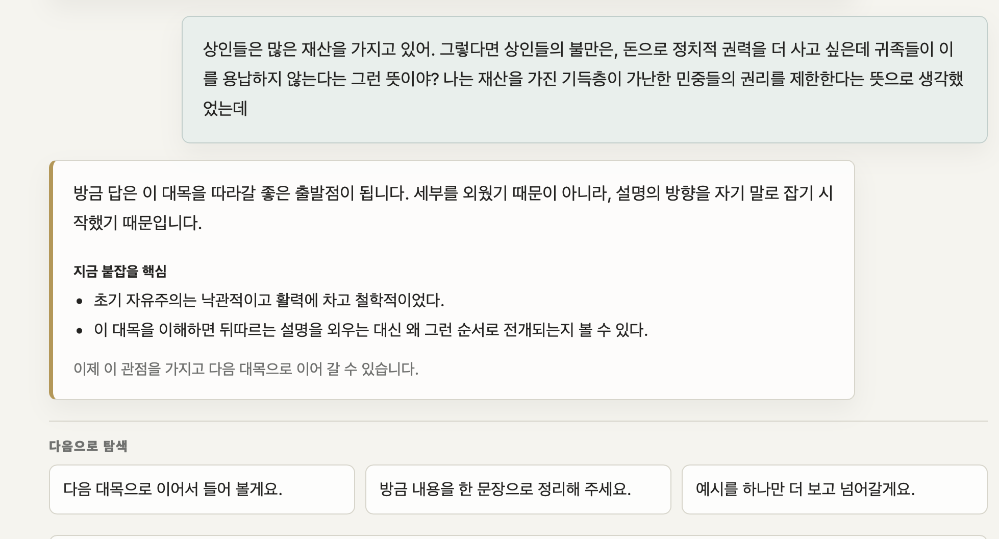
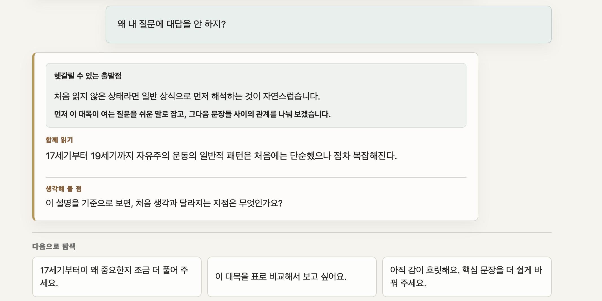
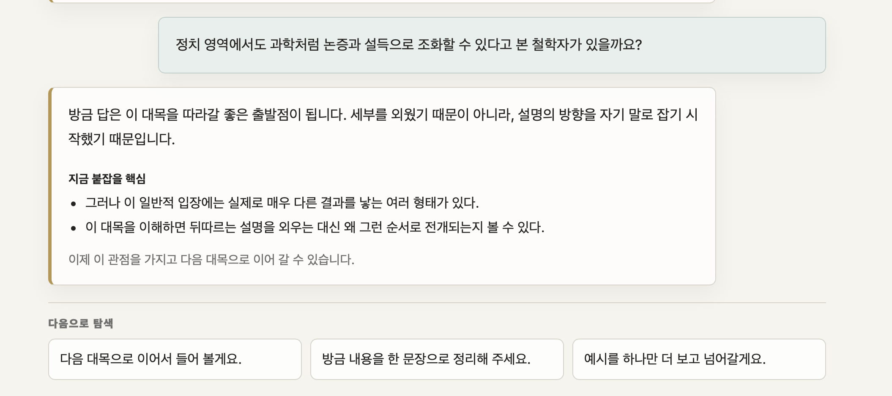
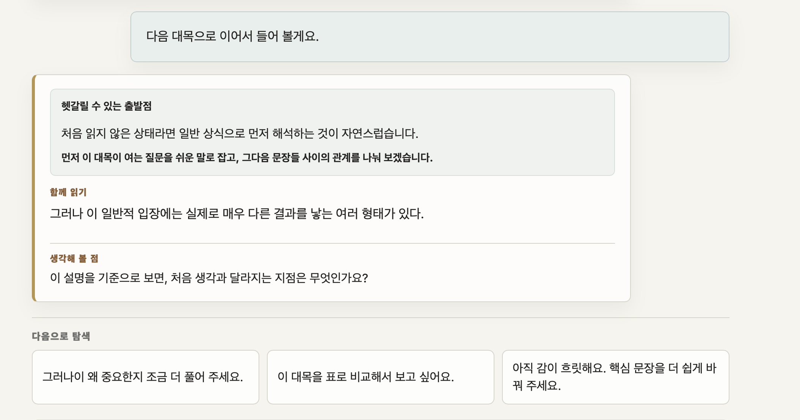
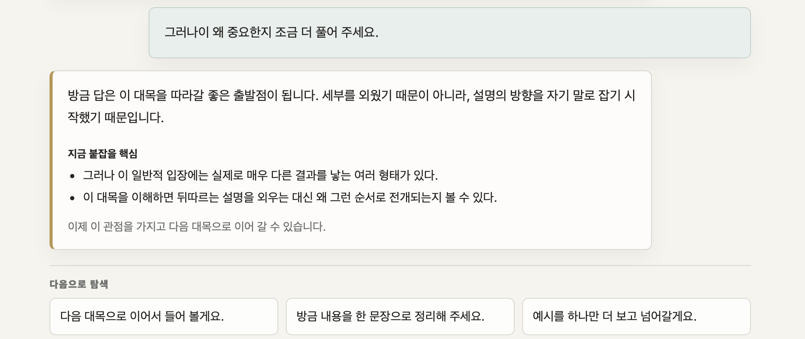
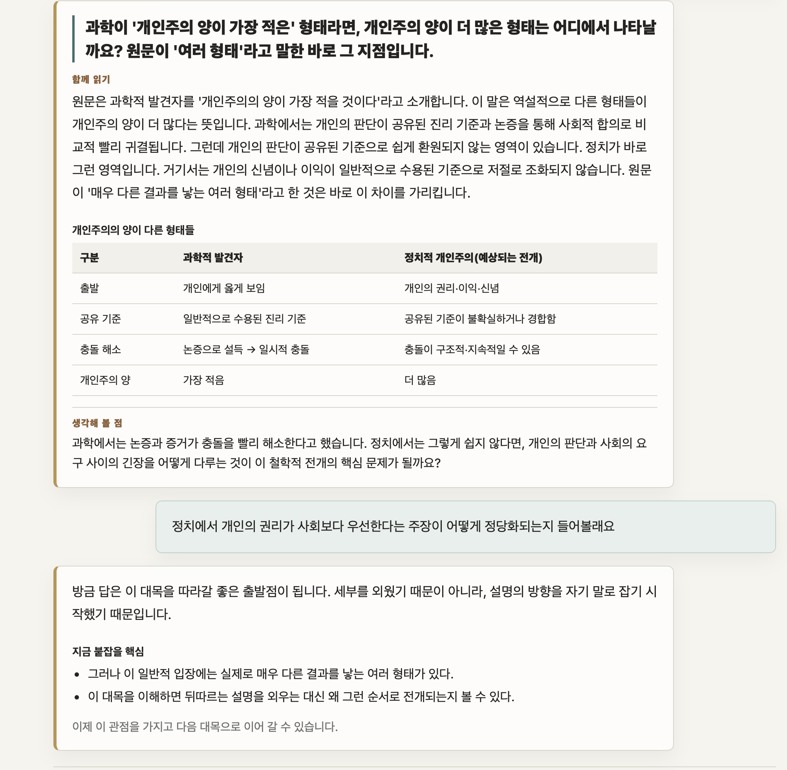

이 대목을 보면 user가 정해진 script에서 벗어나는 질문을 하면, AI가 대답을 회피하면서 다음 대목으로 넘어가려고 얼버무리는 것 같아.

다음 처럼, AI는 노골적으로 user의 질문을 무시하고 있어.

AI는 원문을 context로 삼고, 또한 자신의 지식을 끌어모아서 useR의 질문에 답해야해. user가 어느 정도 만족하다는 표시를 하면, 원래 진도로 다시 돌아가야 하고. 이렇게 중간에 우회하는 것도 허용되어야 해. 현재는 정해진 진도를 직선으로 주행하는  반쪽 Ai 같아. 

어떤 질문을 선택하면 꼭 이런 식으로 답변은 안 하고, 다음으로 넘어가겠다고 해. 이는 어떤 때 나오는 문구이지? 항상 똑같은 대답이니 정해진 문구가 있는 것 같아.

그 다음에 이어지는 것도 AI가 헤매기 시작했다는 징표로 보여

정해진 두 개의 대답을 반복하면서 무한 loop에 빠져버려

내 생각에는 어쨌든 user가 AI가 예상하고 있던 질문 혹은 정해진 보기를 선택하지 않으면 어떻게 진행할지를 모르고 혼란스러워 하는 것 같아.

점점 interaction 이 늘어나면 더 혼란이 심화되는 것 같아.  AI가 기대할 것 같은 정답 보기를 선택해도 여전히 혼란에서 못 벗어나.

