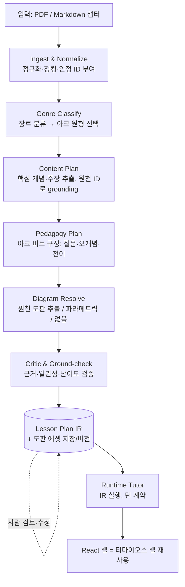

# 범용 인터랙티브 강의 생성기 — 설계 가이드

> 임의의 PDF/마크다운 챕터를 입력하면, 티마이오스 프로토타입과 같은 소크라테스식 인터랙티브 강의를 자동으로 생성하는 시스템의 아키텍처 명세. 실제 구현은 Claude Code에 인계한다. 이 문서는 *무엇을 왜 그렇게* 만들지를 규정하며, 알고리즘 코드는 담지 않는다(데이터 계약과 파이프라인 다이어그램은 명세의 일부로 포함한다).

---

## 0. 프로토타입이 이미 증명한 것

티마이오스 강의는 다섯 조각으로 이루어져 있었다.

1. **원천 텍스트**가 시스템 프롬프트에 박혀 있었다.
2. **강의 아크**(도입→창조의 틀→구체와 회전→비례→시간→정다면체→공간→영혼→평가)를 내가 손으로 설계했다.
3. **여섯 개의 도해**를 손으로 그려 두고, "이 내용을 다룰 때 띄우라"는 트리거 규칙을 붙였다.
4. **턴 계약**(JSON: `message` / `diagram` / `choices` / `progress`)이 런타임의 인터페이스였다.
5. **React 셸**이 그 계약을 받아 렌더링했다.

범용화란 결국 이 다섯 중 **사람이 손으로 한 2·3을 자동화**하는 일이다. 4·5는 그대로 재사용하되 챕터마다 내용이 채워지도록 일반화한다. 따라서 이 시스템의 본질은 "**챕터를 받아 2·3에 해당하는 교수 대본을 데이터로 저작(compile)하는 컴파일러**" + "그 데이터를 실행하는 기존 런타임"이다.

---

## 1. 설계 원칙 (불변식)

이후 모든 결정은 다음 네 원칙에서 파생된다.

- **2단계 분리(compile-time vs run-time).** 강의 저작은 느리고 비싸고 정밀해야 하는 오프라인 작업이고, 튜터링은 빠르고 값싸야 하는 온라인 작업이다. 둘을 한 단계로 섞지 않는다. 모든 무거운 분석·도해 해결·검증은 컴파일 단계에서 끝내고, 런타임은 그 산출물(IR)을 *실행*만 한다.
- **근거성(groundedness).** 강의가 말하는 모든 주장은 원천 텍스트의 특정 단위로 추적 가능해야 한다. 환각 방지와 인용은 부가 기능이 아니라 IR의 1급 속성이다. (이는 작성자의 출처 검증 원칙과도 직결된다.)
- **사람의 개입 가능성(human-in-the-loop).** IR은 사람이 읽고 고칠 수 있는 형태여야 한다. 자동 생성된 아크·질문·도해를 *발행 전에* 검토·수정하는 단계를 구조적으로 허용한다.
- **결정론적 렌더링.** 모델은 도해를 직접 그리지 않는다. 모델은 *데이터*(어떤 템플릿에 어떤 값)를 내고, 결정론적 렌더러가 그 데이터를 그림으로 바꾼다. 티마이오스에서 모델이 SVG를 그리지 않고 6개 키 중 하나만 골랐던 원리를 일반화한 것이다.

---

## 2. 파이프라인 개요



좌측 B→G는 **컴파일러**(챕터당 1회, 강한 모델 허용), 우측 H→U는 **런타임**(턴당, 값싼 모델). 핵심 결정은 이 경계를 IR이 가른다는 것이다.

---

## 3. Lesson Plan IR — 시스템의 심장

IR(중간 표현)은 컴파일러의 산출물이자 런타임의 유일한 입력이며, 사람이 검토하는 대상이다. **이 스키마를 잘 정의하는 것이 이 프로젝트의 8할이다.** 세 층위로 분리한다: *무엇을 가르칠지(content)* / *어떻게 가르칠지(pedagogy)* / *무엇을 보여줄지(media)*. 이 분리 덕에 도해를 바꾸지 않고 아크만, 혹은 아크를 바꾸지 않고 내용만 손볼 수 있다.

아래는 형태(shape)를 보여주는 데이터 계약이며, 구현 코드가 아니다.

```jsonc
{
  "meta": {
    "course_id": "...",
    "source_ref": "russell-hwp/ch-timaeus",      // ScholarWiki 문서 ID 등
    "source_lang": "ko", "teaching_lang": "ko",
    "genre": "expository_conceptual",             // §4의 원형
    "reading_level": "advanced",
    "estimated_minutes": 18,
    "lesson_index": 1, "lesson_total": 1          // 긴 챕터는 여러 lesson으로 분할
  },

  // (A) 근거 단위: 원천을 주소 가능한 조각으로. 모든 주장이 여기로 추적된다.
  "source_units": [
    { "id": "u12", "text": "...", "heading_path": ["플라톤의 우주생성론"] }
    // PDF는 단락/문장 단위, Markdown은 헤딩 경로 + 단락 인덱스로 안정 ID
  ],

  // (B) 용어집: 원어 보존(작성자 선호). 런타임 툴팁/주석에 사용.
  "glossary": [
    { "term": "시간", "original": "χρόνος (chronos)", "gloss": "영원의 움직이는 이미지" }
  ],

  // (C) 강의 비트: 순서 있는 교수 단위. 티마이오스의 '흐름'을 데이터화한 것.
  "beats": [
    {
      "id": "b1",
      "objective": "왜 철학적으로 사소한 대화편이 천 년을 지배했는가의 역설을 인식한다",
      "claims": [
        { "text": "키케로의 라틴역이 중세 서방이 아는 유일한 플라톤이었다",
          "grounds": ["u3", "u4"] }   // ← 근거 ID. 비어 있으면 발행 금지(critic가 차단)
      ],
      "hook_question": "철학적으로 변변찮은 책이 어떻게 가장 큰 영향력을 가질 수 있었을까요?",
      "probe_question": "영향력과 철학적 깊이가 비례하지 않는다면, 무엇이 영향력을 만들까요?",
      "anticipated": [                 // 분기 힌트: 학습자 반응 → 교정/심화
        { "if": "번역/접근성 때문이라 답함", "then": "정확하다고 짚고 제도적 전달로 확장" },
        { "if": "내용이 훌륭해서라 답함", "then": "러셀의 평가절하를 부드럽게 대비시킴" }
      ],
      "diagram": null,                 // 이 비트에서 띄울 도판 id 또는 null
      "transition": "이제 그 영향의 알맹이인 '창조의 틀'로 넘어간다"
    }
    // ... 비트들이 아크를 이룬다
  ],

  // (D) 도판 매니페스트: 런타임은 이 목록에서만 고른다(티마이오스의 enum을 일반화).
  "diagrams": [
    { "id": "d_proportion",
      "kind": "parametric:proportion",          // §5 템플릿 어휘
      "title": "네 원소의 연속 비례",
      "spec": { "terms": ["불","공기","물","흙"], "relation": "continuous_ratio" },
      "depicts": "불:공기=공기:물=물:흙",
      "grounds": ["u20"] },
    { "id": "d_solids_fig3",
      "kind": "source_figure",                   // 원천에서 추출한 실제 도판
      "asset": "assets/ch-timaeus/fig3.png",
      "caption": "다섯 정다면체와 원소 대응",
      "grounds": ["u31","u32"] }
  ]
}
```

런타임 **턴 계약**은 티마이오스와 동일하게 유지하되 근거 추적을 추가한다.

```jsonc
{
  "message": "튜터의 발화(teaching_lang)",
  "diagram": "d_proportion | null",   // 반드시 매니페스트의 id 중 하나
  "choices": ["...", "..."],          // 0~3개
  "progress": 0-100,
  "beat_id": "b4",                    // 현재 비트(진행 추적)
  "citations": ["u20"]               // 발화의 근거(선택)
}
```

---

## 4. 장르 분류와 강의 아크 원형

티마이오스 아크는 '개념 해설형'이라 잘 맞았다. 그러나 **모든 챕터에 같은 아크 모양을 강요하면 안 된다.** 역사 서사 챕터를 "정의→직관→예시"로 가르치면 어색하다. 컴파일러는 먼저 장르를 분류하고, 그에 맞는 **아크 원형(archetype)** 을 골라 비트를 채운다. 한 챕터가 여러 장르를 섞으면 비트 단위로 원형을 혼합한다.

- **개념 해설형(expository_conceptual)** — 정의 → 직관 → 질문 → 정교화 → 사례. *(티마이오스의 기본 골격.)*
- **역사 서사형(historical_narrative)** — 맥락/이해관계 → 긴장 → 인물 → 전환점 → 귀결. *(정신의학사·교리사에 적합.)*
- **논증 재구성형(argument_reconstruction)** — 주장 → 전제 → 추론 → 반론 → 평가. *(철학 논문·당신의 화학적 구속 윤리 원고류.)*
- **비교 대조형(comparative)** — 비교 축 → 입장들 → 상충/교환. *(율리아누스–아우구스티누스 삼자택일 같은 매핑.)*
- **절차/기법형(procedural_technical)** — 목표 → 단계 → 각 단계의 이유 → 함정. *(방법론·임상 프로토콜.)*

아크 원형은 비트의 *기본 형판*만 제공하고, 실제 질문·오개념·전이는 Content/Pedagogy Plan 단계에서 챕터 내용으로 채운다.

---

## 5. 도해 해결 전략 (가장 까다로운 부분)

손으로 6개를 그리던 일을 자동화하는 곳이다. **단일 방법은 없다. 계층적으로 떨어진다(tiered fallback).** 그리고 §1의 원칙대로, 도판 결정은 *컴파일 단계에서* 끝나고 IR 매니페스트에 박힌다. 런타임은 고르기만 한다.

**Tier 1 — 원천 도판 추출(우선).** PDF에는 이미 그림·표가 있다. 챕터 자신의 도판을 뽑아 알맞은 비트에 붙이는 것이 가장 충실하고 확장성 있다. 당신의 PP-DocLayout + 비전 모델 도판 추출 파이프라인을 그대로 이 Tier에 연결한다. 캡션·근거 ID와 함께 매니페스트에 등록.

**Tier 2 — 파라메트릭 템플릿(생성이 필요할 때).** 손그림 대신 *제약된 도해 어휘*에 매핑한다. 컴파일러는 "어떤 템플릿 + 작은 JSON 데이터"만 내고, 결정론적 렌더러(예: 그래프/흐름/타임라인은 Mermaid, 나머지는 소형 SVG 렌더러)가 그린다. 권장 어휘:

- `timeline`(연대기) · `tree`/`taxonomy`(분류·위계) · `flow`(과정/인과) · `cycle`(순환)
- `matrix2x2`(2축 분류) · `spectrum`/`axis`(연속선·정도) · `comparison_table`(대조표)
- `proportion`/`ratio`(비례) · `part_whole`(부분-전체) · `concept_map`(개념망) · `number_line`

**핵심 규칙: 모델은 SVG를 손으로 그리지 않는다.** 모델은 위 템플릿 중 하나와 그 데이터만 산출한다. 이것이 신뢰성과 일관된 미감을 동시에 보장한다.

**Tier 3 — 맞춤 SVG(드물게, 캐시 필수).** 어떤 템플릿에도 안 맞는 고유 도식만, 컴파일 단계에서 모델로 SVG를 생성하되 *검토·캐시 후* 매니페스트에 고정한다. 런타임 생성은 절대 금지(지연·불안정).

**Tier 4 — 없음.** 어느 것도 안 맞으면 `null`. **틀린 도해보다 도해 없음이 낫다.** 이걸 명시적 선택지로 허용한다.

수식 챕터는 별도 처리: 도해가 아니라 KaTeX 인라인 렌더링 경로를 둔다.

---

## 6. 런타임 튜터

티마이오스 런타임을 IR로 매개변수화한 것에 가깝다. 추가되는 것은 *근거성*과 *적응성*이다.

- **시스템 프롬프트 = 역할 + 교수법 + IR(아크·근거 주장·도판 매니페스트·용어집).** 원천 전문을 통째로 넣던 것을, 비트별 근거 주장과 source_units로 대체해 토큰을 절약하고 환각을 줄인다.
- **상태 기계는 가볍게.** `covered_beats`, `open_questions`, 학습자의 대략적 이해도만 추적. v1에서 정교한 숙달 모델을 만들지 말 것 — IR + 대화 기록을 받은 LLM이 대부분을 처리한다.
- **적응성.** 계획된 아크를 따르되 학습자 반응에 따라 건너뛰기·심화·교정(비트의 `anticipated` 활용)을 허용. 단 답변은 비트의 grounded claims 안에서.
- **범위 밖 질문 처리.** IR 밖을 물으면 "이 강의의 범위를 벗어난다"고 정직하게 말하거나, (선택) 원천 RAG로 검색해 근거와 함께 답한다.
- **모델 선택.** 턴당 호출이므로 빠르고 값싼 모델. 컴파일 단계의 강한 모델 비용은 챕터당 1회로 상각된다.
- **다국어.** `teaching_lang`으로 가르치되 용어집의 원어(Fachbegriffe)는 보존.

---

## 7. 품질·검증 레이어

자동 생성물이 좋은지 어떻게 아는가. 발행 전 critic 패스를 둔다.

- **근거 검사.** 모든 `claims[].grounds`가 비어 있지 않고 실제 source_unit을 가리키는지. 빈 근거 주장은 발행 차단. → 당신의 **academic-citation-validator** 발상을 그대로 차용(주장-근거 정합).
- **아크 일관성.** 비트가 objective를 향하는지, 전이가 매끄러운지, 중복/공백이 없는지.
- **도해 정합.** 매니페스트의 각 도판이 자신이 붙는 비트의 내용을 실제로 묘사하는지, `depicts`와 `grounds`가 일치하는지.
- **난이도 보정.** `reading_level`에 맞는 어휘·전제. (당신처럼 고급 독자면 과한 친절을 깎는다.)
- **사람 검토.** IR이 읽을 수 있으므로, 발행 전 당신이 아크·질문·도해를 직접 수정. 이 단계가 자동화의 안전판이다.

오프라인이라는 점을 활용해 자기일관성(self-consistency)·다중 패스·검색을 마음껏 쓴다. 런타임은 그럴 여유가 없다.


## 9. 단계적 구현 로드맵

Claude Code가 한 번에 다 짓지 않도록 절단면을 제안한다.

- **MVP** — 입력은 *마크다운만*(PDF 인제스트 생략). 장르는 개념 해설형 *하나만*. 도해는 *파라메트릭 + 없음* 두 Tier만. 런타임은 티마이오스 셸을 IR로 매개변수화해 재사용. 목표: "임의의 .md 챕터 → 작동하는 강의"의 종단 경로를 먼저 뚫는다.
- **v1** — PDF 인제스트 + Tier 1 원천 도판 추출 + critic 근거 검사 + 사람 검토 화면 + 장르 분류(원형 3종).
- **v2** — 맞춤 SVG Tier, 다중 lesson 분할, 적응성 강화,  다국어.

---

## 10. 위험과 한계 (명시적으로)

- **쓰레기 입력 = 쓰레기 강의.** 스캔본/OCR 잡음·다단 조판·각주 뒤섞임은 정규화 품질이 곧 강의 품질을 결정한다. ScholarWiki 정규화 단계가 약하면 전체가 무너진다.
- **장르 오분류.** 혼합 장르 챕터에서 원형 선택이 빗나가면 아크가 어색해진다. → 비트 단위 원형 혼합 + 사람 검토로 완충.
- **도해의 천장.** 파라메트릭 어휘로 안 잡히는 고유 도식(티마이오스 정다면체 같은)은 결국 Tier 1(원천에 그림이 있을 때) 아니면 Tier 3(맞춤)에 의존한다. 일반 챕터에서 "딱 맞는 그림"은 기대만큼 자주 나오지 않는다 — `null`을 부끄러워하지 않도록 설계.
- **근거 vs 흥미의 긴장.** 너무 엄격히 근거에 묶으면 튜터의 '흥미로운 도입'이 메마를 수 있다. 도입·비유는 자유롭게 두되 *사실 주장*만 grounded로 강제하는 경계를 분명히.
- **수식·표 중심 챕터**는 별도 렌더 경로(KaTeX/표) 없이는 빈약해진다. MVP 범위에서 의도적으로 제외.

---

## 11. Claude Code 인계용 작업 단위

다음 순서의 독립 작업으로 쪼개 맡기면 좋다.

1. **IR 스키마 확정** (§3) — JSON Schema로 고정. 이후 모든 단계의 계약.
2. **Normalize/청킹 + 안정 ID** (§2 B) — 마크다운부터. ScholarWiki 출력 어댑터.
3. **Content Plan**: 청크 → 근거 달린 주장 추출(컴파일러, 강한 모델, 구조화 출력).
4. **Pedagogy Plan**: 주장 + 아크 원형 → 비트(질문·오개념·전이) 생성.
5. **Diagram Resolve**: 파라메트릭 어휘 + 결정론 렌더러(§5 Tier 2) 먼저.
6. **Critic**: 근거·일관성 검사(§7), 발행 게이트.
7. **Runtime 매개변수화**: 티마이오스 셸 → IR 소비 + 턴 계약 + 근거 추적.
8. 이후 PDF 인제스트·Tier 1 도판·장르 분류·사람 검토 화면을 v1으로.

각 단계는 IR을 입력/출력으로 갖는 순수 변환이므로 개별 테스트·교체가 쉽다. 이 모듈성 자체가 가장 큰 설계 이득이다.
