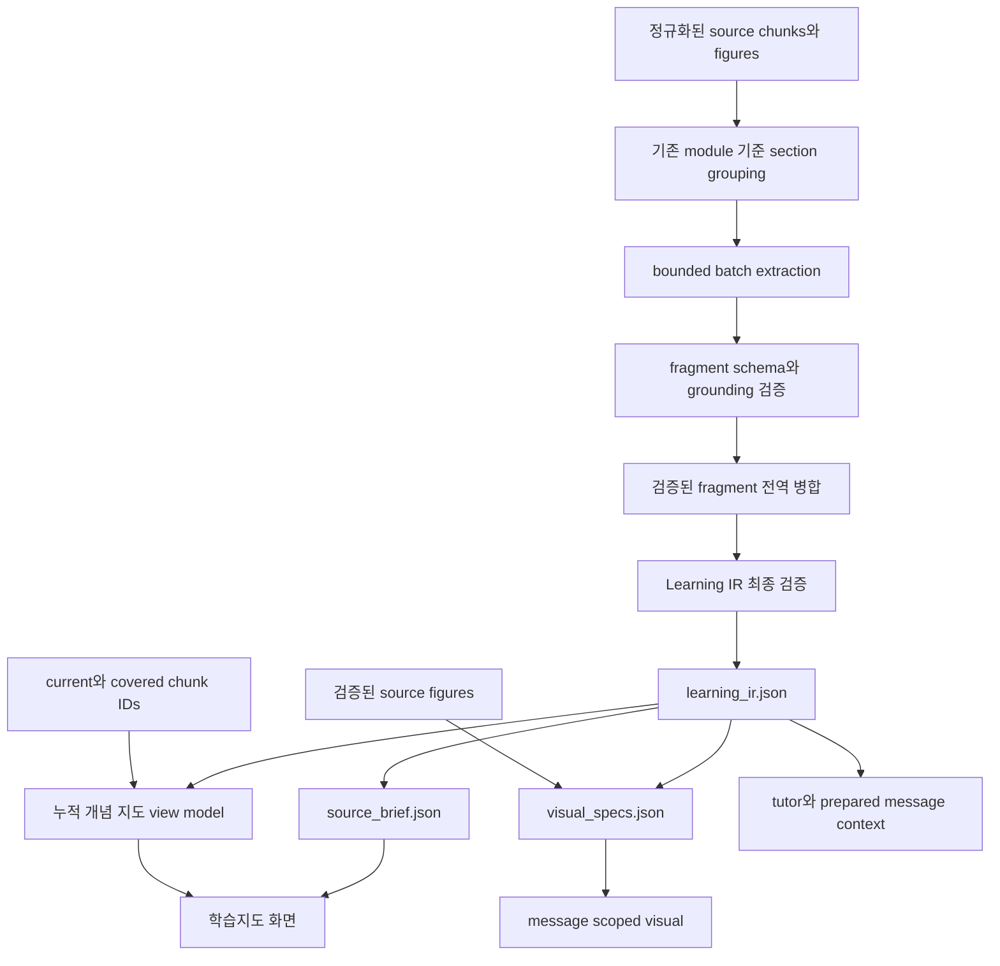
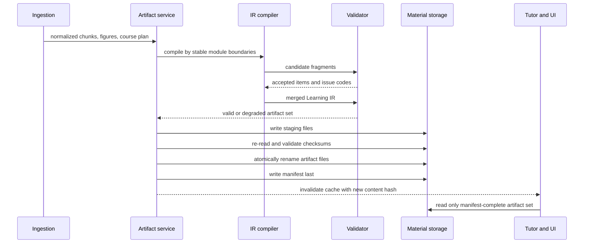
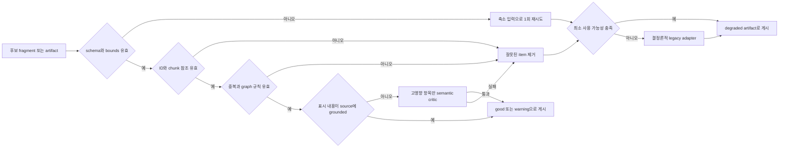

# Learnie 학습 산출물 강화 구현 계획

*문서 상태: 구현 반영안 · 범위: 내부 Source Semantic IR → prepared message 완성 후 Learning IR → 학습지도 · 제외: TTS · 작성일: 2026-08-13*

## 구현 정정: 학습지도는 메시지 완성 후 산출한다

아래 초안에서 하나의 Learning IR이 원문 분석과 학습지도를 함께 담당하도록 한 결정은 폐기한다. 실제 구현은 다음 두 계층을 엄격히 분리한다.

1. `SourceSemanticIr`은 원문의 개념·주장·관계를 분석하는 내부 자료다. section 제목, 첫 문단, figure, caption은 개념이 아니며 사용자에게 학습지도로 노출하지 않는다.
2. 사용자에게 보이는 `LearningIr`은 prepared message set이 `ready`가 된 뒤, 완성된 모든 tutor message가 실제로 가르친 개념과 실제로 설명한 관계만 추출해 작성한다.
3. 학습 시작 전 Source Brief, 임의의 원문 진입점, 원문 청크 기반 개념 지도는 표시하지 않는다.
4. 완료된 메시지에서 2개 이상의 근거 있는 개념과 1개 이상의 설명된 관계를 확인하지 못하면 학습지도는 만들지 않는다. 제목이나 첫 문장을 개념으로 승격하는 결정론적 fallback은 금지한다.
5. 완성된 Learning IR은 material 아래 `learning_ir/<messageSetId>.json`으로 저장하며, message set fingerprint와 compiler/prompt version이 일치할 때만 재사용한다.
6. 개념을 선택하면 정의·수업에서 사용한 이유·처음 설명한 메시지·직접 설명된 관계를 그래프 바로 옆에서 함께 보여 준다.

이 정정안은 아래 문서의 사전 Source Brief 및 원문 기반 누적 개념 지도 설명보다 우선한다.

---

## 📋 실행 결론

이번 개편은 네 기능을 서로 독립된 AI 기능으로 추가하는 작업이 아니다. **한 번 컴파일하고 검증한 공통 Learning IR을 Source Brief, 수업 중 시각 자료, 누적 개념 지도가 함께 소비하는 단일 파이프라인**으로 구현한다.

채택할 핵심 원칙은 다음과 같다.

1. 기존 `coursePlan → module → sourceChunk` 순서와 ID를 유지한다. Learning IR은 기존 학습 단위에 개념·주장·관계를 연결하는 의미 계층이다.
2. 모델은 후보 내용을 제안하지만 ID, 참조 무결성, 레이아웃, 저장 성공 여부는 애플리케이션이 결정한다. 모델이 UUID, Mermaid, SVG, 좌표를 만들게 하지 않는다.
3. 모든 개념·주장·관계·시각 요소는 하나 이상의 `sourceChunkIds`를 가져야 한다. 출처가 없는 요소는 표시하지 않는다.
4. 검증 실패는 학습 진입 실패로 확대하지 않는다. 해당 batch만 한 차례 축소 재시도하고, 그래도 실패하면 결정론적 축약본으로 강등한다.
5. 새 산출물은 material 디렉터리의 adjacent file로 저장한다. DB 열은 추가하지 않고 material artifact schema로 버전을 관리한다.
6. 기존 material은 즉시 열 수 있어야 한다. 메모리 내 호환 어댑터를 먼저 제공하고 안전한 시점에 백그라운드 backfill한다.
7. 개념 지도의 학습 상태는 별도로 저장하지 않는다. 기존 `currentChunkId`와 `coveredChunkIds`에서 파생한다.
8. 시각 자료는 대목의 논리 구조와 맞을 때만 module당 0–2개를 만들며, 관련 source figure가 있으면 우선한다.
9. Source Brief는 학습 전 오리엔테이션이지 별도 강의나 평가가 아니다. 원문 탐색과 학습 진입을 돕되 진도나 정답 판정을 변경하지 않는다.
10. TTS, 자동 외부 이미지 검색, mastery 추정, 그래프 편집은 이번 범위에서 제외한다.

### 성공 상태

사용자는 학습 시작 전 Source Brief에서 자료의 질문과 구조를 파악하고, 수업 중에는 현재 대목에 맞는 구조적 시각 자료를 보며, 이후에는 같은 IR에서 파생된 개념 지도로 무엇을 배웠고 무엇이 남았는지 확인한다. 세 화면의 용어와 연결 관계가 서로 어긋나지 않아야 한다.

## 🔍 현재 구조와 해결할 문제

### 활용할 수 있는 기반

- [`artifact-types.ts`](src/shared/artifact-types.ts)의 `Concept`, `VisualSpec`, `CourseModule`, `MaterialArtifacts`는 확장 출발점으로 충분하다.
- [`course-artifact-service.ts`](src/bun/course-artifact-service.ts)는 material artifact 생성·저장·캐시·로드를 조율한다.
- [`tutor-types.ts`](src/shared/tutor-types.ts)는 메시지의 `visualId`, 블록형 콘텐츠, visual placement를 이미 수용한다.
- 학습 진도는 세션의 `current_chunk_id`와 `covered_chunk_ids_json`으로 보존되고 프로젝트·문서·자료 단위 집계가 가능하다.
- 프로젝트와 document transfer는 material 디렉터리를 함께 복사하므로 adjacent artifact를 추가할 수 있다.

### 현재 한계

| 영역 | 현재 동작 | 문제 | 이번 변경 |
|---|---|---|---|
| Concept map | 앞부분 청크 제목을 개념으로 만들고 선형 prerequisite로 연결 | 실제 논증·인과·비교 구조가 아니며 첫 12개 청크에 편향 | 전체 자료를 bounded batch로 분석하고 검증된 개념·주장·관계 그래프 생성 |
| Overview | 긴 원문을 한 번의 호출로 요약한 단일 문단 | 자료 구조·핵심 개념·원문 진입점이 없음 | typed `SourceBrief`와 한 페이지형 UI 제공 |
| Visual | 첫 섹션 제목 몇 개의 course map 한 종류 | 대목의 성격과 무관하고 메시지에 정확히 귀속되지 않음 | section kind별 visual grammar와 message-scoped visual reference 도입 |
| Critic | 고정 점수 기반 보고서 | 실제 schema·참조·grounding 검증이 아님 | deterministic validator와 제한적 semantic critic으로 교체 |
| Progress map | 개념별 상태 없음 | 청크 진도와 별개 상태를 만들면 불일치 | 청크 참조로 `covered/introduced/current/upcoming` 파생 |
| Cache invalidation | course/module/chunk 샘플 중심 fingerprint | IR이나 visual이 바뀌어도 prepared message가 재사용될 수 있음 | IR content hash, artifact version, visual IDs 포함 |
| Service ownership | runtime이 있는 service와 없는 service 인스턴스 혼재 | lazy generation·cache·backfill 경로가 달라질 수 있음 | 단일 `CourseArtifactService`를 tutor/export에 주입 |
| Compatibility | legacy overview와 기존 artifact path 전제 | 구버전 이동·새 파일 누락 시 열기 실패 가능 | schema-aware loader, legacy adapter, safe backfill |

### 제품 차원의 진단

현재 문제는 모델 품질보다 **모델 출력이 기능별로 분리되어 있고, 같은 출처를 가리키는지 검증할 공통 형식이 없다는 점**이다. UI부터 추가하면 Source Brief, tutor visual, concept map이 서로 다른 개념명을 사용하거나 존재하지 않는 청크를 가리키거나 재생성 뒤 준비 메시지와 어긋날 수 있다. 구현 순서는 반드시 IR과 검증기부터 시작한다.

## 🏗️ 목표 아키텍처



### 계층별 책임

| 계층 | 책임 | 하지 않는 일 |
|---|---|---|
| Source normalization | 청크 순서, locator, 본문 hash, figure 참조 정규화 | 개념 추론 |
| IR compiler | section별 후보 추출, 안정 ID 부여, 전역 중복 병합 | 신뢰하지 않은 출력을 그대로 저장 |
| Validator | schema, 참조, 중복, 그래프 규칙, 크기, grounding 판정 | 그럴듯한 내용을 임의 보충 |
| Source Brief compiler | 검증된 IR을 짧은 사전 안내로 투영 | 상세 강의·정답·진도 기록 |
| Visual grammar | 대목 유형을 허용된 시각 타입과 typed data로 변환 | SVG·Mermaid·좌표 생성 |
| Tutor integration | 해당 module/message에 검증된 visual ID 연결 | 매 턴 별도 개념 그래프 생성 |
| Concept map projection | IR 그래프와 청크 진도에서 화면 상태 파생 | 별도 mastery 저장 |
| React renderer | 접근 가능한 노드·선·카드 렌더링과 원문 이동 | 의미 판단 |

### 생성 수명 주기



## 📚 데이터 계약과 생성 규칙

### Learning IR v1

새 타입은 [`src/shared/learning-ir-types.ts`](src/shared/learning-ir-types.ts)에 둔다. `schemaVersion`은 파일 형식, `compilerVersion`과 `promptVersion`은 생성 동작, `sourceFingerprint`는 입력 동일성을 구분한다.

```ts
type LearningIr = {
  schemaVersion: 1;
  materialId: string;
  documentType: "book" | "article" | "mixed" | "unknown";
  sourceFingerprint: string;
  contentHash: string;
  generatedAt: string;
  generator: {
    model: string;
    compilerVersion: string;
    promptVersion: string;
  };
  sections: LearningSectionIr[];
  concepts: LearningConcept[];
  claims: LearningClaim[];
  relations: LearningRelation[];
  quality: ArtifactQualitySummary;
};

type LearningSectionKind =
  | "expository_conceptual"
  | "historical_narrative"
  | "argument_reconstruction"
  | "comparative"
  | "procedural_technical"
  | "causal_mechanism"
  | "quantitative";

type LearningSectionIr = {
  id: string;
  moduleId: string;
  title: string;
  kind: LearningSectionKind;
  sourceChunkIds: string[];
  conceptIds: string[];
  claimIds: string[];
  relationIds: string[];
  visualCandidateKinds: VisualGrammarKind[];
};

type LearningConcept = {
  id: string;
  label: string;
  originalLabel?: string;
  definition: string;
  whyItMatters: string;
  sourceChunkIds: string[];
};

type LearningClaim = {
  id: string;
  role:
    | "thesis" | "premise" | "evidence" | "counterclaim"
    | "conclusion" | "definition" | "event" | "mechanism" | "step";
  statement: string;
  sourceChunkIds: string[];
};

type LearningRelation = {
  id: string;
  fromId: string;
  toId: string;
  type:
    | "supports" | "challenges" | "causes" | "enables"
    | "contrasts_with" | "part_of" | "precedes"
    | "prerequisite_for" | "explains";
  label?: string;
  sourceChunkIds: string[];
};
```

`fromId`와 `toId`는 concept 또는 claim을 가리킬 수 있다. validator는 두 endpoint의 존재를 확인한다. `prerequisite_for`만 DAG 제약을 받고, 인과·cycle 관계는 실제 순환 구조를 허용한다.

### 안정 ID와 fingerprint

- 모델은 batch 내부 임시 key만 반환한다.
- 앱은 `materialId + moduleId + canonical sourceChunkIds + normalized label/role`를 기반으로 stable ID를 만든다.
- normalized label은 Unicode 정규화, 대소문자 정리, 공백 축약에만 사용하고 표시 문자열은 원문 언어를 보존한다.
- 전역 reducer는 같은 canonical label과 겹치는 source 범위를 가진 후보만 병합한다. 동음이의어나 역할이 다른 항목은 자동 병합하지 않는다.
- `sourceFingerprint`는 ordered source IDs, ordered chunk ID/text hash/locator, document type, compiler version, prompt version을 hash한다.
- `contentHash`는 canonicalized 최종 IR을 hash하며 생성 시각처럼 의미와 무관한 필드는 제외한다.

### Source Brief v1

```ts
type SourceBrief = {
  schemaVersion: 1;
  materialId: string;
  scope: "single_source" | "multi_source";
  documentType: "book" | "article" | "mixed" | "unknown";
  guidingQuestion: string;
  summary: string;
  centralIdea: string | null;
  conceptIds: string[];
  structureVisualId: string | null;
  misconceptions: Array<{
    statement: string;
    repair: string;
    sourceChunkIds: string[];
  }>;
  anchors: Array<{
    sourceChunkId: string;
    label: string;
    excerpt: string;
  }>;
  reviewPrompt: {
    prompt: string;
    kind: "recall" | "connect" | "apply";
  };
  sourceFingerprint: string;
  generatedAt: string;
  generatorVersion: string;
  quality: ArtifactQualitySummary;
};
```

생성 규칙:

- guiding question 1개, 120자 이내.
- summary는 자료 전체 안내 1–2개 문단이며 강의체 확장을 금지한다.
- 주요 concept는 4–6개를 기본으로 하고 모두 IR ID를 참조한다.
- misconception은 0–3개이며 근거가 약하면 비운다.
- anchor는 3–6개이고 source order를 보존한다. excerpt는 앱이 실제 청크에서 최대 240자로 잘라 만들며 모델이 인용문을 작성하지 않는다.
- review prompt는 `recall/connect/apply` 중 하나의 사고 목적을 가지지만 사용자를 점수화하지 않는다.
- article은 현행 사전 안내 원칙을 보존해 topic, problem, background, approach 수준까지만 보여 준다. 표본 크기, 수치 결과, 효과 크기, 상세 결론은 선노출하지 않는다.
- book/mixed source는 central idea를 허용하되 자료에 명시적 중심 명제가 없으면 `null`을 허용한다.

### 시각 문법 v1

기존 `VisualSpec`을 폐기하지 않고 공통 grounding 필드와 필요한 타입만 확장한다.

```ts
type GroundedVisualSpec = VisualSpec & {
  schemaVersion: 1;
  sectionId: string;
  sourceChunkIds: string[];
  nodeIds: string[];
  placement: "before_explanation" | "after_explanation" | "review";
};
```

| 대목 유형 | 1순위 문법 | 대안 | 사용 조건 |
|---|---|---|---|
| 논증 재구성 | `argument_map` | `flow` | thesis·premise·objection 관계가 검증됨 |
| 역사적 서술 | `timeline` | `relationship_graph` | 사건 순서 또는 행위자 관계가 명시됨 |
| 인과 메커니즘 | `flow`, `cycle` | `layers` | 인과 endpoint와 방향이 검증됨 |
| 비교 | `contrast`, `matrix` | `annotated_table`, `axis` | 비교 기준이 둘 이상 존재 |
| 절차·기술 | `flow` | `annotated_table` | 단계 순서가 source에 존재 |
| 설명·개념 | `relationship_graph` | `layers`, `contrast` | 관계가 단순 목록 이상 |
| 정량 | `formula`, `axis` | `annotated_table` | 실제 식·변수·수치 구조가 source에 존재 |

추가 제약:

- module당 0–2개, tutor message당 최대 1개다. 적합한 시각 문법이 없으면 `null`이 정상 결과다.
- 관련 source figure가 현재 대목과 연결되어 있으면 생성 visual보다 우선한다.
- visual label과 node는 IR ID를 참조하고 renderer가 검증된 표시 문자열을 가져온다.
- `argument_map`, `relationship_graph`, `tree`, `cycle`만 신규 타입 후보로 추가한다. 기존 타입으로 충분하면 늘리지 않는다.
- LLM 응답에는 URL, 파일 경로, HTML, SVG, Mermaid, CSS, 좌표를 허용하지 않는다.

### 생성 방식

1. 현재 course module 경계를 유지해 section group을 만든다.
2. group이 문자 예산을 넘으면 source order대로 batch를 나눈다.
3. 각 batch에서 typed fragment를 추출한다.
4. fragment validator가 유효한 item만 통과시킨다.
5. 유효 fragment만 reducer에 전달해 중복을 합치고 교차 section 관계를 제한적으로 만든다.
6. 최종 IR을 다시 검증한 뒤 Source Brief와 visual specs를 투영한다.
7. 실패 batch는 더 작은 입력과 더 엄격한 schema로 한 번만 재시도한다.
8. 두 번째 실패 시 heading, source order, 기존 module 정보로 deterministic degraded fragment를 만든다.

## 🛡️ 검증, 실패 격리, 품질 보고

### 검증 단계



### 코드가 보장할 규칙

- JSON 구조, enum, 문자열 길이, 항목 수 상한.
- 모든 ID의 전역 고유성.
- `moduleId`, `sourceChunkIds`, relation endpoint, visual node ID의 존재.
- 같은 concept 또는 동일 `(fromId, toId, type)` edge의 중복 제거.
- `prerequisite_for` subgraph의 cycle 부재.
- section당 concept 수, graph node·edge 수, visual node 수 상한.
- Source Brief의 concept·visual·anchor가 같은 material을 가리키는지.
- 표시되는 concept, claim, relation, misconception, visual에 source chunk 근거가 있는지.
- 금지된 HTML·SVG·script·외부 URL·파일 경로와 과도한 텍스트.

### semantic critic의 제한

deterministic 검증으로 판단할 수 없는 다음 항목에만 사용한다.

- Source Brief central idea가 source 범위를 과도하게 일반화하는지.
- 서로 다른 section을 잇는 고영향 relation이 실제로 뒷받침되는지.
- misconception의 repair가 원문과 반대 의미를 만들지 않는지.

critic은 `accept/reject/needs_degrade`와 issue code만 반환한다. 자동 문장 수정은 하지 않고, 수정이 필요하면 생성 단계가 재시도한다.

### 품질 보고서

기존 고정 점수 `critic_report.json`은 실검증 보고서 v2로 발전시키고 loader는 legacy 보고서도 읽는다.

| issue code | 의미 | 처리 |
|---|---|---|
| `invalid_schema` | 타입·enum·bounds 위반 | batch 재시도 후 item 제거 |
| `missing_chunk_ref` | 존재하지 않는 source chunk 참조 | item 제거 |
| `orphan_node` | relation만 있고 정의 없는 node | edge 제거 또는 복구 재시도 |
| `duplicate_concept` | 정규화 기준 중복 | deterministic merge |
| `invalid_edge` | endpoint/relation type 오류 | edge 제거 |
| `prerequisite_cycle` | 선수관계 DAG 위반 | 가장 약한 신규 edge 제거 후 warning |
| `unsupported_visual` | 허용되지 않은 visual | visual 제거 |
| `ungrounded_claim` | 출처 근거 미확인 | critic 후 제거 또는 degrade |
| `oversize` | node·edge·문자 상한 초과 | source order와 중요도로 축약 |
| `unsafe_content` | HTML·script·경로·외부 URL | 즉시 제거, 원응답 미저장 |

로그에는 material ID, stage, 처리 개수, issue code, provider/model/version, 소요 시간만 남긴다. 전체 원문이나 모델 원응답은 일반 로그에 남기지 않는다.

## 🎨 제품 및 상호작용 설계

### 학습지도 진입점

App의 `viewMode`를 `"chat" | "source"`에서 `"chat" | "source" | "guide"`로 확장하고 상단 전환을 `원문보기 / 학습공간 / 학습지도`로 구성한다.

- 세션 시작 전: 현재 `SourceLearningPreview` 자리에 Source Brief를 보여 준다.
- 학습 중: 학습지도에서 Source Brief와 누적 개념 지도를 함께 볼 수 있다.
- 학습 후: 동일 화면이 복습 지도 역할을 한다.
- 작은 창에서는 카드를 세로로 쌓고 정상 스크롤을 허용한다. “한 페이지”는 데스크톱에서 핵심이 한눈에 보인다는 의미다.

### Source Brief 레이아웃

1. 상단: guiding question, 짧은 summary, central idea.
2. 중단: 주요 개념 4–6개와 구조 visual 1개 이하.
3. 하단: 오해하기 쉬운 지점, 원문 anchor, review prompt.
4. anchor 선택: 원문보기로 전환하고 해당 chunk로 스크롤·포커스.
5. review prompt 선택: 학습공간으로 이동해 composer에 문구를 채우고 focus만 부여. 자동 전송 금지.

원문 이동은 `ImmersiveSourceView`의 기존 chunk scroll 동작을 외부 `focusRequest` prop으로 노출한다. App이 pending chunk ID를 설정하고 source view로 전환한다.

### 대목별 시각 자료

- chat 전체 하단에 하나를 띄우지 않고 해당 `TutorMessage` 안에서 메시지별로 렌더링한다.
- `visual_ref` 또는 `diagram` content block이 검증된 visual ID와 placement를 가진다. 기존 `visual_id` 열은 legacy fallback으로 유지한다.
- block은 기존 `blocks_json`에 저장하므로 신규 DB column은 만들지 않는다.
- tutor prompt에는 현재 module의 유효 visual ID만 제시하고 sanitizer는 실제 존재하는 ID만 허용한다.
- visual이 없거나 renderer가 실패해도 텍스트 수업은 그대로 표시한다.

### 누적 개념 지도

| 상태 | 계산 규칙 | 표시 의미 |
|---|---|---|
| `current` | node의 `sourceChunkIds`에 현재 chunk 포함 | 지금 학습 중 |
| `covered` | 유효 sourceChunkIds가 모두 covered | 다룬 개념 |
| `introduced` | 일부만 covered | 시작했지만 이어지는 개념 |
| `upcoming` | covered가 하나도 없음 | 앞으로 다룰 개념 |

- 상태를 저장하지 않고 progress service의 청크 집계에서 파생한다.
- 지도 열람 자체는 진도를 올리지 않는다.
- 세션이 있으면 해당 세션 current와 누적 material covered set을 사용한다. 세션 전에는 모두 upcoming이다.
- node 선택 시 설명, 중요성, 관계, source anchor를 detail panel에 표시한다.
- source anchor는 원문 chunk로 이동한다.
- primary node는 기본 12–24개, 최대 32개 edge로 제한한다. 초과 정보는 section cluster/detail panel로 보낸다.
- prerequisite·causal·sequence 관계로 layer를 만들고 부족하면 source order로 배치한다.
- React 결정론적 layout helper를 사용하고 실제 `<button>` node와 `aria-hidden` SVG edge를 렌더링한다.
- 키보드 순서는 source order를 따르고 모든 node를 Tab/Enter로 접근할 수 있어야 한다.
- 좁은 화면은 가로 스크롤과 list fallback을 제공한다. v1에는 force simulation, drag, pan/zoom을 넣지 않는다.
- `prefers-reduced-motion`에서는 상태 전환 애니메이션을 제거한다.

### 빈 상태와 저품질 상태

- Source Brief가 degraded이면 “간략 안내”로 표시하고 없는 섹션을 억지로 채우지 않는다.
- 개념이 2개 미만이거나 유효 relation이 없으면 graph 대신 source-order concept list를 보여 준다.
- visual이 없으면 빈 카드나 오류 문구를 만들지 않는다.
- backfill 중에도 legacy overview와 현재 학습공간은 즉시 사용할 수 있다.

## 💾 저장, 호환성, 전송 전략

### artifact 파일 배치

| 파일 | 상태 | 역할 |
|---|---|---|
| `material_manifest.json` | 확장 | artifact schema, source fingerprint, compiler/prompt version, content hash, required files |
| `learning_ir.json` | 신규 | 공통 의미 그래프의 source of truth |
| `source_brief.json` | 신규 | 학습 전·복습 안내 projection |
| `visual_specs.json` | 확장 | grounded section visual specs |
| `critic_report.json` | v2 | validator issue와 quality 상태 |
| `concept_map.json` | 호환 | 한 release 동안 IR 투영 legacy shape 또는 loader adapter |
| `material_overview.json` | legacy | 기존 material 읽기 fallback |

`source_brief.json`은 기존 `overview_path/overview_json` DB 필드를 재사용한다. 새 DB column은 필요 없다. `MaterialArtifacts`에는 `learningIr`와 `sourceBrief`를 추가하고 `overview`는 한 호환 주기 동안 adapter로 제공한다.

### 원자적 게시

1. material 디렉터리의 staging 경로에 모든 신규 파일을 쓴다.
2. 파일을 다시 읽어 schema·참조·hash를 검증한다.
3. 각 artifact를 최종 이름으로 atomic rename한다.
4. `material_manifest.json`을 마지막에 교체한다.
5. DB의 기존 path/inline JSON과 `updated_at`을 갱신한다.
6. 마지막으로 artifact cache를 무효화한다.

실패하면 기존 manifest와 마지막 정상 artifact를 유지한다. partial v2 파일은 manifest에서 참조되지 않으므로 runtime이 읽지 않는다.

### legacy material 마이그레이션

- loader는 v2 artifact를 우선한다.
- v2가 없으면 기존 overview, concept map, course plan을 메모리 내 degraded IR/Brief로 즉시 변환한다.
- 학습 진입을 막지 않는 백그라운드 singleflight backfill을 예약한다.
- active generation, active prepared-message set 전환, transfer 중에는 persisted backfill을 보류한다.
- backfill은 기존 course/module/chunk ID와 메시지에 사용된 visual ID를 유지한다.
- visible transcript와 session progress는 다시 쓰지 않는다.

### prepared message와 cache 일관성

Tutor material fingerprint에 `artifactSchemaVersion`, `learningIr.contentHash`, `sourceFingerprint`, module별 visual ID/content hash를 추가한다. 새 fingerprint는 이후 prepared set에 반영하되 이미 보이는 메시지는 유지한다. 진행 중인 세트는 끝까지 기존 fingerprint에 묶거나 backfill을 세트 종료 뒤 수행한다.

### transfer와 bundle sync

- 프로젝트/document transfer는 material 디렉터리 전체를 복사하므로 신규 adjacent file을 자동 포함한다.
- [`project-bundle-sync.ts`](src/bun/project-bundle-sync.ts)의 명시적 artifact 목록은 `learning_ir.json`과 `source_brief.json`을 우선하도록 갱신한다.
- schema v2 manifest가 두 파일을 required로 선언하면 transfer preview에서 존재·schema·checksum을 검사하고 누락 시 commit 전에 실패한다.
- legacy bundle은 계속 수용하고 import 후 adapter/backfill 대상으로 표시한다.
- adjacent file 추가만으로 project/document transfer schema를 올리지 않는다. 호환성 경계는 material artifact schema가 담당한다.
- export용 `CourseArtifactService`도 전역 service를 주입받아 runtime path와 cache 동작을 통일한다.

## ⚙️ 단계별 구현 계획

### Phase 0 — 기준선과 서비스 ownership

목표: 기존 학습 순서, progress, prepared message, transfer 동작을 회귀 기준으로 고정한다.

작업:

- 현재 artifact를 test 전용 임시 디렉터리로 복제해 legacy fixture를 만든다. 사용자 example/export 파일에는 의존하지 않는다.
- course/module/chunk ID, overview load, visual ID sanitizer, session restart, prepared-message resume 테스트를 보강한다.
- shared `CourseArtifactService`를 [`index.ts`](src/bun/index.ts)에서 생성하고 tutor/export service에 dependency injection한다.
- generation progress enum에 `normalize/extract/validate/brief/visuals/graph/persist/complete/failed`를 추가하되 기존 UI fallback label을 유지한다.

완료 기준:

- 기존 material이 같은 학습 route와 session progress로 열린다.
- tutor, export, RPC가 같은 artifact service/cache 인스턴스를 사용한다.
- 이후 schema 변경 전 기준 테스트가 통과한다.

### Phase 1 — Learning IR compiler와 validator

신규 파일:

- [`src/shared/learning-ir-types.ts`](src/shared/learning-ir-types.ts)
- [`src/bun/learning-ir-compiler.ts`](src/bun/learning-ir-compiler.ts)
- [`src/bun/learning-ir-validator.ts`](src/bun/learning-ir-validator.ts)

수정 파일:

- [`src/shared/artifact-types.ts`](src/shared/artifact-types.ts)
- [`src/bun/course-artifact-service.ts`](src/bun/course-artifact-service.ts)

작업:

- typed candidate schema, stable ID factory, source fingerprint, canonical content hash 구현.
- 기존 course module을 section 경계로 사용하는 bounded batch extractor 구현.
- fragment 검증, deterministic merge, global relation reducer, final IR 검증 구현.
- `critic_report.json` v2 issue report와 degraded fallback 구현.
- staging write, re-read validation, manifest-last atomic publish 구현.
- `materialOverviewRuntime`을 `learningArtifactRuntime`으로 일반화.

완료 기준:

- 동일 source/compiler version이 동일 stable ID, source fingerprint, content hash를 만든다.
- 존재하지 않는 chunk/node 참조가 최종 IR에 남지 않는다.
- 모델 응답이 전부 실패해도 degraded IR이 생성되고 material은 ready가 된다.

### Phase 2 — Source Brief와 legacy adapter

신규 파일:

- [`src/bun/source-brief-compiler.ts`](src/bun/source-brief-compiler.ts)
- [`src/components/SourceBriefView.tsx`](src/components/SourceBriefView.tsx)

작업:

- 검증된 IR에서 Source Brief를 만드는 compiler/validator 구현.
- article/book/multi-source 정책 분리.
- 실제 source chunk에서 excerpt를 자르는 deterministic anchor builder 구현.
- loader가 `source_brief.json → material_overview.json → deterministic summary` 순으로 읽게 변경.
- `SourceLearningPreview`를 Brief 기반으로 바꾸되 legacy paragraph도 표시.
- anchor-to-source focus와 review-prompt-to-composer focus 구현.

완료 기준:

- article preview가 수치 결과·효과 크기·상세 결론을 선노출하지 않는다.
- 모든 anchor가 실제 chunk로 이동한다.
- runtime/provider가 없는 export/import 환경에서도 legacy material을 연다.

### Phase 3 — 대목별 시각 문법과 메시지 귀속

신규 파일:

- [`src/bun/visual-grammar.ts`](src/bun/visual-grammar.ts)
- [`src/components/LearningVisual.tsx`](src/components/LearningVisual.tsx)

작업:

- section kind → visual grammar 후보의 pure mapping 구현.
- source figure 우선, visual 상한, `null` 허용 정책 구현.
- 신규 visual 타입을 최소 범위로 추가하고 payload validator 구현.
- tutor context에는 현재 module의 validated visual만 노출.
- `visual_ref` block을 `blocks_json`에 저장하고 message-scoped renderer 연결.
- 기존 전역 visual 표시는 legacy fallback 뒤 제거.

완료 기준:

- 메시지는 artifact에 없는 visual ID를 표시할 수 없다.
- renderer 실패가 tutor text/progress/prepared message 소비를 중단하지 않는다.
- 관련 source figure가 생성 visual보다 우선된다.
- visual이 부적합하면 빈 UI 없이 텍스트만 표시한다.

### Phase 4 — 누적 개념 지도와 학습지도

신규 파일:

- [`src/components/LearningGuideView.tsx`](src/components/LearningGuideView.tsx)
- [`src/components/ConceptGraphView.tsx`](src/components/ConceptGraphView.tsx)
- [`src/lib/concept-graph-layout.ts`](src/lib/concept-graph-layout.ts)
- [`src/lib/concept-progress.ts`](src/lib/concept-progress.ts)

작업:

- `viewMode: "guide"`와 학습지도 전환 추가.
- progress service에 material chunk 상태 read-only RPC 추가.
- concept state projector와 deterministic layered layout 구현.
- 접근 가능한 button node, SVG edge, detail panel, list fallback 구현.
- node/detail anchor에서 원문 chunk로 이동.
- narrow viewport, dark mode, reduced motion 지원.

완료 기준:

- 별도 상태 저장 없이 재시작 후 같은 개념 상태가 나온다.
- map 열람이나 node 클릭이 covered chunk를 변경하지 않는다.
- keyboard만으로 visible node와 source anchor를 탐색한다.
- graph 상한 초과 시 cluster/detail 또는 list fallback이 적용된다.

### Phase 5 — backfill, transfer, release hardening

작업:

- legacy adapter와 singleflight background backfill 연결.
- active session/prepared set/transfer 상태에 따른 backfill gate 구현.
- project bundle sync, project transfer, document transfer에 v2 검증 추가.
- generation progress와 warning/degraded 상태를 사용자 친화적으로 표시.
- telemetry가 stage timing과 issue code만 수집하는지 점검.
- 실제 자료 유형 fixture로 packaged app smoke test.

완료 기준:

- legacy 프로젝트를 즉시 학습할 수 있고 backfill 전후 session/transcript/progress가 유지된다.
- v2 project/document transfer round trip 후 재생성 없이 동일 content hash를 읽는다.
- required artifact가 손상된 v2 bundle은 import commit 전에 거부된다.
- packaged app에서 개발 shell/provider에 의존하지 않고 degraded read가 가능하다.

### 권장 커밋 경계

1. 서비스 ownership과 기준 테스트.
2. IR types/compiler/validator와 persistence.
3. Source Brief compiler/loader/UI.
4. visual grammar와 message-scoped rendering.
5. concept map projection/UI.
6. backfill/transfer/release hardening.

각 커밋은 독립적으로 typecheck와 관련 테스트를 통과하게 유지한다. UI와 artifact migration을 한 커밋에 묶지 않는다.

## 🧪 테스트 및 인수 기준

### 단위 테스트

- validator: schema, enum, 길이·개수 상한, unique ID, missing ref, duplicate, invalid edge.
- graph: prerequisite cycle 거부, causal cycle 허용, orphan 제거, max node/edge 축약.
- compiler: stable ID, fingerprint, content hash, batch merge, 1회 재시도, degraded fallback.
- Source Brief: article spoiler 제한, book central idea nullable, multi-source scope, real excerpt anchor.
- visual grammar: section mapping, source figure priority, 0–2 상한, unsupported payload 거부.
- concept progress: current 우선, covered, introduced, upcoming, orphan chunk 무시.
- layout: 같은 입력의 같은 위치·키보드 순서, source-order fallback.

### 통합 테스트

- fake AI로 v2 artifact 생성, staging 검증, manifest-last 게시 확인.
- invalid AI output이 partial ready 상태나 깨진 graph를 만들지 않는지 확인.
- legacy load → in-memory adapter → gated backfill 검증.
- IR/visual 변경 시 tutor fingerprint가 바뀌고 이미 표시된 메시지는 보존되는지 확인.
- message `visual_ref`의 저장·재시작·export round trip 확인.
- project bundle sync, project transfer, document transfer의 v1/v2 교차 round trip 확인.
- import preview가 v2 required file 누락/checksum/schema 오류를 commit 전에 잡는지 확인.

### UI 및 접근성 테스트

- Source Brief anchor → 원문 해당 chunk.
- review prompt → composer prefill/focus, 자동 전송 없음.
- concept node → detail → source anchor.
- map open/close 후 progress 불변.
- 키보드 탐색, visible focus, screen-reader label, list fallback.
- 좁은 창, 긴 한국어/영어 label, dark mode, reduced motion.
- invalid/없는 visual에서 텍스트 수업 유지.
- 세션 전·학습 중·완료 후 학습지도 상태.

### 대표 fixture

1. 철학·인문 논증: thesis, premise, counterclaim, conclusion.
2. 역사 서술: 사건 순서, 행위자, 전환점.
3. 과학·기술 메커니즘: cause, component, procedure, formula.
4. 연구 article: topic/problem/background/approach와 preview spoiler 제한.

fixture는 테스트 디렉터리 복제본이나 임시 생성물을 사용하고 사용자의 작업 중 example/export 파일을 전제로 하지 않는다.

### 릴리스 게이트

```text
bun run typecheck
bun test
bun run smoke:python
bun run test:python
git diff --check
```

추가로 packaged macOS 앱에서 legacy load, 신규 material generation, 세션 재시작, project/document transfer smoke test를 수행한다.

최종 인수 기준:

- IR에서 사용자에게 보이는 모든 의미 요소가 실제 source chunk로 역추적된다.
- Source Brief, 수업 visual, concept map이 같은 concept ID/label을 사용한다.
- 세 기능 중 하나가 degraded여도 원문 보기와 텍스트 학습은 계속된다.
- session progress/transcript는 migration/backfill 전후 동일하다.
- 지도 상태는 실제 semantic source chunk 진도와 일치한다.
- 신규 v2 artifact는 이동 후 재생성 없이 재사용된다.

## ⚠️ 위험, 완화책, 비범위

### 주요 위험과 완화

| 위험 | 영향 | 완화책 |
|---|---|---|
| 긴 자료의 비용·지연 | 생성 대기 증가 | bounded map/reduce, cache, progress stage, safe background backfill |
| 그럴듯하지만 없는 관계 | 잘못된 학습 구조 | source refs 의무화, strict reject, 고영향 semantic critic |
| IR 갱신과 prepared message 충돌 | 세션 중 설명 불일치 | fingerprint 확대, active set 고정, backfill gate |
| legacy/transfer artifact 누락 | 프로젝트 열기 실패 | in-memory adapter, manifest required-file 검사, import 전 검증 |
| 개념 지도 과밀 | 인지 부하와 느린 UI | primary node/edge 상한, section cluster, list fallback |
| 대목에 맞지 않는 시각화 | 이해 방해 | `null` 정상화, source figure 우선, grammar validation |
| 모델 출력 보안 문제 | HTML/script/path 주입 | typed allowlist, sanitizer, 앱 소유 renderer |
| 접근성 저하 | 키보드·스크린리더 사용 불가 | real button node, DOM 순서, list fallback, reduced motion |

### 이번 범위에서 하지 않는 것

- TTS, 음성 자동 재생, 음성별 artifact 생성.
- Wikimedia 등 외부 이미지 자동 검색·다운로드.
- 모델 생성 Mermaid, SVG, canvas 좌표, force layout.
- 기존 course/module/chunk 순서 재편.
- mastery 확률, 시험 점수, 정답 판정, 지도 열람에 따른 진도 증가.
- 같은 material의 다국어 artifact variant. v1은 현재 표시 언어와 원문 용어를 함께 보존한다.
- concept graph 편집, 협업 주석, drag, pan/zoom.
- readable session export 별도 재설계. 기존 export/transfer는 회귀시키지 않는다.

### 구현 중 확정할 수 있는 제한적 결정

다음 사항은 architecture를 바꾸지 않으므로 Phase 1–4 fixture 결과로 결정한다.

- primary concept 기본값을 16개로 둘지 20개로 둘지.
- `argument_map`을 신규 visual type으로 둘지 기존 `flow`의 semantic variant로 둘지.
- desktop 학습지도에서 Source Brief와 개념 지도를 tab으로 나눌지 한 화면에 세로 배치할지.
- section 간 relation에 semantic critic을 적용할 최소 영향도 기준.

이 결정은 사용자의 별도 선택을 기다려 구현을 멈출 항목이 아니다. 실제 fixture의 가독성, validator 통과율, 생성 지연을 측정해 보수적인 기본값을 채택하고 테스트로 고정한다.
