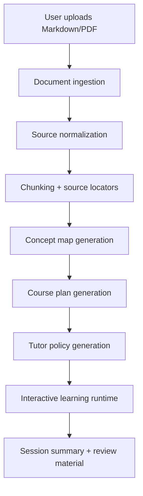
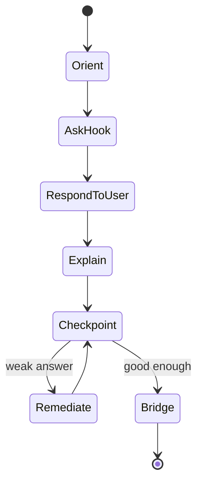

# Interactive Learning Material Generator Plan

## 1. Goal

사용자가 chapter 하나 정도 길이의 Markdown 또는 PDF를 입력하면, 앱이 그 내용을 바탕으로 학습자가 대화하며 따라갈 수 있는 interactive learning material을 생성한다.

핵심은 "요약 페이지"가 아니라 "학습 세션"이다. 앱은 먼저 전체 수업의 뼈대를 만들고, 이후 사용자의 답변, 오해, 관심사, 난이도에 반응하면서 원문 내용으로 계속 되돌아가게 해야 한다.

## 2. What We Learned From The Existing Example

### `example/timaeus-course.jsx`

이 예시는 좋은 방향을 보여준다.

- 원문 내용을 압축한 `SOURCE`를 tutor prompt 안에 넣는다.
- tutor는 매 turn 짧게 말하고, 질문으로 끝내며, 사용자의 답변에 반응한다.
- 도해는 별도 registry로 관리하고, 모델은 `diagram` id만 선택한다.
- 모델 출력은 `{ message, diagram, choices, progress }` JSON으로 제한한다.
- UI는 채팅형이지만 단순 챗봇이 아니라 "수업의 흐름"을 가진다.

하지만 그대로 일반화하기에는 한계가 있다.

- 특정 텍스트에 맞춘 hand-written prompt와 도해가 강하게 결합되어 있다.
- chapter 구조, 개념 순서, 질문, misconception, 도해 후보가 코드 안에 박혀 있다.
- PDF/Markdown 입력에서 학습 자료를 자동 생성하는 ingestion pipeline이 없다.
- 사용자의 현재 이해 상태를 구조적으로 추적하지 않는다.
- 모델이 원문 밖으로 벗어났는지 검증하는 장치가 약하다.

### `interactive-course-skill/`

이 skill은 다른 방향에서 유용하다.

- source를 normalize한다.
- concept map을 만든다.
- 5-12개 module로 나눈다.
- 각 module에 orientation, hook question, interaction, teaching sequence, visual, checkpoint, bridge를 둔다.
- `course_data.json`을 만들고 정적 HTML로 렌더링한다.

단, 이 skill의 기본 출력은 정적 tutorial이다. 이번 프로젝트의 목표인 "앱 속에서 사용자 반응에 따라 실시간으로 이끌어가는 tutor"와는 다르다.

따라서 전략은 둘 중 하나를 고르는 것이 아니라, skill의 구조화 단계를 adaptive tutor runtime의 planning layer로 흡수하는 것이다.

## 3. Product Strategy

### Desired User Experience

1. 사용자가 Markdown 또는 PDF를 업로드한다.
2. 앱이 문서를 읽고, 제목/섹션/핵심 개념/난점/도해 후보를 추출한다.
3. 앱이 "이 문서로 어떤 학습 세션을 만들 것인지" preview를 보여준다.
4. 사용자가 시작하면 tutor가 첫 질문을 던진다.
5. 사용자는 자유롭게 답하거나 제시된 선택지를 누른다.
6. tutor는 답변을 평가하고, 원문 근거에 기반해 설명하며, 다음 개념으로 이동한다.
7. 앱은 현재 위치, 완료한 개념, 반복되는 오해, 관심 주제를 추적한다.
8. 세션이 끝나면 요약, 약점, 복습 질문, 원문 위치별 다시 보기 링크를 제공한다.

### Product Principle

앱은 "무엇이든 답하는 AI"가 아니라 "이 chapter를 끝까지 읽게 만드는 tutor"여야 한다.

모델의 자유도는 대화의 표면에서는 높게 보이되, 내부적으로는 다음 제약을 강하게 둔다.

- 말할 수 있는 내용은 source 또는 source에서 안전하게 추론 가능한 내용으로 제한한다.
- 매 turn은 현재 module의 learning goal에 봉사해야 한다.
- 사용자가 옆길로 가도 완전히 막지 말고, 짧게 인정한 뒤 원문으로 되돌린다.
- 어려운 개념은 한 번에 설명하지 않고 prediction, contrast, analogy, checkpoint로 쪼갠다.
- 도해는 장식이 아니라 argument structure, process, contrast, taxonomy를 설명할 때만 쓴다.

## 4. Core Architecture

### High-Level Pipeline



### Main Artifacts

The system should generate and persist these artifacts per source document.

1. `source_manifest.json`
   - source title
   - source type
   - extraction method
   - page/heading locators
   - warnings about noisy extraction or missing figures

2. `source_chunks.json`
   - stable chunk ids
   - text
   - heading path or page range
   - citations/footnotes if present
   - figure/table captions if detected

3. `concept_map.json`
   - 8-20 core concepts
   - prerequisites
   - misconceptions
   - source evidence
   - visual candidates

4. `course_plan.json`
   - 5-12 modules
   - learning goals
   - module order
   - hook questions
   - checkpoints
   - bridge logic

5. `tutor_policy.json`
   - tutor persona/tone
   - per-module allowed claims
   - source-grounding rules
   - off-track recovery rules
   - response schema

6. `session_state.json`
   - current module
   - progress
   - user answers
   - detected misconceptions
   - completed checkpoints
   - interest signals

## 5. Proposed Data Model

### Source Chunk

```json
{
  "id": "chunk-017-004",
  "heading_path": ["플라톤의 우주생성론", "시간의 기원"],
  "page_range": null,
  "text": "시간은 영원의 움직이는 이미지...",
  "kind": "body",
  "confidence": 0.98
}
```

### Concept

```json
{
  "id": "concept-time-eternity",
  "name": "시간은 영원의 움직이는 이미지",
  "definition": "피조 세계가 영원을 완전히 가질 수 없기 때문에 시간은 영원을 운동과 수로 모방한다는 설명.",
  "why_it_matters": "티마이오스 우주론의 핵심적인 형이상학적 장치다.",
  "prerequisites": ["concept-copy-pattern", "concept-created-cosmos"],
  "misconceptions": [
    "시간을 단순한 측정 도구로만 이해한다.",
    "영원과 오래 지속됨을 같은 것으로 본다."
  ],
  "source_chunk_ids": ["chunk-017-004"],
  "visual_candidate": {
    "type": "contrast",
    "description": "정지한 영원과 회전하는 시간을 대비"
  }
}
```

### Course Module

```json
{
  "id": "module-04-time",
  "title": "시간: 영원의 움직이는 이미지",
  "learning_goal": "영원과 시간의 차이를 이해하고, 왜 시간과 하늘이 함께 생겨나는지 설명한다.",
  "concept_ids": ["concept-time-eternity", "concept-heaven-time"],
  "opening_move": "먼저 영원을 '아주 오래 지속되는 것'으로 생각하는지 물어본다.",
  "interaction_plan": [
    {
      "type": "prediction",
      "prompt": "피조물은 왜 영원을 그대로 가질 수 없을까?"
    },
    {
      "type": "misconception_check",
      "prompt": "영원은 '끝없이 긴 시간'과 같은가?"
    }
  ],
  "checkpoint": "시간이 영원의 이미지라는 말을 한 문장으로 설명하게 한다.",
  "source_chunk_ids": ["chunk-017-004", "chunk-017-005"]
}
```

### Tutor Turn Output

The runtime should force every model turn into a strict JSON shape.

```json
{
  "message": "튜터의 이번 발화",
  "diagram": "time_eternity",
  "choices": ["아주 긴 시간 아닌가요?", "변화가 핵심 같아요"],
  "progress": 42,
  "module_id": "module-04-time",
  "state_update": {
    "detected_misconception_ids": [],
    "checkpoint_passed": false,
    "next_action": "ask_prediction"
  },
  "source_refs": ["chunk-017-004"]
}
```

## 6. Runtime Strategy

### Use A Controlled Tutor Loop

Each tutor turn should be generated from four inputs.

1. Current `course_plan`
2. Current `session_state`
3. Relevant source chunks
4. User's latest message

The model should not receive the full document every turn once artifacts exist. It should receive only relevant chunks plus compact global context. This improves reliability, cost, and source discipline.

### Tutor State Machine

Each module should move through predictable phases.



This gives the tutor flexibility inside each phase without losing control of the lesson.

### Response Policy

Every tutor response should follow these rules.

- 4-8 sentences by default.
- React to the user's actual answer before adding new content.
- Mention source-grounded ideas, not external trivia, unless the course plan explicitly allows context.
- End with a question, choice, or next action unless the session is complete.
- If the learner is confused, simplify the same concept before moving on.
- If the learner is advanced, compress the explanation and ask a higher-level contrast/application question.
- If the learner asks outside the source, answer briefly only if safe, then connect back to the document.

## 7. Ingestion Strategy

### Markdown

Markdown is the preferred first input type for MVP.

Implementation notes:

- Parse headings, paragraphs, blockquotes, lists, footnotes, images, and tables.
- Preserve heading path for every chunk.
- Keep blockquotes and figure captions as separate `kind`s.
- Do not trust headings as final module boundaries; use them as weak signals.

### PDF

PDF should be supported, but with explicit extraction quality handling.

Implementation notes:

- First try text-layer extraction.
- Preserve page numbers.
- Detect repeated headers/footers and remove them.
- Identify probable headings by font/position if available; otherwise infer from text structure.
- Extract figure/table captions separately when possible.
- Only use OCR if the text layer is missing or clearly unusable.
- Show extraction warnings to the user before generating the course.

For MVP, PDF support can be limited to text-first academic/book PDFs. Scanned PDFs can be a later milestone.

## 8. Visual Generation Strategy

The Timaeus example demonstrates a good pattern: the tutor emits a diagram id, and the UI renders a trusted local component.

Generalize this as a visual registry.

### Visual Types

- `flow`: causal or procedural sequence
- `contrast`: two-sided conceptual comparison
- `taxonomy`: hierarchy or classification
- `timeline`: chronological development
- `argument_map`: premise/conclusion structure
- `cycle`: repeated process
- `matrix`: dimensions crossed against each other
- `formula_or_relation`: symbolic or proportional relation

### Generation Rule

The model should generate a visual specification, not arbitrary frontend code.

Example:

```json
{
  "id": "visual-time-eternity",
  "type": "contrast",
  "title": "영원과 시간의 차이",
  "nodes": [
    {"label": "영원", "description": "변화 없는 있음"},
    {"label": "시간", "description": "수에 따라 움직이는 이미지"}
  ],
  "relations": [
    {"from": "영원", "to": "시간", "label": "모방"}
  ]
}
```

The app should render this with a small set of robust React components rather than allowing generated JSX.

## 9. MVP Scope

### MVP Must Have

- Markdown upload or paste.
- PDF text-layer extraction for reasonably clean PDFs.
- Source normalization with locators.
- Concept map generation.
- Course plan generation.
- Chat-style tutor UI.
- Per-turn structured JSON response.
- Progress indicator.
- Choice chips plus free-form input.
- Diagram registry with generic visual renderers.
- Session state persisted locally.
- Source notes shown on demand.
- End-of-session summary and review questions.

### MVP Can Skip

- Fully scanned PDF OCR.
- Multi-document courses.
- User accounts.
- LMS export.
- Real-time collaborative learning.
- Arbitrary generated React code.
- Perfect figure extraction from PDFs.
- Fully automatic beautiful bespoke diagrams for every source.

## 10. Implementation Phases

### Phase 1: Build The Document-To-Course Compiler

Deliverables:

- `source_manifest.json`
- `source_chunks.json`
- `concept_map.json`
- `course_plan.json`
- validation scripts

Tasks:

- Add Markdown ingestion.
- Add PDF text extraction.
- Define JSON schemas.
- Build chunking and locator preservation.
- Generate concept map from source chunks.
- Generate module plan using the `interactive-course-skill` logic as the starting point.
- Add validation that every concept/module cites at least one source chunk.

### Phase 2: Build The Interactive Tutor Runtime

Deliverables:

- React app shell.
- Tutor loop.
- Session state.
- Structured model output parsing.

Tasks:

- Implement chat-style course player.
- Add course start, reset, continue, and progress states.
- Add a tutor state machine per module.
- Send only relevant module chunks to the model per turn.
- Parse and validate tutor JSON output.
- Add fallback behavior when JSON parsing fails.
- Add source note drawer for current turn/module.

### Phase 3: Build Visual Registry

Deliverables:

- Generic visual specification schema.
- React visual components.
- Visual selection in tutor output.

Tasks:

- Implement flow, contrast, taxonomy, timeline, and argument map renderers.
- Generate visual candidates during course planning.
- Let tutor choose one visual id per turn.
- Prevent duplicate visual spam within a short span.

### Phase 4: Quality Gates

Deliverables:

- Course artifact validator.
- Tutor response validator.
- Regression examples.

Tasks:

- Validate JSON schema for every generated artifact.
- Check every module has source references.
- Check tutor turn source refs exist.
- Detect unsupported claims heuristically by requiring source refs for explanations.
- Add example-based tests using `example/017-section.md`.
- Compare generated course plan against the hand-written `timaeus-course.jsx` learning flow.

### Phase 5: PDF Robustness And UX Polish

Deliverables:

- PDF extraction quality report.
- Better upload/preview flow.
- Learner review screen.

Tasks:

- Add page preview for PDFs.
- Show extraction warnings.
- Let user inspect generated outline before starting.
- Add session recap with weak concepts and suggested review order.
- Add export to static HTML/course bundle as optional output.

## 11. Suggested Tech Direction

This repo currently contains examples and a Python static renderer, not a full app scaffold. I would build the product as:

- Frontend: React + TypeScript
- Local app shell initially: Vite web app
- Backend/API layer: lightweight Node or Python service, depending on where PDF extraction lands
- PDF extraction: Python-first is pragmatic because the ecosystem is stronger
- Artifact schemas: JSON Schema checked in repo
- Model abstraction: one provider interface so Anthropic/OpenAI/local models can be swapped
- Persistence: local filesystem for generated artifacts in dev; browser localStorage/IndexedDB for session state in UI

The important architectural choice is to keep generated learning structure as data, not generated app code.

## 12. Key Risks And Mitigations

### Risk: The tutor hallucinates beyond the source

Mitigation:

- Require `source_refs` in every tutor turn.
- Retrieve only relevant chunks.
- Add source-grounding instructions in tutor policy.
- Show source notes in UI.
- Validate output against known chunk ids.

### Risk: Generated course plan is shallow summary

Mitigation:

- Force every module to include a hook, misconception, checkpoint, bridge, and source notes.
- Score questions against pedagogical criteria.
- Reject trivia-only questions.
- Require a concept dependency map before module generation.

### Risk: PDF extraction noise corrupts the course

Mitigation:

- Produce extraction quality report.
- Preserve page locators.
- Warn before generation when extraction confidence is low.
- Prefer Markdown/text-layer PDFs for MVP.

### Risk: App becomes a generic chatbot

Mitigation:

- Use explicit module state machine.
- Track current learning goal.
- Require next action in structured output.
- Keep tutor responses short and instructional.
- Redirect off-topic answers back to the current concept.

### Risk: Visuals become decorative or brittle

Mitigation:

- Use typed visual specs.
- Render with generic trusted components.
- Generate visuals only when they clarify structure.
- Avoid generated JSX in normal flow.

## 13. Immediate Next Step

Start with Phase 1 and Phase 2 against the existing Timaeus example.

The first implementation target should be:

1. Ingest `example/017-section.md`.
2. Generate `source_chunks.json`, `concept_map.json`, and `course_plan.json`.
3. Build a minimal React tutor that uses the generated plan instead of hard-coded Timaeus prompt content.
4. Recreate the quality of `example/timaeus-course.jsx` through data-driven artifacts.

This gives a concrete regression target: if the generalized pipeline cannot produce a good Timaeus learning session, it is not ready for arbitrary chapters.

## 14. Definition Of Done For The First Milestone

The first milestone is complete when:

- A Markdown chapter can be ingested.
- The generated course has 5-12 coherent modules.
- Every module cites source chunks.
- The tutor can run through the course interactively.
- User answers affect the next tutor response.
- Progress and session state persist across refresh.
- At least one visual appears from a typed visual spec, not hand-written per-source JSX.
- The Timaeus example works without hard-coding the Timaeus-specific flow in the app code.

