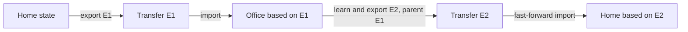

# Session Export and Project Transfer Plan

## 1. Purpose

Learnie needs two export flows with different owners, formats, and user expectations.

1. **Session export** is a human-readable record of one learning session.
2. **Project transfer** is a machine-readable project snapshot used to continue learning on another computer.

These flows must remain completely separate. A readable session export must never be treated as an importable backup, and a project transfer bundle must not be presented as a document archive.

This document is the implementation contract for replacing the current project-level learning archive with those two explicit flows.

---

## 2. Product decisions

### 2.1 Human-readable export belongs to a session

- Remove the current project-level `Export project archive` action from the inspector.
- Add an export button to every session card.
- The action exports only the selected session.
- The result is a ZIP intended for reading, sharing, and long-term reference.
- Its primary content is Markdown. It may contain referenced image assets, but it contains no machine restoration payload.
- Active, completed, and archived sessions can all be exported.

### 2.2 Cross-computer transfer belongs to a project

- Project transfer exports the complete project state required by another Learnie installation.
- Importing the bundle creates a project when the project ID is unknown locally.
- Importing the bundle updates the existing project when the same project ID already exists locally.
- Each computer keeps its own local project root and SQLite database.
- The transfer bundle carries logical project data and portable artifacts; it never copies the live SQLite database.
- Google Drive, a USB drive, or another file-transfer service may carry the completed ZIP, but Learnie does not synchronize a live project folder through that service.

### 2.3 Terminology

Use distinct terminology throughout the UI, RPC layer, services, filenames, documentation, and tests.

| Purpose | Product term | Suggested UI label |
| --- | --- | --- |
| Read/share one session | Session export | `Export session` / `세션 내보내기` |
| Move a project to another computer | Project transfer | `Export for another computer` / `다른 컴퓨터로 내보내기` |
| Apply a transferred project | Project transfer import | `Import project transfer` / `프로젝트 가져오기` |

Do not use `archive`, `backup`, or `sync` as interchangeable labels for these operations.

---

## 3. Current state and required changes

The current `projects.exportArchive` flow queries every source, material, and session in a project, writes readable Markdown, and returns one project-level ZIP. This mixes a readable record with project ownership and still lacks enough machine data to restore the project.

Current reusable foundations:

- Projects, sources, materials, sessions, messages, progress, learner signals, and annotations already have stable IDs in SQLite.
- The project folder already stores canonical source and material artifacts.
- `writeSessionSnapshot` already writes a structured `session.json` with message and cursor state.
- The existing bundle importer already understands project, source, material, annotation, and session artifacts.
- Import already has a basic stale-session guard based on `updatedAt`.
- `defaultDownloadFolder` is already persisted.

Required structural changes:

- Move readable Markdown generation out of project export and into a session export service.
- Replace `projects.exportArchive` with a project transfer exporter.
- Add a public, user-triggered transfer importer instead of depending on project-root scanning.
- Expand the portable schema to cover all durable learning state.
- Add transfer lineage so update, duplicate import, and divergence are determined without relying on timestamps alone.
- Make import transactional across logical DB state and project files, with recovery after interruption.

---

## 4. Session export specification

### 4.1 Ownership and entry point

The export action belongs to each row in the right-pane Sessions tab.

Each session card has two independent secondary actions:

- Export session
- Delete session

The export action must stop click propagation so it does not open the session. Its loading state is scoped to the selected session; exporting one session must not make every session card appear busy.

Recommended card action order:

```text
[Open session body]                         [Export] [Delete]
```

Use an icon plus an accessible label and tooltip. The compact card may show icon-only buttons, but screen readers must receive `Export <session title>` and `Delete <session title>` labels.

### 4.2 Filename and ZIP layout

Filename:

```text
<session-title>-learning-session-YYYYMMDD-HHmm.zip
```

ZIP layout:

```text
<session-title>-learning-session/
  session.md
  assets/
    <referenced-images-only>
```

Rules:

- Use collision-safe, filesystem-safe names.
- If the destination already contains the same filename, add a stable numeric suffix instead of overwriting silently.
- Do not include JSON restoration files, DB rows, project manifests, absolute paths, API settings, or hidden internal diagnostics.
- Only copy images actually referenced by the exported session.
- All Markdown image links must be relative to `session.md`.
- If the session has no referenced images, omit `assets/`.

### 4.3 Markdown content

`session.md` contains:

1. Session title
2. Project and material titles
3. Session status
4. Created and last-updated times
5. Model name when available
6. Human-readable progress summary
7. Ordered visible conversation
8. Source citations using source title and locator
9. Session-scoped annotations, highlights, lookups, and question threads
10. Export timestamp

Suggested outline:

```markdown
# Session title

Project: ...
Material: ...
Status: active
Progress: 14 of 28 passages
Created: ...
Updated: ...
Exported: ...

## Conversation

### Tutor
...

### Learner
...

## Notes and highlights
...

## Sources
...
```

Rendering rules:

- Render structured tutor blocks into readable Markdown rather than dumping JSON.
- Preserve compare tables, bullet lists, reflection prompts, source quotes, bridges, and misconception repairs.
- Include user messages and visible assistant messages in ordinal order.
- Exclude prepared, discarded, system-only, parser-recovery, and internal diagnostic messages.
- Render annotation question threads as readable nested dialogue.
- Do not expose UUIDs in normal prose. UUIDs may only appear in an optional HTML comment if a future provenance requirement needs them; they are omitted in the first version.
- Prefer source title and locator over chunk ID.
- Clearly label incomplete/active sessions without implying completion.

### 4.4 Backend contract

Add a session-owned RPC:

```ts
type SessionReadableExport = {
  zipPath: string;
  fileName: string;
  sessionId: string;
  messageCount: number;
  annotationCount: number;
  assetCount: number;
};

"sessions.exportReadable": {
  params: { sessionId: string; destinationFolder?: string };
  response: SessionReadableExport;
};
```

Implement a dedicated `SessionExportService`. It may reuse Markdown helpers extracted from `ProjectService`, but `ProjectService` must no longer own readable conversation export.

The service must authorize every queried object through the session relationship:

```text
session -> material -> project
```

It must never accept a project ID and then export all sessions.

### 4.5 Consistency

Session export represents a single point-in-time snapshot.

- Serialize it through the same per-session mutation queue used for tutor mutations, or acquire an equivalent session read barrier.
- Read session metadata and visible messages inside one SQLite read transaction.
- Resolve annotations and assets against that same snapshot.
- Exporting must not change session status, progress, or `updatedAt`.

---

## 5. Project transfer specification

### 5.1 User flow

Project-level actions belong in the project menu, not in the session inspector.

Recommended actions:

- `Export for another computer` on the active project's menu
- `Import project transfer` in the project switcher/menu and in the no-project empty state

Export flow:

1. User selects `Export for another computer`.
2. Learnie creates one completed ZIP in `defaultDownloadFolder`.
3. Learnie reports the project title, transfer time, ZIP path, and item counts.
4. Optionally reveal the ZIP in Finder.

Import flow:

1. User selects a transfer ZIP.
2. Learnie validates and inspects it without changing local data.
3. Learnie shows whether it will create a new project, fast-forward an existing project, do nothing, or encounter divergence.
4. User confirms the prepared operation.
5. Learnie applies the import and opens the appropriate project/session.

### 5.2 Filename and identity

Filename:

```text
<project-title>-project-transfer-YYYYMMDD-HHmm.zip
```

The bundle retains the original project ID. That ID decides whether the target imports a new project or updates the existing project.

Do not infer identity from project title, source filenames, folder names, or content similarity.

### 5.3 Top-level transfer manifest

Every bundle contains `transfer.json`:

```ts
type ProjectTransferManifest = {
  format: "learnie-project-transfer";
  schemaVersion: number;
  minimumReaderSchemaVersion: number;
  appVersion: string;
  projectId: string;
  projectTitle: string;
  exportId: string;
  parentExportId: string | null;
  deviceId: string;
  exportedAt: string;
  projectStateHash: string;
  counts: {
    sources: number;
    materials: number;
    sessions: number;
    messages: number;
    annotations: number;
    preparedMessages: number;
  };
  files: Array<{
    path: string;
    size: number;
    sha256: string;
  }>;
};
```

Meaning:

- `exportId` uniquely identifies this immutable transfer.
- `parentExportId` is the most recent imported/exported ancestor known by this project copy.
- `deviceId` identifies an installation, not a person, and contains no hostname or personal information.
- `projectStateHash` represents the normalized durable state, independent of absolute paths and ZIP timestamps.
- File checksums protect against partial cloud upload, corruption, and accidental modification.
- Schema compatibility is checked before import preparation.

### 5.4 Transfer ZIP layout

The project transfer is machine-readable and does not contain the readable session archive.

```text
transfer.json
project/
  project.json
  sources/
    <source-id>/
      source_manifest.json
      source_chunks.json
      figures.json
      original.md | original.pdf | original.txt
      assets/
        ...
  materials/
    <material-id>/
      material_manifest.json
      concept_map.json
      course_plan.json
      material_overview.json
      lecture_plan.json
      presentation_plan.json
      critic_report.json
      visual_specs.json
      source_index.json
      source_chunks.json
      figures.json
      figure_index.json
      annotations.json
  sessions/
    <session-id>/
      session.json
      module_progress.json
      learner_signals.json
  prepared/
    message_sets.json
    <message-set-id>/
      messages.json
```

Only files present for a source or material are listed and checksummed. Missing optional artifacts must be expressed as absent, not replaced with empty placeholder data.

### 5.5 Durable data that must be included

#### Project

- Stable project ID
- Title and description
- Learning level
- Created and updated timestamps
- Archived state when still supported
- Portable project metadata

Do not transfer `rootPath` or `lastOpenedAt`. The target installation owns both.

#### Sources

- Stable source ID and project relationship
- Original imported file
- Source manifest
- Extracted chunks
- Figures and source assets
- Quality state
- Content hash
- Source title and original filename

The original external path is informational only and must never become the target's active path.

#### Materials

- Stable material ID and project relationship
- Ordered source relationships
- Full generated artifacts required by `getArtifacts`
- Overview and course plan
- Source indexes and material-level chunks
- Figures and visual specifications
- Artifact generation metadata/version/fingerprint

All serialized paths must be relative bundle paths. The importer constructs target-local absolute paths.

#### Sessions and visible learning state

- Stable session ID
- Project and material relationships
- Status and title
- Current module and completed module IDs
- Current chunk and covered chunk IDs
- Model
- Last revealed route/message cursor
- Every visible user/assistant message with stable ID, ordinal, blocks, choices, source refs, state update, conversation kind, and timestamps
- `session_module_progress`
- `module_progress`
- `learner_signals`

This is the minimum required to open the session and continue from the same conceptual position.

#### Annotations

- All material- and session-scoped annotations
- Text anchors
- Message and block anchors
- Question-thread data
- Source metadata
- Created and updated timestamps

#### Prepared learning content

Transfer ready and partial message sets that can still be consumed by an imported session:

- Message-set identity and generation context
- Annotation snapshot hash/data
- Provider/model identifiers without credentials
- Prepared messages and route indexes
- Session consumption cursor

Normalize `queued`, `generating`, and `waiting_for_provider` work to `interrupted` during export. Another computer must not assume ownership of a process started on the source computer.

If a prepared set fails compatibility checks against the imported material, annotation snapshot, prompt version, or local settings, keep the session but invalidate that prepared set and regenerate it normally. Prepared content must improve continuity but must never block import.

### 5.6 Data that must not be included

- SQLite database files, WAL, or SHM files
- API keys, tokens, cookies, provider secrets, or credentials
- Global app settings
- Local project root or download folder
- Window state and UI panel state
- Temporary imports and extraction directories
- Active process ownership/lease values
- Tutor prefetch rows
- Failed, cancelled, stale, or consumed transient prefetch payloads
- Logs and parser diagnostics not needed to reconstruct learner-visible state
- Unreferenced caches

Tutor prefetch is intentionally excluded because it is tied to a device, provider configuration, expiry, and session fingerprint. It is regenerated after import.

---

## 6. Transfer lineage and change detection

Timestamps alone are not a safe synchronization rule because computer clocks can differ and both computers may edit the project after the same import.

Add durable transfer history, preferably in a new DB table:

```sql
CREATE TABLE project_transfer_history (
  export_id TEXT PRIMARY KEY,
  project_id TEXT NOT NULL REFERENCES projects(id) ON DELETE CASCADE,
  parent_export_id TEXT,
  device_id TEXT NOT NULL,
  direction TEXT NOT NULL CHECK (direction IN ('export', 'import')),
  project_state_hash TEXT NOT NULL,
  transferred_at INTEGER NOT NULL,
  applied_at INTEGER
);
```

Each local project also needs to know its current transfer base: the most recent transfer state from which local edits descended.

Example sequential handoff:



Import classification:

| Condition | Result |
| --- | --- |
| Unknown project ID | `create_new` |
| `exportId` already applied | `no_changes` |
| Incoming parent matches local transfer head and local durable state is unchanged | `fast_forward` |
| Incoming state hash equals local state hash | `no_changes` |
| Same ancestor but both sides changed | `diverged` |
| No trustworthy common ancestor for an existing project ID | `unrelated_or_legacy` |
| Unsupported schema or invalid checksum | `invalid` |

The prepare screen must show this classification before enabling commit.

---

## 7. Merge and conflict policy

### 7.1 First release policy

The first reliable release supports:

- New-project import
- Duplicate/no-op import
- Fast-forward update
- Merging entities with new, previously unseen IDs

It must not silently merge divergent versions of the same mutable entity.

For divergence, preserve local data and offer one safe action:

- Import the transferred state as a separate project copy

Import-as-copy requires a complete ID remap for project, material, session, message, annotation, progress, signal, prepared-message, and anchor relationships. It is not implemented by changing only the project ID.

### 7.2 Later entity-level merging

Once lineage snapshots are available, apply these rules:

| Entity | Merge behavior |
| --- | --- |
| New source/material/session ID | Add |
| Same immutable source/material content | Reuse |
| Same source/material ID with different content | Do not overwrite; require project copy or explicit version resolution |
| New annotation ID | Add |
| Same annotation changed on only one side | Apply changed side |
| Same annotation changed on both sides | Preserve both; remap imported annotation ID and report conflict |
| Different session IDs | Preserve both |
| Same session with one changed side | Apply changed side |
| Same session changed on both sides | Fork the imported session graph |

Session forking must remap all affected relationships, not just the session ID:

- Session ID
- Conflicting message IDs
- Annotation `sessionId`, `anchorMessageId`, and text-anchor message references
- Learner-signal evidence message IDs
- Module-progress ownership
- Prepared-message origins and consumption pointers

The imported branch title receives a visible suffix such as `— Office branch`. The app opens neither branch automatically until the user selects one.

### 7.3 Deletions

Do not propagate deletion in the first release. Absence from a transfer bundle does not mean delete locally.

True deletion synchronization requires explicit tombstones with entity ID, deletion time, ancestor, and device. Add it only after update/import behavior is proven reliable.

---

## 8. Import architecture

### 8.1 Prepare/commit API

Use a two-step API similar to prepared source import.

```ts
type ProjectTransferPreview = {
  importId: string;
  fileName: string;
  projectId: string;
  projectTitle: string;
  exportedAt: string;
  sourceDeviceLabel: string;
  classification:
    | "create_new"
    | "fast_forward"
    | "no_changes"
    | "diverged"
    | "unrelated_or_legacy"
    | "invalid";
  counts: ProjectTransferManifest["counts"];
  changes: {
    added: number;
    updated: number;
    unchanged: number;
    conflicted: number;
  };
  warnings: string[];
};

"projects.prepareTransferImport": {
  params: { path: string };
  response: ProjectTransferPreview;
};

"projects.commitTransferImport": {
  params: {
    importId: string;
    mode: "create_new" | "fast_forward" | "import_copy";
  };
  response: ProjectTransferImportResult;
};

"projects.cancelTransferImport": {
  params: { importId: string };
  response: boolean;
};
```

The prepared import is stored in a private temporary directory with a short expiry. Commit uses the validated prepared payload, not an arbitrary path supplied again by the renderer.

### 8.2 Validation and security

Before showing the preview:

- Reject absolute archive paths and `..` traversal.
- Reject symlinks and unsupported special files.
- Set limits for compressed size, uncompressed size, file count, individual file size, and nesting depth.
- Verify `format`, schema compatibility, project ID, and required manifests.
- Verify every listed size and SHA-256 checksum.
- Reject unlisted files except explicitly allowed compatibility metadata.
- Validate JSON with runtime schemas; TypeScript types alone are insufficient.
- Verify every foreign-key relationship in memory before DB mutation.
- Ensure all relative paths stay inside the prepared directory and final project directory.
- Ensure no secret-bearing settings file is present.
- Reject duplicate entity IDs with conflicting payloads inside one bundle.

### 8.3 Applying a new project

1. Acquire a global transfer-import lock and a project mutation lock.
2. Validate that the project ID does not exist locally.
3. Build the target project folder entirely in staging.
4. Rewrite portable relative paths to target-local absolute paths.
5. Start a SQLite transaction.
6. Insert entities in dependency order.
7. Atomically rename the staged project folder into its final location.
8. Commit the DB transaction and transfer-history row.
9. Release locks and open the imported project.

Dependency order:

```text
project
  -> sources
  -> materials and material_sources
  -> prepared message sets and prepared messages
  -> sessions and visible messages
  -> progress and learner signals
  -> annotations
```

### 8.4 Applying an update

1. Acquire the same locks.
2. Recompute the local state hash to ensure the preview is still valid.
3. Abort and require a new preview if local state changed after preparation.
4. Create a recovery journal.
5. Stage all incoming files outside the live project directory.
6. Rename the current project directory to an import backup.
7. Rename the staged directory to the live location.
8. Apply logical DB upserts in one transaction.
9. Record the import lineage.
10. Commit, then remove the backup.

If any step fails, roll back the DB transaction and restore the previous directory. If the app exits between filesystem and DB steps, startup recovery reads the journal and deterministically completes or reverts the operation.

Do not use `DELETE + INSERT` for an entire project. Update only validated incoming entities, and do not interpret absent entities as deletion.

### 8.5 Path rewriting

The target computer owns:

- Project root
- Imported source path
- Manifest paths
- Material artifact paths
- Figure and asset paths

The importer derives them from:

```text
<target-project-root>/<project-id>/...
```

No absolute path from the source computer may remain as an active runtime path after import. Original external file paths may be retained only as non-operative provenance text if useful.

---

## 9. Export architecture

### 9.1 Point-in-time consistency

Project transfer must represent one coherent project state.

1. Acquire a project mutation barrier.
2. Finish or pause active synchronous persistence work.
3. Mark in-progress batch/message-set work as interrupted in the exported representation without mutating the live row solely for export.
4. Read all durable DB entities from one SQLite read transaction.
5. Copy required canonical files into staging.
6. Normalize paths and volatile fields.
7. Compute entity and project state hashes.
8. Write all payload files and `transfer.json`.
9. Verify the staged bundle against the same importer schemas.
10. Build the final ZIP under a temporary filename.
11. Atomically rename it to the final destination filename.
12. Record transfer history only after the final ZIP exists.

Never expose a partially written destination ZIP to Google Drive or Finder. The destination receives the final filename only after generation and verification complete.

### 9.2 Project state hash

Hash normalized logical data, not raw SQLite pages or ZIP bytes.

Normalization excludes:

- Absolute paths
- `lastOpenedAt`
- Export time
- ZIP entry timestamps
- Device-local leases and transient status
- File ordering differences

Sort object keys and entity arrays by stable ID before hashing. This makes equal project states produce the same hash on different computers.

### 9.3 Export status and interruption

- Show a project-scoped export progress state.
- Keep the app usable for other projects where safe.
- If the export fails, remove staging and the temporary ZIP.
- Do not record `exportId` as the project head until the final bundle is successfully created.
- A cancelled export does not alter project lineage.

---

## 10. UI behavior

### 10.1 Session card

Add an export icon button beside the existing delete button.

States:

- Idle: `Export session`
- Exporting: spinner, disabled only for this session
- Success: non-blocking status with filename and reveal action
- Failure: actionable error; session remains unchanged

The current project-level archive button at the bottom of the right inspector is removed.

### 10.2 Project menu

Project actions:

- Rename/project settings as currently available
- Export for another computer
- Archive/hide project if still retained as metadata behavior
- Delete project

Global project action:

- Import project transfer

Do not place transfer import inside a material/session action group.

### 10.3 Import preview

Preview must answer:

- Which project is this?
- When and from which Learnie installation was it exported?
- Will this add, update, do nothing, or diverge?
- How many sources, materials, sessions, messages, and annotations are involved?
- Will prepared learning content be reused or regenerated?
- What safe action is available?

Fast-forward confirmation example:

```text
The Rise and Fall of Soul and Self
Exported July 11, 2026 at 18:20

This transfer continues the version previously imported on this computer.
1 session updated · 24 annotations added · no conflicts

[Update project]
```

Divergence example:

```text
This project changed on both computers after the last transfer.
Your local project will not be overwritten.

[Import as a separate project copy] [Cancel]
```

### 10.4 Recency indicators

Project UI should expose small, non-intrusive provenance:

- Last imported transfer
- Last successful export
- Local changes since the last transfer base

Warn when the user imports an ancestor older than the current project head. Never present a timestamp alone as proof that one project is newer.

---

## 11. Service and file organization

Recommended code structure:

```text
src/bun/
  session-export-service.ts
  project-transfer-exporter.ts
  project-transfer-importer.ts
  project-transfer-schema.ts
  project-transfer-lineage.ts
  project-transfer-paths.ts
  archive-writer.ts

src/shared/
  project-transfer-types.ts
  rpc-types.ts
```

Responsibilities:

| Module | Responsibility |
| --- | --- |
| `session-export-service.ts` | Human-readable one-session Markdown ZIP |
| `project-transfer-exporter.ts` | Consistent portable project snapshot and ZIP |
| `project-transfer-importer.ts` | Prepare, validate, preview, commit, rollback |
| `project-transfer-schema.ts` | Runtime validation and schema migration |
| `project-transfer-lineage.ts` | Export IDs, ancestry, state hashes, classification |
| `project-transfer-paths.ts` | Relative-path validation and target-path rewriting |
| `archive-writer.ts` | ZIP writing only; no product semantics |

Avoid growing `ProjectService` into a combined Markdown renderer, ZIP generator, importer, merge engine, and project CRUD service.

---

## 12. Migration from the current feature

### RPC migration

- Add `sessions.exportReadable`.
- Add `projects.exportTransfer`.
- Add `projects.prepareTransferImport`.
- Add `projects.commitTransferImport`.
- Add `projects.cancelTransferImport`.
- Remove renderer use of `projects.exportArchive`.
- Remove `ProjectArchiveExport` after all callers and tests migrate.

No old readable project ZIP is accepted as a transfer bundle. Its missing `format: "learnie-project-transfer"` marker produces a clear message:

> This is a readable learning archive, not a project transfer. Open its Markdown files to read it, or export a project transfer from the source computer.

### Existing project roots

Current projects can be exported without an earlier transfer history.

- Their first project transfer has `parentExportId: null`.
- Importing it onto a computer without that project creates the project normally.
- Importing it over an existing same-ID legacy project is classified `unrelated_or_legacy` unless normalized state hashes match.
- Never assume the higher `updatedAt` project is authoritative in that case.

---

## 13. Implementation phases

### Phase 1: Separate readable session export

- Extract Markdown/block/source formatting from current project archive code.
- Implement `SessionExportService` and `sessions.exportReadable`.
- Add export action to each session card.
- Include session-scoped annotations and referenced assets.
- Remove the project-level readable archive UI and RPC use.
- Add unit, service, RPC, and UI tests.

Exit condition: any session card exports exactly one readable session ZIP, and no project-level readable export remains in the normal UI.

### Phase 2: Project transfer schema and exporter

- Add transfer types and runtime schemas.
- Add lineage/history migration.
- Implement normalized domain DTOs and relative paths.
- Export all required source, material, session, progress, annotation, and prepared-message data.
- Add checksums and point-in-time state hashing.
- Validate the staged transfer with importer schemas before finalizing it.
- Add project-menu export UI.

Exit condition: a transfer ZIP is self-contained, contains no secrets or active absolute paths, and passes independent validation.

### Phase 3: New-project import

- Implement safe ZIP extraction and prepare/commit lifecycle.
- Add import preview.
- Rewrite paths into the target root.
- Reconstruct DB entities and canonical project files.
- Open the imported project and latest active session.
- Validate restart persistence.

Exit condition: a transfer made on computer A can create a functional project on clean computer B and continue the active session without source/material regeneration.

### Phase 4: Idempotency and fast-forward update

- Record import/export lineage.
- Detect duplicate/no-op imports.
- Recompute local state before commit.
- Implement project update with journaled filesystem rollback and one DB transaction.
- Preserve local-only entities and reject divergence.
- Add last-import/export indicators.

Exit condition: A -> B -> A sequential handoff preserves every session, message, progress cursor, annotation, and usable prepared message without duplication or loss.

### Phase 5: Divergence preservation

- Implement whole-project import-as-copy with complete ID remapping.
- Add session-branch conflict support only after ancestor snapshots are available.
- Add explicit conflict reports.
- Keep deletion propagation out of scope until tombstones are designed and tested.

Exit condition: editing both computers after the same transfer never overwrites either side silently.

---

## 14. Test plan

### 14.1 Session export tests

- Export an active session with user and assistant messages.
- Export completed and archived sessions.
- Verify only the selected session appears.
- Verify message order and structured-block Markdown.
- Verify source titles/locators and no raw chunk IDs in normal output.
- Verify session-scoped highlights, lookups, notes, and question threads.
- Verify referenced images use valid relative links and unreferenced assets are absent.
- Verify prepared/discarded/internal messages are absent.
- Verify no API key, absolute project path, JSON restoration payload, or UUID leakage.
- Verify duplicate filenames do not overwrite an earlier export.
- Verify export does not mutate session timestamps or progress.
- Verify export and delete buttons do not trigger session open.

### 14.2 Transfer exporter tests

- Export a project containing multiple sources, materials, sessions, and annotations.
- Include active/completed/archived sessions.
- Include user questions, detours, source references, and annotation anchors.
- Include ready and partial prepared message sets.
- Normalize active generation ownership to interrupted representation.
- Verify every manifest file checksum.
- Verify deterministic state hashes across different local roots.
- Verify no absolute runtime paths, DB files, settings, credentials, leases, or prefetch rows.
- Verify the final destination filename appears only after ZIP completion.

### 14.3 New-project import tests

- Import into an empty database and different project root.
- Verify source files open and source citations resolve.
- Verify all material artifacts load without regeneration.
- Verify the latest active session resumes at the same current chunk.
- Verify completed/covered modules and message ordinals.
- Verify annotation anchors against imported message IDs.
- Verify learner signals and mastery/module progress.
- Verify valid prepared messages remain usable; incompatible ones are invalidated without blocking import.
- Restart the app and verify the imported state remains identical.

### 14.4 Update tests

- Import the same `exportId` twice and verify the second import is a no-op.
- Fast-forward A -> B -> A.
- Add independent sessions with new IDs and preserve both.
- Preserve local-only entities absent from the incoming bundle.
- Reject commit when local state changed after preview.
- Reject an older ancestor transfer.
- Detect divergent edits from the same parent.
- Verify no annotation replacement or message duplication.
- Inject failure before/after directory rename and before/after DB commit; verify startup recovery.

### 14.5 Security and compatibility tests

- Path traversal and absolute archive path
- Symlink entry
- ZIP bomb/size limit
- Excessive file count or nesting
- Missing or mismatched checksum
- Invalid/duplicate IDs
- Broken foreign keys
- Unsupported newer schema
- Migratable older schema
- Readable session archive mistakenly selected for project import
- Project transfer mistakenly opened through session export flow
- Bundle containing a known secret-field filename or settings payload

### 14.6 End-to-end acceptance scenario

1. Home computer creates a project, imports sources, generates materials, starts a session, asks questions, and adds annotations.
2. Home exports project transfer E1 to a Google Drive folder.
3. Office imports E1 as a new project and restarts Learnie.
4. Office continues the same active session without regeneration or cursor rewind.
5. Office starts another session, adds annotations, and exports E2 with parent E1.
6. Home imports E2 as a fast-forward update.
7. Home verifies both sessions, all messages, progress, annotations, sources, and prepared content.
8. Home exports one selected session from its session card.
9. The session ZIP contains only readable Markdown and referenced assets and cannot be imported as a project.

---

## 15. Definition of done

The work is complete only when all of the following are true:

- Readable export exists only at session level in normal product UI.
- Every session card can export only that session.
- Session ZIP is human-readable and contains no restoration payload.
- Project transfer is a separate project-level action and format.
- A transfer bundle is sufficient to continue learning on another computer without the source computer's DB or root path.
- Import automatically distinguishes new project, no-op, fast-forward, and divergence.
- Fast-forward import is idempotent and does not duplicate messages or annotations.
- Divergent state is never silently overwritten.
- Import failure or app interruption cannot leave DB and project files permanently mismatched.
- API keys, credentials, global settings, and transient device-bound state never leave the source installation.
- Paths are rewritten for the target computer.
- Full A -> B -> A handoff and restart tests pass.
- Existing unrelated worktree changes remain outside the implementation scope unless explicitly included later.

---

## 16. Final product model

```text
Session card
  -> Export session
  -> human-readable Markdown ZIP
  -> no import semantics

Project menu
  -> Export for another computer
  -> complete machine-readable project transfer ZIP

Project menu / empty state
  -> Import project transfer
  -> create new project or safely update the same project
```

The transfer workflow is a deliberate handoff between complete snapshots, not live folder synchronization. This preserves the convenience of carrying one file through Google Drive while avoiding the failed requirement that a cloud folder and a live SQLite database remain continuously identical.
