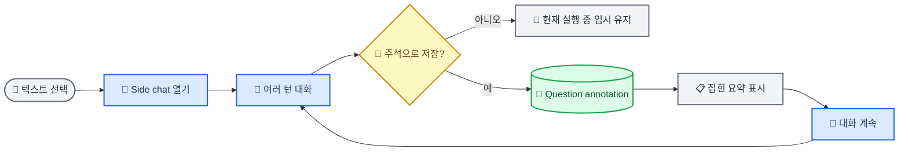

# 선택 텍스트 Side Chat 설계

_Learnie의 일회성 `further question`을 선택 텍스트에 귀속된 다중 턴 보조 대화로 확장하기 위한 구현 계약 — 2026-07-10_

| 항목 | 값 |
| --- | --- |
| 상태 | Proposed |
| 대상 | 학습공간에서 AI tutor 응답의 일부를 선택해 묻는 추가 질문 |
| 핵심 결정 | 메인 tutor 세션과 분리된 side-chat thread를 question annotation 한 건으로 저장 |
| 디자인 방향 | 차분한, 집중된, 보조적인 대화 |

---

## 📋 배경과 현재 문제

현재 [`LearningSelectionLookup`](src/views/main/components/LearningSelectionLookup.tsx)은 선택 텍스트에 대해 질문 하나를 보내고 `LookupResult` 하나를 받는다. 백엔드의 `annotations.ask`도 이전 질문과 답변을 전달받지 않으므로 각 요청을 독립적인 1문 1답으로 처리한다.

저장된 question annotation은 [`ChatSavedAnnotationCard`](src/views/main/App.tsx)에서 질문과 답변 전체를 항상 펼쳐 보여준다. 한 번의 답변에는 적합하지만 대화가 여러 턴으로 늘어나면 다음 문제가 생긴다.

- 후속 질문이 앞선 답변의 맥락을 이어받지 못함
- 사용자가 매번 선택 텍스트와 앞선 질문을 다시 설명해야 함
- 긴 annotation이 메인 학습 대화의 흐름을 밀어냄
- 저장된 대화를 다시 열어 이어서 질문할 수 없음
- side chat이 메인 tutor progression에 섞일 경우 학습 진행 의미가 오염될 수 있음

> 📌 **핵심 원칙:** Side chat은 메인 tutor 대화의 하위 메시지가 아니라, 특정 선택 텍스트에 귀속된 별도 대화 thread다. Annotation은 그 thread를 학습 자료에 고정하는 저장 표현이다.

## 🎯 목표와 비목표

### 목표

- 선택 텍스트를 기준으로 여러 차례 질문과 답변을 이어가기
- side chat을 메인 tutor 세션과 분리해 progression, mastery, module advance에 영향을 주지 않기
- 사용자가 명시적으로 저장한 대화를 annotation으로 복원하기
- 저장된 대화를 기본적으로 접어서 메인 학습 흐름을 보존하기
- 저장된 annotation에서 같은 대화를 다시 열고 계속 질문하기
- 기존 1문 1답 question annotation을 깨뜨리지 않기
- 기존 annotation 저장, 삭제, 위치 복원, project bundle snapshot 경로를 재사용하기

### 비목표

- side chat 내용을 자동으로 학습 진도나 mastery evidence에 반영하기
- 메인 tutor 대화 전체를 side chat context에 포함하기
- 초기 버전에서 저장하지 않은 draft를 앱 재시작 후 복원하기
- 여러 side-chat 창을 동시에 열기
- side chat별 모델, temperature, context 길이 설정을 사용자 옵션으로 노출하기

## 🔄 사용자 흐름



### 시작

1. 사용자가 AI tutor 응답 안의 텍스트를 선택한다.
2. 현재 selection toolbar에서 `추가 질문`을 선택한다.
3. 기존 lookup popover 위치에 non-modal side-chat 창이 열린다.
4. 선택 텍스트는 창 상단에 한 줄로 표시하고 필요할 때만 전체를 펼친다.
5. composer에 즉시 focus를 둔다.

### 대화

1. 첫 질문을 보내면 사용자 메시지를 즉시 transcript에 추가한다.
2. 마지막에 `답변 작성 중` assistant 행을 표시한다.
3. 응답이 오면 같은 thread에 assistant message를 추가한다.
4. 다음 질문은 선택 텍스트, module context, 해당 side-chat history를 함께 사용한다.
5. side chat을 사용하는 동안에도 메인 tutor 화면과 composer는 계속 조작할 수 있다.

### 저장과 재개

1. 저장 전에는 현재 앱 실행 동안만 유지되는 draft로 취급한다.
2. `주석으로 저장`을 누르면 question annotation 한 건을 생성한다.
3. 저장 이후의 추가 질문과 답변은 같은 annotation에 자동 반영한다.
4. 저장된 annotation의 `대화 계속`을 누르면 동일한 history로 side-chat 창을 다시 연다.
5. 저장하지 않은 대화를 닫으면 즉시 파기하지 않고 Undo toast로 한 번 복원할 수 있게 한다.

## 💾 데이터 모델과 호환성

### 새 결과 타입

`MaterialAnnotation.kind`는 계속 `question`으로 유지하고, 새로운 다중 턴 결과만 `result.kind`로 구분한다.

```ts
export type QuestionThreadMessage = {
  id: string;
  role: "user" | "assistant";
  content: string;
  createdAt: number;
  model?: string;
};

export type QuestionThreadResult = {
  kind: "question_thread";
  version: 1;
  title: string;
  messages: QuestionThreadMessage[];
  provider: "ai";
  model?: string;
  sourceTitle?: string;
  retrievedAt: string;
  updatedAt: number;
  sourceMeta: LookupSourceMeta[];
};
```

선택 텍스트, material, chunk, message, block, text anchor 정보는 기존 `MaterialAnnotation` 필드를 그대로 사용한다. 동일 데이터를 `QuestionThreadResult` 안에 중복 저장하지 않는다.

### 저장 방식

- 기존 `material_annotations.result_json`에 `QuestionThreadResult` 전체를 저장
- 기존 `annotations.save`로 최초 annotation 생성
- 기존 `updateMaterialAnnotationResult`를 확장해 저장된 thread 갱신
- 갱신마다 기존 `writeMaterialAnnotationsSnapshot` 경로로 `annotations.json` 동기화
- 기존 `annotations.delete`로 thread 전체 삭제

새 DB column이나 table이 필요하지 않으므로 SQLite schema migration은 추가하지 않는다.

### 레거시 호환

기존 `result.kind === "question"` 데이터는 다음과 같이 가상의 1턴 thread로 읽는다.

```ts
function questionMessages(result: LookupResult | QuestionThreadResult) {
  if (result.kind === "question_thread") return result.messages;
  if (result.kind !== "question") return [];
  return [
    { role: "user", content: result.question || result.title },
    { role: "assistant", content: result.body },
  ];
}
```

레거시 데이터를 읽는 시점에 DB를 수정하지 않는다. 사용자가 `대화 계속`을 선택하고 새 턴을 추가할 때만 `question_thread` 형식으로 갱신한다.

## 🌐 RPC와 AI context

### 단일 turn RPC

질문 시작과 저장된 대화 재개를 하나의 RPC로 처리한다.

```ts
"annotations.askTurn": {
  params: {
    materialId: string;
    chunkId: string;
    selectedText: string;
    userText: string;
    draftThread?: QuestionThreadResult;
    annotationId?: string;
  };
  response: {
    thread: QuestionThreadResult;
    annotation?: MaterialAnnotation;
  };
};
```

`draftThread`와 `annotationId`는 동시에 받지 않는다.

- `annotationId` 없음: 전달된 draft를 검증하고 새 thread만 반환
- `annotationId` 있음: DB에서 annotation과 thread를 읽고 새 턴을 추가한 뒤 snapshot까지 갱신
- annotation의 material, chunk, kind가 요청과 일치하지 않으면 거부
- client가 전달한 provider 또는 model 값을 실행 설정으로 신뢰하지 않음

### Prompt 구성

AI 요청은 다음 순서로 구성한다.

1. Learnie side-chat 역할과 답변 규칙을 담은 system message
2. 선택 텍스트, source title, locator, module learning goal, bounded source context
3. 해당 side-chat의 이전 user/assistant messages
4. 새 user question

메인 tutor session history는 포함하지 않는다. Side-chat 답변은 메인 tutor message table에도 기록하지 않는다.

### 길이 관리

- 선택 텍스트와 현재 module context는 항상 유지
- 최근 6~8개 user question과 대응 assistant answer를 원문으로 유지
- 그보다 오래된 history는 context용 summary로 압축
- annotation의 UI transcript에는 전체 message를 보존
- UI에는 임의의 짧은 hard limit을 노출하지 않음
- server에서 message 수, 개별 message 길이, 전체 payload 크기를 검증

## 🎨 Side-chat 인터페이스

### 패널 구조

기존 draggable `lookup-popover`를 재사용하되 question action에서는 전용 `SelectionSideChat`을 렌더링한다.

| 영역 | 내용 | 동작 |
| --- | --- | --- |
| Header | `사이드 대화`, 선택 텍스트, 저장 상태 | drag, 선택문 펼치기, 저장, 닫기 |
| Transcript | user와 assistant messages | 독립 scroll, 마지막 메시지 자동 이동 |
| Composer | textarea와 보내기 | 기존 submit shortcut 적용 |

권장 기본 크기는 폭 약 `460px`, 높이 `min(72vh, 680px)`이다. 현재 창처럼 viewport 밖으로 나가지 않게 좌표를 제한한다.

### 시각적 위계

- 사용자 메시지는 우측의 작고 옅은 배경으로 구분
- assistant 메시지는 별도 카드 없이 본문형으로 표시
- 선택 텍스트는 한 줄 ellipsis가 기본이며 명시적으로 펼칠 수 있음
- `주석으로 저장`은 header의 단일 주요 작업으로 유지
- 저장 후에는 버튼을 `저장됨` 상태로 바꾸고 이후 변경은 자동 저장
- transcript 안에 카드나 별도 accordion을 중첩하지 않음

### 상호작용과 접근성

- side chat은 modal이 아니며 배경을 `inert` 처리하지 않음
- 열릴 때 composer로 focus 이동
- `Escape`는 side chat만 닫음
- icon button에 `aria-label` 제공
- assistant 응답 상태를 `aria-live="polite"`로 알림
- keyboard focus ring을 모든 버튼과 composer에 제공
- 대화 생성 중에는 중복 전송만 막고 닫기와 기존 transcript 탐색은 허용
- 패널 이동과 accordion 전환은 `prefers-reduced-motion`을 존중

## 📋 저장된 annotation accordion

### 접힌 기본 상태

저장된 side chat은 material을 다시 열었을 때 항상 접힌 상태로 시작한다.

접힌 상태에는 다음 정보만 표시한다.

- `사이드 대화` label
- 선택 텍스트 한 줄
- 첫 질문
- `질문 N개 · 마지막 업데이트 시간`
- 펼치기 chevron

답변 전체나 model/source metadata는 접힌 상태에서 숨긴다. 추가 AI 호출로 summary를 만들지 않고 첫 질문과 message count만 사용한다.

### 펼친 상태

- 전체 user/assistant transcript
- AI provider, model, source metadata
- `대화 계속`
- `원문 위치`
- `삭제`

한 tutor message 아래에 여러 annotation이 있으면 한 번에 하나의 question thread만 펼친다. 다른 message group의 열린 상태에는 영향을 주지 않는다.

accordion header는 실제 `button`을 사용하고 `aria-expanded`, `aria-controls`를 연결한다. 높이를 직접 animate하지 않고 `grid-template-rows`와 opacity로 상태를 표현한다. 본문의 inline annotation link를 클릭하면 기존 위치 이동 동작에 더해 해당 question thread를 자동으로 펼친다.

## ⚠️ 오류와 경계 상태

| 상태 | 사용자에게 보이는 처리 | 데이터 처리 |
| --- | --- | --- |
| 첫 질문 전 | composer와 선택문만 표시 | thread 없음 |
| 답변 생성 중 | user message와 pending assistant 행 표시 | 완료 전 저장하지 않음 |
| provider 오류 | 실패한 질문 아래 `다시 시도` 제공 | assistant message 미추가 |
| 저장 실패 | 대화는 유지하고 구체적인 오류 표시 | draft 상태 유지 |
| 저장 후 갱신 실패 | 마지막 저장본 유지, 재시도 제공 | optimistic 결과 rollback |
| anchor 유실 | `원문 위치를 찾을 수 없음` 표시 | transcript 열람과 삭제 허용 |
| 레거시 question | 1턴 thread처럼 표시 | 계속할 때만 새 형식으로 변환 |
| 긴 대화 | transcript scroll과 context 압축 | 전체 UI 기록 보존 |
| annotation 삭제 | 즉시 UI에서 숨기고 Undo toast | Undo 만료 후 실제 삭제 권장 |

새 텍스트를 선택해 side chat을 열 때 이미 저장하지 않은 대화가 있다면 기존 draft를 즉시 버리지 않는다. 현재 material 안에서 anchor fingerprint별로 보관하고, 동시에 표시되는 창은 하나만 유지한다.

## 🔍 대안과 결정 이유

| 대안 | 장점 | 거부 이유 |
| --- | --- | --- |
| 메인 tutor chat에 side-chat turn 추가 | 기존 메시지 UI 재사용 | progression, mastery, tutor cursor 의미가 섞임 |
| 질문과 답변마다 annotation 생성 | 저장 로직 단순 | 같은 대화가 여러 카드로 분절되고 삭제·복원이 어려움 |
| 즉시 별도 side-chat table 도입 | draft와 saved 상태를 정교하게 관리 | 초기 요구보다 migration과 동기화 범위가 큼 |
| question annotation 한 건에 thread 저장 | 기존 anchor와 snapshot 재사용 | `result_json` 갱신 시 전체 thread를 다시 직렬화해야 함 |

선택한 방식은 마지막 대안이다. 일반적인 몇 차례의 follow-up 대화에서는 `result_json` 전체 갱신 비용이 작고, 기존 annotation 생명주기를 재사용하는 이점이 더 크다. 향후 대화가 매우 길어지거나 draft crash recovery가 필수가 되면 별도 thread/message table을 다시 검토한다.

## ✍️ 구현 순서

| 단계 | 작업 | 주요 파일 | 완료 조건 |
| --- | --- | --- | --- |
| 1 | thread 타입과 legacy adapter 추가 | `artifact-types.ts`, 새 `question-thread.ts` | 구·신규 결과를 동일 transcript로 변환 |
| 2 | multi-turn RPC와 저장 갱신 추가 | `rpc-types.ts`, `annotation-service.ts`, `annotation-store.ts`, `index.ts` | draft와 saved thread 모두 다음 턴 생성 |
| 3 | side-chat 패널 분리 | `LearningSelectionLookup.tsx`, 새 `SelectionSideChat.tsx` | 질문만 전용 transcript UI 사용 |
| 4 | annotation accordion 분리 | `App.tsx`, 새 `QuestionThreadAnnotationCard.tsx` | 접힘, 펼침, 계속하기, 위치, 삭제 동작 |
| 5 | 스타일과 접근성 완성 | `app.css` | light/dark, keyboard, reduced motion 대응 |
| 6 | 회귀 및 통합 검증 | 관련 Bun tests | 저장, 재실행, 레거시, 실패 경로 통과 |

`App.tsx`와 `app.css`에는 현재 다른 사용자 변경이 있으므로 구현과 staging에서 side-chat 관련 hunk만 다뤄야 한다.

## ✅ 검증과 수용 기준

### 자동 테스트

- [ ] 첫 질문 뒤 두 번째 질문이 앞선 assistant answer를 AI history로 전달함
- [ ] 저장 전 thread가 `annotations.askTurn` 응답으로 누적됨
- [ ] 저장된 annotation에 새 턴을 추가하면 같은 annotation id가 유지됨
- [ ] 저장된 갱신이 `annotations.json` snapshot에 반영됨
- [ ] 앱 재실행 후 전체 transcript가 복원됨
- [ ] 기존 `result.kind === "question"` annotation이 정상 표시됨
- [ ] 레거시 annotation에 새 턴을 추가하면 `question_thread`로 변환됨
- [ ] 잘못된 material 또는 non-question annotation 갱신을 거부함
- [ ] provider 오류 시 실패한 user message를 재시도할 수 있음
- [ ] annotation 삭제가 inline 표시와 accordion 양쪽에서 제거됨

### UI 검증

- [ ] side-chat 창이 메인 tutor composer를 막지 않음
- [ ] panel의 header, transcript, composer가 독립적으로 안정된 layout을 유지함
- [ ] 저장된 annotation은 reload 후 접힌 상태로 시작함
- [ ] `대화 계속`이 정확한 thread를 다시 엶
- [ ] inline annotation link가 카드로 이동하고 자동으로 펼침
- [ ] 한 message group에서 한 question thread만 펼쳐짐
- [ ] keyboard만으로 열기, 질문, 저장, 펼치기, 계속하기, 닫기가 가능함
- [ ] light와 dark theme에서 선택문, 메시지 역할, focus가 구분됨
- [ ] `prefers-reduced-motion`에서 불필요한 위치 animation이 제거됨

### 완료 명령

```bash
bun run typecheck
bun test
```

필요하면 annotation service와 UI 관련 test만 먼저 실행한 뒤 전체 test suite로 마무리한다.

## 📌 확정된 제품 원칙

- Side chat은 메인 tutor의 진행 대화가 아니다.
- 선택 텍스트와 side-chat history가 대화의 경계를 정의한다.
- 저장은 사용자가 명시적으로 선택한다.
- 한 번 저장한 thread의 후속 턴은 자동 저장한다.
- 저장된 annotation은 기본적으로 접혀 있다.
- 펼친 annotation에서 전체 기록을 보고 대화를 계속할 수 있다.
- 초기 구현은 기존 annotation 저장 구조를 확장하며 새 DB table을 만들지 않는다.
- 레거시 question annotation은 읽을 수 있어야 하며 강제 migration하지 않는다.
